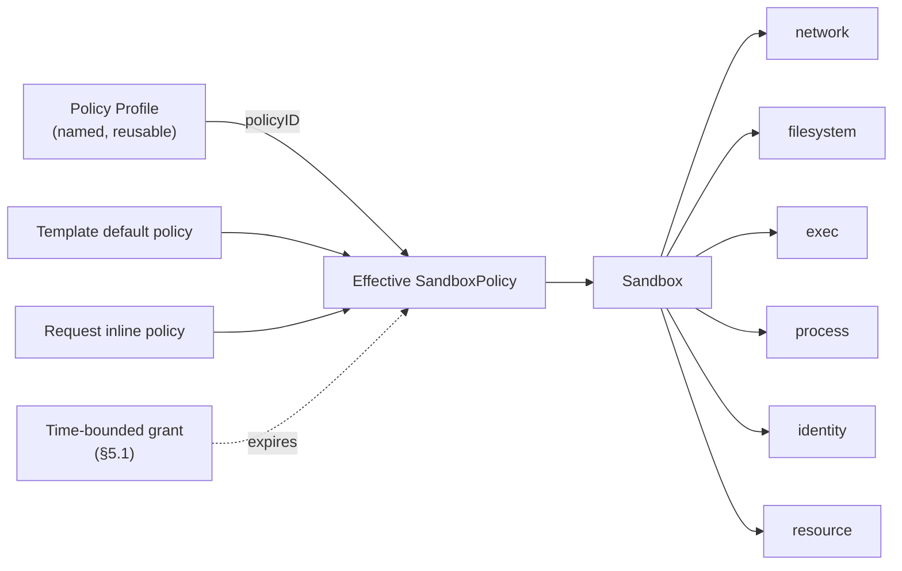

# Proposal 0001: Sandbox Security Policy — Overview

| | |
| --- | --- |
| **Status** | Draft — under community discussion |
| **Proposal** | 0001 (document set) |
| **Authors** | _(add yourself when you pick up a section)_ |
| **Created** | 2026-08 |
| **Discussion** | GitHub Issue: _**not yet opened — Phase 0 blocker.** Until the tracking issue exists, review comments have nowhere durable to live._ |
| **Source of truth** | The English documents under `specs/0001-sandbox-security-policy/en/` are normative. The `zh/` set is a translation that MAY lag; on any discrepancy the English text governs. |

The key words **MUST**, **MUST NOT**, **SHOULD**, and **MAY** are to be interpreted as described in RFC 2119.

---

## 1. Summary

Every cloud ECS instance ships with a security group: a declarative, reusable definition of *what the machine may talk to*. This proposal introduces the equivalent — and necessary superset — for CubeSandbox: a unified, declarative **Sandbox Security Policy** that defines the complete capability boundary of a single sandbox across six modules:

| Module | Spec |
| --- | --- |
| **Network** — what the sandbox may reach, and what may reach it | [network.md](./network.md) |
| **Filesystem** — which paths inside and outside the sandbox may be read, written, or executed | [filesystem.md](./filesystem.md) |
| **Exec** — which commands may run, as which user, for how long, and how many at once | [exec.md](./exec.md) |
| **Process** — what an already-running process may do: privilege gain, persistence, and system calls | [process.md](./process.md) |
| **Identity** — which credentials the sandbox may use, and in what form they reach it | [identity.md](./identity.md) |
| **Resource** — steady-state quotas, windowed limits (minute–month + lifetime), and LLM token accounting | [resource.md](./resource.md) |

A sandbox is not merely a network endpoint like an ECS instance. It is an **execution environment running partially trusted, agent-generated code**. Its "security group" must therefore govern not only network reachability, but also what that code can touch on disk, what it can execute, and how much it can consume — otherwise the boundary is incomplete.

## 2. Motivation

A security group works because it is:

- **Declarative** — users state intent ("allow 443 to this CIDR"), not mechanism.
- **Default-on** — every instance gets one, with a sane baseline.
- **Reusable** — one group binds many instances; changes propagate to all of them.
- **Uniform** — one grammar, one evaluation order, one audit story.

Sandboxes need exactly these properties, extended to the execution domain:

| ECS instance | Sandbox |
| --- | --- |
| Runs human-authored, trusted workloads | Runs agent-generated, partially trusted code |
| Boundary = network reachability | Boundary = network **+ filesystem + exec + process + resource** |
| Blast radius: data exfiltration | Blast radius: exfiltration **+ credential theft, host-mount abuse, privilege escalation, runaway loops, token burn** |

### 2.1 Gap analysis

The five modules are at very different levels of maturity today:

| Module | What exists today | Gap |
| --- | --- | --- |
| Network | Egress allow/deny at L3/L4, domain allow-listing with DNS learning, L7 HTTP/HTTPS rules with audit and header injection, public-ingress gating. | Fields are scattered across the create request; ingress is a single switch; no reusable policy object; no unified merge semantics across modules. |
| Filesystem | Host-mount prefix allowlist and per-mount `readOnly`. | No protection for sensitive paths *inside* the sandbox (`~/.ssh`, `~/.aws/credentials`, `/etc/shadow`); no path-level read-only/deny policy; the prefix allowlist is not part of the user-facing policy API. |
| Exec | Per-request `timeout`, `user`, `cwd` on command execution. | No sandbox-level policy: no command allowlist/denylist, no user restriction, no concurrency cap, no wall-clock ceiling, no audit trail. |
| Process | Nothing user-facing. Process and PID isolation between sandboxes is a property of the substrate (§12.3), not something a policy can state. | No policy surface at all: privilege gain, persistence, and system-call exposure cannot be constrained declaratively, even though the enforcement mechanisms already exist below the API — [filesystem.md](./filesystem.md) §11 already contemplates "equivalent syscall-level enforcement". |
| Identity | Nothing. Credentials reach the sandbox as environment variables or files, where any code in it can read them. | No policy surface: no workload identity, no destination-bound injection, no exposure mode, no TTL or revocation. [filesystem.md](./filesystem.md) §2.3 of the defense matrix already concedes that `denyPaths` cannot protect a secret already in process memory or an env var — which is where secrets currently are. |
| Resource | Steady-state CPU/memory quotas; idle timeout with kill/pause. | No windowed limits (minute–month) or lifetime budgets; no bandwidth ceiling; no LLM token metering; no exceed actions, notifications, or human-approval flow. |

### 2.2 Why a unified object

Without a single policy object, every module grows its own config style, merge rules, defaults, and audit format. Users must reason about five half-systems; template authors cannot express "this template's sandboxes are locked down" in one place; and future modules (device access, snapshot permissions, ...) would add a sixth and seventh dialect.

A unified policy gives CubeSandbox:

- One mental model: *"the sandbox may do exactly what its policy says."*
- One merge story (template default + request override), shared by all modules.
- One default security baseline, on by default.
- One place to audit and observe ("why was this denied?").

### 2.3 Defense-in-depth matrix

No single module is a boundary on its own. Each answers a specific threat, and they are only meaningful as layers. This matrix exists so that nobody sizes a threat model against the wrong module.

| Module | Primary threat it answers | Enforcement surface | Does **not** cover |
| --- | --- | --- | --- |
| **Network** | Data exfiltration; reaching internal services and metadata endpoints | Every packet leaving the sandbox, whichever process sent it | What the code does locally; data already leaked through an allowed channel |
| **Filesystem** | In-sandbox credential theft; host-mount abuse | Every filesystem access by **every** process | Secrets already in process memory or passed as env vars |
| **Resource** | Runaway loops, token burn, noisy-neighbour effects | Kernel accounting + outbound HTTP metering, per sandbox | Actions that are harmful but cheap |
| **Process** | Privilege gain, unwanted persistence, and syscall-surface abuse by processes the workload started **itself** | Every process the sandbox runs, at the kernel boundary | What a process may legitimately do within the privileges it was granted |
| **Identity** | Theft and reuse of long-lived credentials by code inside the sandbox | The credential issuance and egress-proxy path outside the sandbox | A credential the workload legitimately used within its scope, for the duration of that scope |
| **Exec** | Injected or mistaken commands arriving **through the control interface** | Only executions initiated through the sandbox control interface | Processes the workload starts on its own |

The asymmetry in the last row is deliberate and load-bearing:

- `exec` policy is a **control-interface gate**. It is the right tool against instructions that reach the sandbox through the API (a prompt-injected agent step, a compromised orchestrator) and against operator error (unbounded timeouts, wrong user).
- It is **not** a containment boundary for code already running inside the sandbox. A process admitted once by `exec` may `fork`/`exec` anything the image contains without further `exec` evaluation. In the agent-generated-code scenario the first admitted command is typically an interpreter or a build tool, so the *practical* protection surface of an `exec` allowlist is small — see [exec.md](./exec.md) §1 and §3.6.
- Containment for self-started processes comes from `filesystem` (what it may read and write), `network` (where it may send), `process` (what privileges it may gain and which system calls it may issue), and `resource` (how much it may consume). Those four are mandatory-enforcement layers under principle 5 (§6).

`process` is the module that answers the question `exec` explicitly declines: **what may a process do once it is running?** It does not make `exec` redundant, and `exec` does not make it redundant — they enforce at two different points, and only `process` survives contact with an admitted interpreter. See [process.md](./process.md) §1.

Therefore: size a threat model on **network + filesystem + process + resource**, and treat `exec` as hardening — never as the boundary.

### 2.3.1 Out of scope: detection and response

Behavioural detection — internal port scanning, connections to known-malicious destinations, anomalous login locations, zombie or malicious process identification — is **not** in scope for any module in this proposal, and no module MAY grow a field for it.

This is a consequence of principles 1 and 5, not an oversight. A policy field states a boundary that is *decidable at enforcement time*: this path, this destination, this syscall. "Malicious" and "anomalous" are verdicts produced by a detector after observing behaviour over time; expressing them as policy fields would mean shipping fields that cannot be enforced deterministically, which principle 5 forbids and which would quietly turn the whole object into a set of suggestions.

Detection and response is a legitimate and complementary capability. It belongs to a separate subsystem that consumes the audit stream (§4.1.6, §11.3) and acts through the control plane — for example by triggering a policy update, which is then versioned and snapshotted like any other. Where the two meet is the audit stream, not the policy object.

## 3. Document set

This proposal is a set of seven documents. This overview defines the shared object model, merge semantics, error model, and compatibility rules that all module specs build on. Each module spec is a standalone, normative specification of one domain.

| Document | Scope |
| --- | --- |
| [overview.md](./overview.md) (this document) | Shared model, merge semantics, principles, tiers, shadow evaluation, time-bounded grants, compatibility, delivery phases |
| [network.md](./network.md) | Egress L3/L4/L7 policy, ingress gating, legacy-field mapping |
| [filesystem.md](./filesystem.md) | Host-mount boundary, in-sandbox path access policy |
| [exec.md](./exec.md) | Command execution policy |
| [process.md](./process.md) | Privilege gain, persistence, and system-call policy for running processes |
| [identity.md](./identity.md) | Workload identity, secret exposure modes, destination binding, credential TTL and revocation |
| [resource.md](./resource.md) | Quotas, windowed limits (minute–month + lifetime), LLM token accounting, exceed actions, hold & approval, notifications |

## 4. Shared object model



**SandboxPolicy** — a declarative object with a tier and six sub-policies. Every field is optional; an absent sub-policy means "server-side default" (§7), never "unrestricted".

```yaml
policy:
  tier:        compatibility | baseline | restricted | unrestricted
                         # default when policy is present: restricted — see §7
  tierVersion: string    # e.g. "tier/1"; default: platform default — see §7.1.7
  auditTier:   compatibility | baseline | restricted | unrestricted
                         # optional; shadow-only — see §7.2
  enforcement: strict | bestEffort   # default: strict — see §8.2
  network: { ... }       # see network.md
  filesystem: { ... }    # see filesystem.md
  exec: { ... }          # see exec.md
  process: { ... }       # see process.md
  identity: { ... }      # see identity.md
  resource: { ... }      # see resource.md
```

**Policy Profile** — a named `SandboxPolicy` stored server-side. Sandboxes reference it by `policyID` or inline a policy at create time. This is the security-group reuse mechanism: update the profile, and every sandbox created afterwards — and, where the module supports it, already-running sandboxes — picks up the change.

```
POST   /policies            create/update a named profile
GET    /policies            list profiles
GET    /policies/{id}       inspect a profile (with resolved defaults)
DELETE /policies/{id}       delete (refusing while sandboxes reference it)
```

### 4.1 Policy identity and versioning

An effective policy is not only computed, it is **identifiable**. Compliance review asks "which policy was this sandbox actually running at 14:03 yesterday?", and that question MUST be answerable from stored records, without re-running merge logic against sources that have since changed.

1. Every effective policy carries an `effectivePolicyVersion`: an integer starting at 1 for the sandbox, incremented on every change to that sandbox's effective policy — including hot updates and changes picked up from a profile.
2. Every effective policy carries `policySources`: the identity and revision of each contributing source — `{template, templateRevision, policyID, policyRevision, inline}`.
3. Policy Profiles are **revisioned**. `POST /policies` against an existing name creates a new immutable revision; it MUST NOT mutate an existing one in place. A revision MUST be retained while any snapshot or audit record references it, even after the profile is deleted.
4. Every change to a sandbox's effective policy MUST produce an immutable **snapshot** holding the fully resolved policy, its version, its sources, and the timestamp and principal that caused the change.
5. Snapshots MUST be retrievable for the sandbox's whole lifetime, and for a deployment-configured retention period after termination.
6. Every denial audit event, in every module, MUST carry the `effectivePolicyVersion` in force at the moment of the denial, so a denial can be joined to the exact policy text that produced it.

```
GET /sandboxes/{id}/policy                  current effective policy + version + sources
GET /sandboxes/{id}/policy/history          snapshot list (version, at, principal, sources)
GET /sandboxes/{id}/policy/history/{ver}    one immutable snapshot
GET /policies/{id}/revisions                profile revision list
GET /policies/{id}/revisions/{rev}          one immutable profile revision
```

This is what makes profile reuse auditable: "already-running sandboxes pick up the change, where the module supports it" is observable precisely because each pickup is a new version with a snapshot. A module that cannot hot-update says so in its own spec; it MUST NOT silently diverge from the version it reports.

### 4.2 Concurrency and atomicity

A version number records what happened; it does not prevent two callers from happening at once. Profile updates, grant expiry, resource approvals, and runtime policy patches are all mutations of the same effective policy, and they can overlap. Without a compare-and-swap the last writer wins silently, which for a security boundary means a narrowing can be lost without anyone seeing an error.

1. Every mutating policy operation MUST accept an `expectedPolicyVersion` (for sandbox-scoped changes) or `expectedRevision` (for profile changes), and MUST reject a mismatch with `409 POLICY_VERSION_CONFLICT` carrying the current value. Where the transport has one, an `ETag` / `If-Match` pair MAY carry the same information.
2. A mutation that omits the expected version MUST be rejected under `enforcement: strict`. Blind writes to a security boundary are not a convenience worth the failure mode they enable.
3. Each mutation MUST be **atomic across fields**. A request that sets three fields either takes effect as one new `effectivePolicyVersion` or has no effect. A partially applied policy is a configuration nobody wrote.
4. Mutating operations MUST accept an idempotency key and MUST return the original outcome on a repeat, so that a retried grant issuance does not produce two grants with two expiry times.
5. Snapshots MUST be totally ordered by `effectivePolicyVersion` for a given sandbox. Concurrent mutations may interleave in wall-clock time, but the version sequence MUST NOT have gaps or duplicates.

**When a tightening takes effect** is a separate question from when it is recorded, and the answer differs by module. Each module spec MUST state, for a narrowing applied at runtime, what happens to work already in flight: established connections, running processes, and open sessions. This is the per-module half of §11.2, and a module that cannot answer it cannot accept grants (§5.1.5) — because a grant that expires without closing what it opened has not expired in any sense that matters.

### 4.3 `status`: what the platform commits to

The effective policy, its version, its sources, the resolved capability set (§8.2), and the list of inert fields are all platform-computed. Together they answer a different question from the request body: not *what did I submit* but **what does the system actually promise**.

1. All of it MUST be exposed as read-only platform-generated state. A request MUST NOT be able to set, influence, or forge any of it; a submitted value in a read-only field MUST be rejected with `400 INVALID_POLICY` rather than ignored.
2. It MUST include at minimum: the resolved policy, its `effectivePolicyVersion`, a content hash of the resolved policy, `policySources` with revisions, the resolved `tier` and `tierVersion`, the capability set version, every `unsupported` or `partial` field (§8.2.3), and every active grant with its remaining TTL (§5.1.6).
3. The content hash MUST be computed over a canonical serialization, so two deployments that resolved the same policy produce the same hash. The canonicalization rules are part of the machine-readable schema (§11.16) rather than prose, because a hash defined in prose is a hash nobody can reproduce.

## 5. Shared merge semantics

When more than one policy source is present, the effective policy is computed once, at create time, by the following rules. Module specs define per-field refinements.

| Aspect | Rule |
| --- | --- |
| Source precedence | Inline request policy > referenced profile > template default. Which principals may contribute each source is defined in §5.2. |
| `tier` | The most restrictive tier wins: `restricted` > `baseline` > `compatibility` > `unrestricted` (§7.1). |
| `tierVersion` | The latest pinned version wins. Since a new tier version may only tighten what a tier expands to (§7.1.7), latest is also most restrictive. |
| `auditTier` | The most restrictive `auditTier` wins, and it is evaluated against the merged `tier` (§7.2). A shadow evaluation observes more; it never enforces, so widening it cannot widen the boundary. |
| Scalar fields | Explicit higher-precedence value overrides lower; absent keeps the lower value. |
| List fields (`allowOut`, `denyPaths`, ...) | Higher-precedence entries are appended to lower-precedence entries, then deduplicated. |
| Rule lists (`rules`, exec command rules) | Higher-precedence rules sort **before** lower-precedence rules; evaluation is first-match-wins. |
| Mode fields (`exec.mode`, `filesystem.mode`, `process.mode`, `process.syscall.mode`) | The most restrictive mode wins. |
| Violation actions (`onViolation`, `onExceeded`) | The most severe action wins (§8.1.7, [resource.md](./resource.md) §10). |
| `enforcement` | `strict` wins. A lower-precedence `strict` MUST NOT be downgraded to `bestEffort` (§8.2.2 rule 2), and an attempt is rejected rather than shadowed. |
| **Narrow-only restrictions** | A restriction contributed by a lower-precedence source MUST NOT be removable, overridable, or punched through by a higher-precedence source. Higher precedence may narrow the boundary; it may never widen it. Module specs name the fields this governs — network binding denies and `allowInternetAccess`, `exec.allowedUsers`, `filesystem.mounts.allowedHostPrefixes` and `filesystem.baselineExceptions`, `process.noNewPrivileges` and `process.allowedCapabilities`, `resource.limits`. The single, bounded exception is a time-bounded grant (§5.1). |

Where a higher-precedence source asks for something the narrow-only rule forbids, the module spec MUST specify one of two outcomes and never a silent third: reject the request (`400`, for a direct contradiction such as flipping a boolean), or accept the request and report the ineffective part in a `policyWarnings` array on the response (for an entry that is merely shadowed).

### 5.1 Time-bounded grants

A policy computed once at create time cannot express "authorize this for the duration of one task, then reclaim it". Expressing that need by editing the policy is what produces permission sprawl: the widened policy stays in force because nobody remembers to narrow it again, and the sandbox keeps a capability it needed for ten minutes for the rest of its life.

A **grant** is therefore a first-class object: a named, time-bounded, additive relaxation of a sandbox's effective policy, issued through the control plane.

A grant is the *only* exception to narrow-only (§5), so it is fenced on all four sides. Every one of the following is normative, and a grant mechanism missing any of them is a privilege-escalation path rather than a feature.

1. **Authorized issuance.** A grant MUST be issued by an authenticated principal authorized to manage the sandbox. It MUST NOT be issuable from inside the sandbox and MUST NOT accept sandbox-scoped credentials — the same condition as the resource approval API ([resource.md](./resource.md) §7.4). Untrusted agent code MUST NOT be able to widen its own boundary.
2. **Mandatory expiry.** Every grant MUST carry a TTL, bounded by a deployment-configured maximum. A grant without a TTL, or with a TTL above the maximum, MUST be rejected with `400 POLICY_GRANT_INVALID`. There are no indefinite grants.
   - Expiry MUST be enforced by the platform. On expiry the grant is removed and the effective policy returns to its pre-grant value **automatically**. Expiry MUST NOT depend on the task, the agent, the orchestrator, or the sandbox reporting completion — a reclamation that relies on the party being constrained to announce it is not a reclamation.
   - Early revocation MUST be possible at any time, for any active grant.
3. **The grant ceiling.** A grant MUST NOT widen the boundary beyond what the **outer boundary** permits. The outer boundary is the set of restrictions contributed by the `template` and `profile` sources — the same provenance distinction that makes a network deny binding ([network.md](./network.md) §4.6).

   | A grant may reopen | A grant may NOT reopen |
   | --- | --- |
   | Something the tier default (§7.1) narrowed | Anything a template restriction closed |
   | Something the request-level inline policy narrowed | Anything a profile restriction closed |
   | | Anything unconditionally denied by a module (e.g. network built-in private-CIDR denies) |

   An attempt to exceed the ceiling MUST be rejected with `400 POLICY_GRANT_EXCEEDS_CEILING`, carrying the restriction and its source. Without this rule an administrator's boundary is merely a suggestion to anyone who can issue grants, and §5 becomes advisory.
4. **Explicit target.** A grant MUST name exactly what it widens: module, field, and entries. Wildcard grants, "unrestricted for 10 minutes", and tier downgrades MUST be rejected. A grant is a hole of known shape, or it is not a grant.
5. **Fully versioned.** Issuance, expiry, and revocation each change the effective policy and therefore each MUST produce a new `effectivePolicyVersion` and an immutable snapshot (§4.1.4), and MUST be audited with the issuing principal, the target, the TTL, and the reason. A grant is never invisible, and neither is its expiry.
6. **Exposed while live.** Active grants MUST appear in the effective policy exposed by the API, each with its remaining TTL, so that "why can this sandbox reach X *right now*?" is answerable without correlating logs.
7. **Independent lifetimes.** Grants do not merge. Overlapping grants each expire on their own schedule; the effective relaxation is the union of active grants, and each entry survives exactly until its own grant expires.
8. **Per-module opt-in.** Each module spec MUST name its grantable fields or state that it has none. A module that names none has no grants: absence is not permission.

```
POST   /sandboxes/{id}/grants              issue {module, field, entries, ttlSec, reason}
GET    /sandboxes/{id}/grants              list active grants with remaining TTL
DELETE /sandboxes/{id}/grants/{grantID}    revoke early
```

> **Terminology.** This `grant` — a time-bounded policy relaxation — is the only thing this document calls a grant. The resource approval payload uses `allowance` for the different concept of adding headroom to a usage counter ([resource.md](./resource.md) §7.3); the two were briefly given the same name, and the resource field was renamed rather than left to collide.

### 5.2 Authority: who may contribute a source

§5 says how sources combine. It does not say who is entitled to be one, and merge rules alone cannot answer that: an algorithm that correctly computes "template restrictions cannot be widened by the request" is worth nothing if any caller can publish the template. Precedence and eligibility are one question and belong in one place.

Five principal roles are distinguished. A deployment MAY map several onto one identity, but MUST NOT collapse the **operator** and **caller** rows, because that erases the boundary every other rule in §5 depends on.

| Principal | What it is |
| --- | --- |
| **Operator** | The party running the platform. Sets deployment-wide bounding constraints such as the host-mount allowlist ([filesystem.md](./filesystem.md) §4.4.4) and the maximum grant TTL. |
| **Tenant admin** | Owns a tenant or namespace. Manages Policy Profiles within it. |
| **Template publisher** | Publishes templates carrying default policy. |
| **Sandbox caller** | Creates sandboxes, supplying inline policy and a `policyID`. |
| **Workload identity** | The sandbox itself, from the inside. Holds no policy authority at all — see rule 5. |

| Operation | Operator | Tenant admin | Template publisher | Caller | Workload |
| --- | --- | --- | --- | --- | --- |
| Set deployment bounding constraints | ✔ | ✘ | ✘ | ✘ | ✘ |
| Create / update a Policy Profile | ✔ | ✔ (own tenant) | ✘ | ✘ | ✘ |
| Publish a template default policy | ✔ | ✔ | ✔ (own templates) | ✘ | ✘ |
| Reference a profile by `policyID` | ✔ | ✔ | ✔ | ✔ (readable profiles) | ✘ |
| Supply inline request policy | ✔ | ✔ | ✔ | ✔ | ✘ |
| Issue or revoke a grant (§5.1) | ✔ | ✔ | ✘ | Deployment-configured | ✘ |
| Approve a resource hold ([resource.md](./resource.md) §7.4) | ✔ | ✔ | ✘ | Deployment-configured | ✘ |
| Read the effective policy and its snapshots | ✔ | ✔ | ✔ (own templates) | ✔ (own sandboxes) | Resolved policy only |
| Read the audit stream | ✔ | ✔ (own tenant) | ✘ | Deployment-configured | ✘ |

1. **A source's provenance is the role that supplied it**, not a field in the request. `template`, `profile`, and `request` provenance (§4.6 of [network.md](./network.md)) MUST be assigned by the platform from the authenticated principal. A caller MUST NOT be able to label its own contribution as template provenance, since binding denies rest on that distinction.
2. **A profile reference is not a privilege escalation.** A caller that may reference a profile it cannot edit gets that profile's restrictions; it does not thereby gain the tenant admin's ability to change them.
3. **Delegated authority MUST NOT exceed its parent.** Where a deployment issues scoped credentials — a child key, a service account, a CI token — the derived principal's policy authority MUST be a subset of the issuer's. This is the same narrow-only rule §5 applies to policy content, applied to authority over it.
4. **Cross-tenant references MUST be rejected**, not silently ignored. A `policyID` naming another tenant's profile MUST fail with `403`; resolving it to the default would produce a sandbox whose effective policy differs from the one its author read.
5. **The workload has no authority, and this is load-bearing.** Code inside the sandbox MUST NOT be able to create profiles, issue grants, approve holds, or modify its own effective policy, and sandbox-scoped credentials MUST NOT be accepted on any of those endpoints — the condition §5.1.1 already states for grants, generalized. It MAY read its own resolved policy, so that a well-behaved agent can adapt instead of failing blindly; it MUST NOT read the audit stream, which would let it observe which of its probes were noticed.
6. **Every authority decision is audited** on the same terms as the policy changes it authorizes: who, what, when, and the version it produced.

`break-glass` access — an operator bypassing the above during an incident — is deliberately not specified here. It is a real operational need and a real escalation path, and it belongs in the same conversation as the deployment's own incident tooling; §11.17 records it rather than inventing it.

## 6. Shared principles

1. **Declarative.** The policy states intent. It does not reference mechanisms, components, or configuration paths.
2. **Absent ≠ unrestricted.** An absent sub-policy or field resolves to the server-side default, which is itself a documented, safe value.
3. **Safe by default, explicit opt-out.** Baseline protections are on by default; opting out is a positive, visible act (e.g. `mode: unrestricted`), never a side effect of omission. "Default" here means the default for a **policy that is present**: a `policy` object without a `tier` resolves to `restricted` (§7). Requests carrying no `policy` at all travel the legacy path and resolve to `compatibility`, which is *not* a safe default and does not claim to be (§7.1).
4. **Denials are explainable.** Every denial carries the reason (matched rule, resource dimension, exceeded limit) in a structured form so that callers and agents can react programmatically.
5. **Enforcement is mandatory, not advisory.** Every rule in the module specs is enforced at a point the sandbox workload cannot bypass. Where a rule cannot be enforced mandatorily, the spec says so explicitly instead of pretending. This principle has exactly one configurable exception — `policy.enforcement: bestEffort` (§8.2), for deployments whose runtime cannot enforce a field at all — and that exception is fenced, defaulted off, and visible in the effective policy for the same reasons a time-bounded grant is (§5.1).
6. **One representation downstream.** Regardless of how a policy was expressed (legacy fields, inline policy, profile), the effective policy is computed once and exposed as one object.

## 7. Shared defaults

Which set of defaults applies is selected by `policy.tier` (§7.1). Two rules decide which tier a request gets, and keeping them apart is what lets this object be safe by default without breaking the existing API:

| The request | Resolved tier | Rationale |
| --- | --- | --- |
| Carries a `policy` object with no `tier` | **`restricted`** | A caller who reached for this object asked for a boundary. Handing them the permissive tier would answer a question they did not ask. |
| Carries no `policy` at all — legacy fields only, or nothing | **`compatibility`** | The E2B-compatible surface must behave exactly as it does today (§9), and it does so under a tier that is named for what it is. |

The table below is the `restricted` tier, the default for any policy that is present. Exact values are normative in each module spec.

| Module | Default (`restricted`) | Opt-out |
| --- | --- | --- |
| Network | Deny-all egress, no public ingress: only named `allowOut`, `portRules`, and L7 destinations pass. | `allowInternetAccess: true`, `ingress.allowPublicTraffic: true`, or `tier: baseline`. |
| Filesystem | Sensitive credential paths denied — versioned baseline set `baseline/1` (`~/.ssh`, `~/.aws`, `~/.gnupg`, `/etc/shadow`, ...); mounts arrive read-only. | `mode: unrestricted`, `baselineExceptions` for named paths, or `mounts.defaultReadOnly: false`. |
| Exec | `unrestricted` mode with a wall-clock timeout ceiling, plus metadata auditing. | Allowlist mode is stricter; `audit: none` opts out of the audit trail. |
| Process | Escape-adjacent system calls denied (`syscall/1`), no privilege gain, no root, no backgrounding. | `noNewPrivileges: false`, `runAsNonRoot: false`, `allowDaemonize: true`, or `mode: unrestricted`. |
| Identity | No secret reaches the sandbox in a form its code can read ([identity.md](./identity.md) §6). | An explicit `exposure` mode per secret. |
| Resource | Quota defaults from the template; no windowed limits; `onExceeded: hold`. | Explicit limits and a different action. |

### 7.1 Policy tiers

Operators asked the same question for every module: *"just give me a locked-down sandbox."* Answering it per module means six independent decisions and six chances to forget one. `policy.tier` answers it once.

```yaml
policy:
  tier: compatibility | baseline | restricted | unrestricted   # default: restricted (§7)
```

The tier is a **default selector and nothing more**. This restraint is what keeps it from becoming a sixth policy dialect:

1. A tier MUST NOT introduce enforcement semantics of its own. Every effect of a tier MUST be expressible as default values of module fields, and MUST appear as those expanded field values in the resolved effective policy.
2. **Expansion happens before merge.** A tier expands to module field defaults, and those defaults inherit the **provenance of the source that set the tier** (§4.6 of [network.md](./network.md) for the provenance model). A `restricted` tier set by a template therefore contributes template-provenance restrictions, and narrow-only (§5) protects them exactly as it protects an explicitly written template field.
3. **An explicit field beats the tier default of the same source.** A source that sets `tier: restricted` and also writes `exec.maxTimeoutSec: 600` gets 600. The tier fills gaps; it does not overwrite intent.
4. `tier: unrestricted` MUST be explicit and MUST be recorded as such in the effective policy. It never arises from omission (principle 3).
5. The resolved effective policy MUST record both the resolved tier **and** the fully expanded field values. Reading a snapshot from six months ago MUST NOT require knowing what `restricted` expanded to on that date.
6. Changing what a tier expands to is an announced platform change with a deprecation window, on the same terms as rolling the default filesystem baseline version ([filesystem.md](./filesystem.md) §6.2.4). It MUST NOT silently alter already-running sandboxes; a tier redefinition reaches a running sandbox only through a policy update, which produces a new `effectivePolicyVersion`.
7. **Tier expansions are versioned and pinnable.** Rule 6 tells an operator that a redefinition will be announced; it does not let them decline one. `tierVersion` does, on exactly the terms the module baseline sets already use ([filesystem.md](./filesystem.md) §6.2, [process.md](./process.md) §4.3):
   - A published tier version (`tier/1`, ...) is **immutable**. The expansion table below is `tier/1`.
   - A new version MAY only **tighten** what a tier expands to. Loosening an expansion weakens every policy resolving to that version and MUST go through an announced deprecation cycle.
   - `tierVersion` pins the set. An unpinned policy resolves to the platform default version, and the effective policy MUST record the **resolved** version either way, so it appears in the snapshot (§4.1).
   - An unknown `tierVersion` MUST be rejected with `400 INVALID_POLICY`.
   - Setting `tierVersion` without setting `tier` is valid: it pins the expansion of the default tier.

Expansion, as published in `tier/1`:

| Module | `tier: compatibility` | `tier: baseline` | `tier: restricted` |
| --- | --- | --- | --- |
| Network | `allowInternetAccess: true`, `ingress.allowPublicTraffic: true`, built-in private-CIDR denies | `allowInternetAccess: true`, `ingress.allowPublicTraffic: false` | `allowInternetAccess: false` (deny-all egress; only explicit `allowOut`, port/protocol rules, and L7 destinations pass), `ingress.allowPublicTraffic: false` |
| Filesystem | `mode: baseline`, `baseline/1` | `mode: baseline`, `baseline/1` | `mode: baseline`, `mounts.defaultReadOnly: true` |
| Exec | `mode: unrestricted`, `maxTimeoutSec: 3600` | `mode: unrestricted`, `maxTimeoutSec: 3600` | `mode: unrestricted`, `maxTimeoutSec: 3600`, `audit: metadata` |
| Process | `mode: baseline`, `syscall.mode: baseline` | `mode: baseline`, `syscall.mode: baseline` | `mode: baseline`, `syscall.mode: baseline`, `noNewPrivileges: true`, `runAsNonRoot: true`, `allowDaemonize: false`, `audit: metadata` |
| Identity | `mode: unrestricted` | `mode: managed` | `mode: managed`, `defaultExposure: proxy` |
| Resource | template quotas, no windowed limits | template quotas, no windowed limits | template quotas, `onExceeded: hold` |

`tier: unrestricted` expands to each module's documented opt-out — `network.allowInternetAccess: true` with no added denies beyond the built-ins (which no tier can lift), `filesystem.mode: unrestricted`, `exec.mode: unrestricted`, `process.mode: unrestricted`, `identity.mode: unrestricted`. It is the tier for trusted, human-authored workloads, and every use of it is visible in the effective policy and its snapshot.

**Ordering.** From most to least restrictive: `restricted` > `baseline` > `compatibility` > `unrestricted`. The most restrictive tier wins in merge (§5). `compatibility` sits *below* `baseline` because it is the only tier that leaves public ingress on.

Three consequences worth stating plainly rather than discovering later:

- **`restricted` does not narrow `exec.mode`, and that is deliberate.** `allowlist` requires a non-empty `allowedCommands` ([exec.md](./exec.md) §5), so a tier that selected it would make `tier: restricted` alone fail validation — the one-field promise broken by the one field. The deeper reason is that it would buy nothing: `exec` is a control-interface gate, not a containment boundary, and an allowlist admitting an interpreter bounds almost nothing ([exec.md](./exec.md) §3.6). What `restricted` actually restricts lives in `network`, `filesystem`, `process`, and `identity`, which enforce below the control interface. The tier turns on `exec` auditing, because that is the part it can supply without inventing the caller's command list. The same restraint applies wherever a tier would have to guess a workload-specific value: `filesystem.writableRoots` ([filesystem.md](./filesystem.md) §6.5) and every `resource` budget ([resource.md](./resource.md) §6) are left alone for this reason. A tier that guesses is a tier that breaks workloads for a posture it did not improve.
- The tier values `baseline` and `unrestricted` deliberately reuse the words used by `filesystem.mode`, `exec.mode`, and `process.mode`. They live at different levels and do different jobs: the tier is policy-level and only selects defaults, while a module `mode` is a module field and is enforced. Where both are present, rule 3 applies — the explicit module field wins.
- **`compatibility` is reachable explicitly, and that is on purpose.** It exists for the legacy path (§7), but a caller migrating to `policy` may need one release cycle at today's behaviour before tightening. Writing `tier: compatibility` gets it, and unlike the old silent default it appears in the effective policy, in the snapshot, and in the audit trail — so "this fleet is still on the permissive tier" is a query rather than an assumption.

**`compatibility` is not a safe default, and this document does not describe it as one.**

Before this revision the default tier permitted internet egress **and** public ingress while §6 principle 3 called the object safe by default. Those two statements cannot both be true. A sandbox reachable from the public internet by default is an availability default, not a security one, and describing it otherwise gives adopters a false picture of their exposure surface — which is worse than the exposure itself, because it removes the reason to look.

The split in §7 resolves it without breaking anyone:

1. `compatibility` is named for its purpose and **makes no safety claim.** It is the tier a legacy request resolves to, so today's callers see exactly today's behaviour (§9).
2. A policy that is *present* defaults to `restricted`. Someone who writes `policy:` gets a boundary, because that is what the object is for.
3. `baseline` remains available as the middle ground — internet egress on, public ingress off — for workloads that need to fetch dependencies but should never be dialled into. Public ingress is the more dangerous of the two defaults and has far weaker compatibility justification, which is why `baseline` drops it and `compatibility` is the only tier that keeps it.

Deployments MUST NOT describe `compatibility` as a secure configuration in their own documentation, and the platform **SHOULD** surface its use in whatever inventory it exposes to operators. A permissive tier that nobody can count is the state this section exists to end.

### 7.2 Shadow evaluation (`auditTier`)

§7.1 gives an operator a locked-down sandbox in one field. It does not tell them **whether turning it on will break the fleet**, and that is the question that actually blocks adoption. Three of the protections in this proposal — the `baseline/1` credential paths, the `syscall/1` deny set, and everything `tier: restricted` expands to — can break a workload at a point far from the policy that caused it. An operator with a thousand running sandboxes has no way to find out except by switching and watching what fails.

`auditTier` is that way.

```yaml
policy:
  tier:      baseline      # enforced
  auditTier: restricted    # evaluated in parallel, reported, never enforced
```

1. **A shadow evaluation never changes an outcome.** The enforced boundary is `tier` and the module fields, exactly as if `auditTier` were absent. `auditTier` produces audit events and nothing else — no denial, no `EPERM`, no `policyWarnings` entry that alters a request, no counter, no hold.
2. **It MUST be stricter than what is enforced.** An `auditTier` equal to or looser than the resolved `tier` MUST be rejected with `400 INVALID_POLICY`. A shadow that reports what a *looser* policy would have allowed answers a question nobody asked, and a shadow equal to the enforced tier is dead configuration that reads as protection.
3. **Shadow events MUST be distinguishable from real denials**, in the same stream and by a field, not by inference. Every event carries `shadow: true`, the resolved `auditTier`, and the expanded field value that produced it, alongside the `effectivePolicyVersion` every denial event already carries (§4.1.6). An operator who cannot tell "this was blocked" from "this would have been blocked" has a worse audit stream than one with no shadow at all.
4. **It MUST NOT be observable from inside the sandbox.** A shadow evaluation is not a side channel: the workload MUST NOT be able to detect which operations would have been denied, whether by error codes, timing, or event visibility. Otherwise a policy meant for the operator becomes an oracle for the code being constrained.
5. **Per-module opt-in, stated either way.** Each module spec MUST state whether it supports shadow evaluation, and for which of its fields. A module that cannot evaluate a second, stricter rule set says so; it MUST NOT silently ignore an `auditTier` that names it. Absence of a statement is a spec defect, not a permission.
6. **Recorded like any other policy field.** The resolved `auditTier`, its `tierVersion`, and its fully expanded values MUST appear in the effective policy and in every snapshot (§4.1.4), for the same reason the enforced expansion does: a shadow report from six months ago is unreadable without knowing what it was shadowing.
7. **Volume is a real cost.** A workload that trips a shadow rule usually trips it in a loop. Implementations **SHOULD** aggregate identical shadow findings rather than emitting one event per occurrence, on the same terms as syscall denial aggregation ([process.md](./process.md) §6). A shadow mode that floods the audit stream will be turned off, which defeats it.

The intended workflow is the reason this field exists, so it is worth stating outright: run `tier: baseline` with `auditTier: restricted`, read the shadow findings, fix or exempt what they name, then promote `tier` to `restricted` and drop `auditTier`. The shadow report is also what makes the stricter fourth tier contemplated in §11.4 introducible at all — a tier nobody can evaluate before adopting is a tier nobody adopts.

Shadow evaluation is deliberately **not** a general dry-run of an arbitrary policy. It shadows a *tier*, because a tier is a single value with a published expansion, which is what keeps the feature from becoming a second policy object with its own merge semantics. Simulating an arbitrary candidate policy is a different feature, recorded as §11.12.

## 8. Shared error model

- All policy errors use the `POLICY_` prefix: `POLICY_NETWORK_*`, `POLICY_FS_*`, `POLICY_EXEC_*`, `POLICY_PROCESS_*`, `POLICY_RESOURCE_*`, `POLICY_GRANT_*`, `POLICY_UNSUPPORTED`, `POLICY_VERSION_CONFLICT`.
- Policy **configuration** errors (invalid, conflicting, over-limit) are reported at create/update time as HTTP `400` with code `INVALID_POLICY` and a machine-readable `field` pointer.
- Policy **enforcement** errors are reported to the operation that was denied, as structured errors carrying the matched rule name or exhausted dimension. Exceptions: filesystem and process enforcement surface as standard OS error codes (`EACCES`/`EROFS`, `EPERM`) because they apply below the API layer.
- Every module defines its error codes and their payloads in its spec.

### 8.1 Violation response model

§8 says how a denial is *reported*. It does not say what the platform *does* about it, and until now each module answered that separately: `process` had a configurable `syscall.onViolation`, `resource` had `onExceeded`, and `network`, `filesystem`, and the rest of `process` had a hard-coded outcome with no field at all. This section is the shared model.

#### 8.1.1 Two kinds of event, deliberately not merged

| | Meaning | Field | Actions |
| --- | --- | --- | --- |
| **Violation** | The workload crossed a boundary it was told not to cross. | `onViolation` | `deny`, `kill` |
| **Exceedance** | The workload stayed inside its boundaries and ran out of budget. | `onExceeded` ([resource.md](./resource.md) §6) | `warn`, `pause`, `hold`, `kill` |

These stay two words with two action sets, and the reason is not history. A violation is a statement about intent — nothing legitimate needed that path, that destination, that syscall — so the only sensible responses are refusing it and ending the process that asked. An exceedance says nothing about intent; a workload that used its whole token budget did exactly what it was permitted to do, just more of it. That is why `hold` (suspend and ask a human) makes sense for one and not the other: there is something for a human to decide about "needs more budget", and nothing to decide about "tried to read `/etc/shadow`".

#### 8.1.2 There is no `warn` for violations, and that is the important part

`onViolation` MUST NOT accept a `warn`-style action — detect, report, and allow. Such an action is a switch that turns a protection off while leaving it configured, which is the single most misleading state a security policy can be in.

The capability people reach for `warn` to get already exists and is strictly better: shadow evaluation (§7.2). The difference is where the observation happens.

| | What is enforced | What is observed |
| --- | --- | --- |
| A hypothetical `onViolation: warn` | **Nothing** — the rule is off | The rule that is off |
| `auditTier` (§7.2) | The current tier, fully | A **stricter** tier, in parallel |

Shadow evaluation lowers no protection; `warn` lowers exactly the protection it names. An operator who wants "tell me what this rule would block, without blocking it" wants a shadow of a stricter tier, not a disabled rule reported as if it were active. This is recorded here rather than in each module because the question — "resource has `warn`, why don't we?" — will be asked of every module, and the answer is the same one every time.

#### 8.1.3 What `kill` terminates is not uniform

`kill` ends something, but *what* it ends depends on where the module enforces, and the difference is load-bearing rather than incidental:

| Module | `deny` surfaces as | `kill` terminates | Why that granularity |
| --- | --- | --- | --- |
| **network** | Connection failure (TCP reset / drop) | The **sandbox** | L3/L4 enforcement sees packets, not process identity. Attributing a connection to a process is unreliable at that layer, and a best-effort attribution would kill the wrong process — worse than not killing at all. |
| **filesystem** | `EACCES` / `EROFS` | The offending **process** | Enforcement sits on the syscall/VFS path, which knows its caller exactly. |
| **process** | `EPERM` / OS-level failure | The offending **process** | Same. |
| **exec** | `POLICY_EXEC_DENIED` (`400`) | *not applicable* — see §8.1.6 | |
| **resource** | *not applicable* — `onExceeded` instead | The sandbox | Consumption is a sandbox-level quantity; there is no single guilty process. |

The asymmetry in the first row MUST be stated in `network`'s own spec rather than left to a reader of this table: `onViolation: kill` is a blunter instrument there than anywhere else, and a deployment that sets it should know it is choosing "one bad connection ends the sandbox".

#### 8.1.4 Violations are always audited

A violation event MUST be emitted regardless of a module's `audit` field. A module's `audit` level governs the recording of **ordinary operations**; it MUST NOT be able to suppress the record of a denial.

This is a change in the reading of `audit: none`, and it is deliberate. Under the previous reading, a `baseline`-tier sandbox — the default — would refuse a read of `~/.aws/credentials` and leave **no trace of it anywhere**. That cannot be squared with principle 4: a denial that is explainable in principle and invisible in practice is not explainable. The audit level decides how much is recorded about what the workload did; it does not decide whether the platform admits to having stopped it.

Every violation event MUST carry: the module, the matched rule or field, the action taken (`denied` or `killed`), the `effectivePolicyVersion` in force (§4.1.6), and `shadow: false` — the last so that real violations and shadow findings (§7.2.3) share one schema and are told apart by a field rather than by which stream they arrived on.

#### 8.1.5 The side channel `kill` opens, and why it is accepted

Every module forbids leaking rule identity to the workload through the error channel ([process.md](./process.md) §4.5.5, [filesystem.md](./filesystem.md) §8). `kill` does not violate that rule — a terminated process learns nothing — but it does move the signal: a *sibling* process can observe that its peer disappeared and infer where the boundary is.

This is accepted rather than solved, for two reasons. The inference costs the workload one process per probe, which makes mapping a policy expensive and noisy in the audit stream. And `deny` is the default everywhere, so a deployment only takes this trade when it has decided that a process which crossed the line should not continue.

#### 8.1.6 Modules that have no `onViolation`, and why

Per the same rule as grantable fields (§5.1.8) and shadow support (§7.2.5), a module states its position either way; silence is a spec defect.

- **`exec`** has no `onViolation`. Its enforcement point is the control interface, so a violation is caught *before* the process exists: there is nothing to kill, and the denial is already a structured `400` to the caller rather than something the sandbox experiences. `deny` is the only coherent action, so it is not a field.
- **`resource`** has no `onViolation`. It has `onExceeded` instead, per §8.1.1, and adding both would put two fields on one module for two things a reader would reasonably expect to be one.

#### 8.1.7 Merge and tier

- `onViolation` merges as **most severe wins**: `kill` > `deny`, from any source. This is the existing rule for `syscall.onViolation` ([process.md](./process.md) §7), applied uniformly.
- **No tier changes `onViolation`.** Both `baseline` and `restricted` resolve to `deny`. This is the §7.1 restraint applied honestly: `deny` versus `kill` is not a question of how strict a deployment wants to be, it is a question of whether a process that crossed the line should be allowed to keep running — and only the deployment knows whether its workload can survive that. Unlike `restricted`'s other expansions, the failure here is neither immediate nor legible: a killed process surfaces as a partial result or a hung task, far from the policy that caused it. `resource`'s `onExceeded: hold` is a tier default precisely because `hold` is safe and reversible; `kill` is neither.

### 8.2 Enforcement capability

Every requirement in this proposal fixes a *property* and leaves the mechanism open. That is what lets one specification target both a VM-per-sandbox runtime and a container runtime (§12.1). It also creates a problem the spec has to answer rather than assume away: **the two runtimes cannot enforce exactly the same set of fields.** Most of the object maps identically — seccomp filters, capability sets, `no_new_privs`, cgroup accounting, and connection tracking exist in both — but two surfaces differ materially, and are named in §12.2.

A policy that names a field the deployment cannot enforce is the exact situation principle 2 was written against: absent must not mean unrestricted, and neither must *present but inert*.

#### 8.2.1 Declared capability

1. Every deployment MUST publish which policy fields it enforces. The published capability set is part of the platform's contract, not documentation.
2. The capability set MUST be **versioned**, and the version in force MUST be recorded in the effective policy and every snapshot (§4.1). Six months later, "why did this sandbox not block that?" MUST be answerable from stored records — and without the capability version it is not.
3. Each field is declared in one of three states, and the middle one is what makes the declaration useful:

   | State | Meaning |
   | --- | --- |
   | `enforced` | The field is enforced with the full semantics its module specifies. |
   | `partial` | The field is enforced, but with a documented narrower scope than the module specifies. The narrowing MUST be described, not merely flagged. |
   | `unsupported` | The field has no enforcement whatsoever on this deployment. |
4. `partial` MUST NOT be used to cover an approximation that changes what the field means. Realizing `denyPaths` as a read-only mount is not partial enforcement of a deny, it is a different rule with a similar name; realizing a domain allow-entry by resolving it once at create time and pinning the address is not partial enforcement of a domain policy, it is an IP policy. Either the field is enforced as specified, narrower but honestly described, or `unsupported`. An approximation reported as enforcement is the failure mode §8.1.2 rejects for `warn`, arriving through a different door.
5. **A declaration is a claim, and a claim needs evidence.** A self-reported `enforced` tells a reader that the platform intends to enforce a field, not that any mechanism does. Each declared field MUST therefore carry:

   | Attribute | Why it is required |
   | --- | --- |
   | `enforcementPoint` | Where the rule is actually applied — kernel filter, CNI datapath, egress proxy, control plane. Two deployments claiming `enforced` at different points offer materially different guarantees against a workload that can reach past one of them. |
   | `provider` and `providerVersion` | The component and version doing the enforcing. "Enforced by a CNI" is unfalsifiable; "enforced by *this* CNI at *this* version" can be checked against known limitations. |
   | `scope` | The unit the enforcement covers — process, sandbox, or network namespace. §4.9 of [network.md](./network.md) exists because these differ. |
   | `knownLimitations` | Structured, not free text. For `partial`, this is where the narrowing from rule 3 lives, and it MUST be machine-readable so a caller can decide programmatically whether the gap matters to it. It is also where a **trust precondition** is recorded: where a field is enforced only while some other condition holds — as `process` and `filesystem` are on the VM substrate, which enforces beside the workload rather than above it (§12.2) — the condition MUST appear here. A guarantee that holds conditionally and is published unconditionally is the failure rule 6 exists to prevent, arriving one level down. |
   | `conformanceSuiteVersion` and `conformanceResult` | Which version of the conformance suite (§11.16) the deployment ran, and its outcome. This is the difference between a claim and a tested claim. |

6. A capability set that omits any attribute in rule 5 for a field it declares `enforced` or `partial` MUST be treated by clients as `unsupported` for that field. An unevidenced claim and no claim carry the same information, and the safe reading of both is the same.
7. The capability set MUST be published for the deployment as a whole *and* resolvable per sandbox, because a node's kernel, CNI, or runtime class can differ from the fleet's. The per-sandbox value is what §4.3 records and what a snapshot preserves.

```
GET /capabilities        the enforcement capability set and its version
```

#### 8.2.2 `policy.enforcement`

```yaml
policy:
  enforcement: strict | bestEffort   # default: strict
```

| Value | A policy naming an `unsupported` field |
| --- | --- |
| `strict` (default) | Rejected with `400 POLICY_UNSUPPORTED`, carrying `{field, state, capabilityVersion}`. |
| `bestEffort` | Accepted. The field is inert, and that fact is made visible per §8.2.3. |

`bestEffort` exists because a single policy object is meant to be portable across runtimes, and under `strict` a policy written for a VM deployment is rejected outright by a container deployment that cannot enforce one of its fields. That is a real cost, and `bestEffort` is the escape from it.

It is also, unavoidably, a switch that makes "is my policy actually enforced?" a configuration question. Principle 5 now names it as its one exception (§6). Because of that, it is fenced the same way a grant is:

1. **Default off.** An absent `enforcement` resolves to `strict`. A deployment gets fail-closed behaviour without asking for it, and `bestEffort` is never reached by omission (principle 3).
2. **Narrow-only.** `strict` wins in merge. A template or profile that set `strict` MUST NOT be downgraded to `bestEffort` by a higher-precedence source; such a request MUST be rejected with `400 POLICY_CONFLICT`. Without this rule, `bestEffort` is a privilege-escalation path: any caller could silently switch off every field an administrator's template relies on.
3. **Never a hole in an unconditional deny.** `bestEffort` applies only to fields a deployment cannot enforce. It MUST NOT relax anything the spec denies unconditionally — the built-in private-CIDR denies ([network.md](./network.md) §4.2) among them — because those are not capability questions. A deployment that cannot enforce them cannot host sandboxes.
4. **Visible in the resolved policy**, per §8.2.3. A `bestEffort` policy that reads like an enforced one is worse than a rejection.

#### 8.2.3 What an inert field must look like

Under `bestEffort`, for every field resolved to `unsupported` or `partial`:

1. The effective policy exposed by the API MUST mark the field with its state and the capability version that determined it. A reader of the effective policy MUST be able to see which parts of it are real without consulting a separate document.
2. The create/update response MUST carry a `policyWarnings` entry `{field, state, reason, capabilityVersion}`.
3. Sandbox creation MUST emit an audit event naming every inert field. A `policyWarnings` entry is read once by whoever made the call; the gap persists for the sandbox's whole life, so it belongs in the audit stream too — the same reasoning that puts `baselineExceptions` there ([filesystem.md](./filesystem.md) §9.4).
4. A `partial` field MUST report the narrowing, not just the state. "Enforced, but only at mount granularity" is actionable; "partial" alone is not.

#### 8.2.4 Interaction with shadow evaluation and grants

- **Shadow evaluation** (§7.2) of an `unsupported` field produces nothing, and MUST say so rather than reporting a clean result. A shadow report that is empty because nothing was evaluated is indistinguishable, to a reader, from one that is empty because nothing was violated — and those are opposite conclusions. The shadow report MUST therefore carry the same inert-field list as §8.2.3.
- **Grants** (§5.1) against an `unsupported` field MUST be rejected with `400 POLICY_GRANT_INVALID`. Granting a temporary relaxation of a restriction that was never in force is a no-op that produces an audit trail implying otherwise, which is worse than the error.

### 8.3 Lifecycle: what policy survives clone, restore, and pause

Least privilege computed at create time can be undone by an operation that copies the sandbox. A snapshot taken while a grant was active, restored a week later, reproduces the widened boundary with none of the conditions that justified it — and no error, because from the platform's point of view it faithfully restored what it recorded. The safe defaults below are normative; the remaining detail is §11.5.

| Carried by a clone or restore | Default | Why |
| --- | --- | --- |
| Resolved policy and `tier` | **Inherited** | It is the boundary the sandbox was created with; dropping it would leave the restored sandbox less constrained. |
| `tierVersion`, `baselineVersion`, capability set version | **Inherited, and recorded** | A restore that silently upgrades to today's versions changes the boundary without a policy update. |
| Profile reference (`policyID`) | **Inherited by reference, re-resolved** | The restored sandbox gets the profile's *current* revision, and the new `effectivePolicyVersion` records which. Pinning the old revision instead is a deployment choice that MUST be recorded either way. |
| **Active grants** (§5.1) | **NOT inherited** | A grant is scoped to a task that no longer exists. Inheriting one is a silent widening with no approver and no reason attached. |
| **Public ingress exposure** | **NOT inherited** | Reachability granted to one sandbox instance is not a property of its filesystem image. A restored sandbox starts unexposed and must be exposed again explicitly. |
| **Secret bindings** ([identity.md](./identity.md)) | **NOT inherited** | Credentials are issued to a workload instance for a bounded period. A restore that reproduces them extends their life past every TTL that governed them. |
| Accumulated usage counters ([resource.md](./resource.md) §4.2) | Deployment-configured, and MUST be recorded | Both readings are defensible — a clone is a new consumer, or a clone continues the parent's budget — but an unstated choice makes a lifetime limit meaningless. |

1. Every clone, restore, or resume MUST produce a new `effectivePolicyVersion` and an immutable snapshot (§4.1.4), naming the source sandbox or snapshot. The lineage MUST be reconstructible.
2. A snapshot MUST NOT include the contents of a path that `denyPaths` denied at the time it was taken. Otherwise `denyPaths` protects a file from the workload while shipping it out in an image, which is a boundary in name only. Where a deployment cannot exclude such paths, it MUST declare snapshotting `unsupported` for policies that set `denyPaths` (§8.2) rather than take the snapshot anyway.
3. A **paused** sandbox retains its policy. Resuming MUST re-resolve the policy and MUST NOT resume with a boundary looser than a create-time evaluation would produce now — otherwise pause becomes a way to hold a stale, wider boundary indefinitely.
4. Where a snapshot is restored into a deployment whose capability set no longer covers a field the original policy relied on, the restore is subject to §8.2.2 exactly as a create is: rejected under `strict`, inert-and-reported under `bestEffort`. A restore is not a privileged path.

## 9. Compatibility

- **E2B parity:** the E2B-compatible surface (`allow_internet_access`, `network{}`) is untouched. Requests without `policy` behave exactly as today; internally they are normalized to the default policy, which becomes the single representation downstream (principle 6).
- **Conflict policy:** a request that supplies *both* a legacy field and the corresponding `policy.*` sub-policy MUST be rejected with `400 POLICY_NETWORK_CONFLICT` (or the module-specific conflict code) rather than silently guessing precedence.
- **Templates:** existing templates gain a default policy equivalent to their current behavior. Zero behavior change.
- **Tiers:** a request with no `policy` object resolves to `compatibility`, whose expansion is today's behavior for `network`, `exec`, and `resource` (§7). `filesystem` and `process` still deny things no compatible workload should depend on — credential paths and escape-adjacent system calls — and both are versioned sets (`baseline/1`, `syscall/1`) so the exception is inspectable and pinnable rather than rolling. Those two remain the deliberate, documented exceptions to "zero behavior change" for legacy callers.
- **The default tier for a present `policy` is `restricted`, and this is a breaking change from the previous revision of this document.** A policy that wrote `policy: {}` and relied on permissive network defaults will now resolve to deny-all egress and no public ingress. This is intentional — the previous default could not be reconciled with principle 3 (§7.1) — but it is a real migration, so it is spelled out rather than buried:

  | Before | Now | To keep the old behaviour |
  | --- | --- | --- |
  | No `policy` field | Unchanged: `compatibility` | Nothing to do |
  | `policy: {}` or `policy` without `tier` | `restricted` | Write `tier: compatibility` or `tier: baseline` explicitly |
  | `policy` with an explicit `tier` | Unchanged | Nothing to do |

  Deployments **SHOULD** run `auditTier: restricted` against their existing fleet before adopting the new default (§7.2), which reports exactly which sandboxes the change would have constrained, without constraining any. The tier is also pinnable: `tierVersion` fixes what each tier expands to (§7.1.7), so a deployment can adopt the new default value without also inheriting future tightenings of it.
- **Tier versions:** an absent `tierVersion` resolves to the platform default, recorded in the effective policy. Since a new tier version may only tighten (§7.1.7), pinning is how a deployment declines a future tightening — not how it obtains today's behavior, which it already has.
- **Shadow evaluation:** an absent `auditTier` means no shadow evaluation and no shadow events. When present it changes no outcome by construction (§7.2.1), so it is compatible by definition. It is also the supported way to de-risk the two exceptions above: shadow the stricter tier, read what it would have denied, then adopt it.
- **Violation actions:** an absent `onViolation` resolves to `deny` in every module, which is each module's existing hard-coded behavior. No workload changes. The one visible change is §8.1.4: denials now produce audit events even at `audit: none`. That adds events to the audit stream where there were none — a new output, not a new denial — and no sandbox behaves differently because of it.
- **Enforcement capability:** an absent `enforcement` resolves to `strict`, so a deployment that publishes a capability set covering everything it ships sees no change. Where a deployment cannot enforce a field, `strict` turns what would have been a silent gap into a `400` at create time. That is a behaviour change for policies that named such a field, and it is the intended one: the alternative is the sandbox the caller believed was protected. Deployments that need the old permissiveness during migration set `bestEffort` explicitly and get the inert-field reporting of §8.2.3 with it.
- **SDKs:** minor versions add a `policy=` parameter and typed policy errors; existing signatures are unchanged.
- **Migration:** a mapping from every legacy field to its policy location is defined in [network.md](./network.md) §8.

## 10. Delivery phases

Each phase is independently valuable and shippable.

| Phase | Scope |
| --- | --- |
| **0** | This proposal set reviewed in a tracking issue; open questions triaged into decisions. |
| **1** | `SandboxPolicy` API model; legacy-field normalization; `policy.network` end-to-end; conflict detection; effective-policy versioning and snapshots (§4.1); the violation response model and its always-on violation events (§8.1); the capability set, `GET /capabilities`, `policy.enforcement`, and inert-field reporting (§8.2); concurrency control and `status` (§4.2, §4.3); the principal and authority matrix (§5.2); the machine-readable schema and conformance suite (§11.16); SDK `policy=`. |
| **2** | Resource: quota merge, windowed limits (`minute`–`month` + `lifetime`), `onExceeded` actions (`warn`/`pause`/`hold`/`kill`), notifications and webhook, hold approval API, usage exposure. |
| **3** | Filesystem: baseline sensitive-path protection, `readOnlyPaths` / `denyPaths` / `writableRoots`, host-mount policy surface. |
| **4** | Exec: modes, user restriction, timeout ceiling, concurrency, audit, typed denials. |
| **5** | Policy Profiles (`/policies`), profile revisions, `policyID` binding, hot updates where supported, LLM token accounting. |
| **6** | Policy tiers (`policy.tier`): `baseline` / `restricted` / `unrestricted` expansion, provenance inheritance, versioned expansions (`tierVersion`, §7.1.7), tier recorded in effective policy and snapshots. Shadow evaluation (`policy.auditTier`, §7.2): the field, its validation, the `shadow: true` event schema, and support in every module already shipped by this point. |
| **7** | Process: `noNewPrivileges`, `runAsNonRoot`, `allowDaemonize`, capability restriction, versioned syscall baseline set, `allowlist`/`denylist` syscall modes, typed denials, and this module's shadow support. |
| **8** | Time-bounded grants (§5.1): grant API, ceiling enforcement, platform-side expiry, per-module grantable fields, grant events in the audit stream. |

One ordering tension is worth naming rather than discovering during rollout: shadow evaluation exists to de-risk the filesystem baseline (phase 3) and the syscall baseline (phase 7), but the field itself cannot land before tiers (phase 6). Phase 3 therefore ships its baseline without a shadow path, which is tolerable only because `baseline/1` is pinnable and escapable per path from the start ([filesystem.md](./filesystem.md) §6.3). A deployment that would rather not take even that risk should sequence 6 before 3; the phases are independently shippable precisely so that this is a choice.

## 11. Cross-cutting open questions

1. **Profile scope and authority over policy content.** Cluster-global, per-namespace, or per-template? Who may create profiles? Two adjacent questions belong here rather than in separate entries, because all three are about authority rather than mechanism: (a) should a deployment be able to constrain what a policy may *say* — "no template in this namespace may set `tier: unrestricted`", the role Kubernetes gives admission constraints — which is a different axis from the merge rules in §5, since narrow-only governs how sources combine, not what any single source is allowed to write; and (b) should quotas and limits be expressible in aggregate across a tenant's sandboxes, rather than only per sandbox as [resource.md](./resource.md) defines them today.
2. **Hot updates.** Which modules support `PATCH /sandboxes/{id}/policy` at runtime, and what are the semantics for already-running processes and connections? Identity, versioning and snapshot semantics are settled (§4.1); what remains open is per-module runtime re-application. Note that grant issuance and expiry are themselves policy changes (§5.1.5): a module that cannot re-apply policy at runtime cannot accept grants, and MUST say so.
3. **Audit unification.** Should denials across all modules share one event schema and sink, so operators get a single audit stream? (Whatever the answer, every denial event carries `effectivePolicyVersion` per §4.1.6.) This is also the interface the out-of-scope detection subsystem consumes (§2.3.1), which raises the bar on getting it uniform. §8.1.4 settles part of this — violation events are mandatory and carry a fixed minimum payload — but the sink, the transport, and whether all five modules use literally one schema remain open.
4. **Tier extensibility.** The graded-levels question formerly open here is settled by §7.1. What remains: may a deployment define additional named tiers, or is the three-value set closed? A deployment-defined tier would need its own versioning and announcement story (§7.1.6), and now also its own published expansion version (§7.1.7). A concrete candidate is a tier stricter than `restricted` that *does* require an `exec` allowlist and named `filesystem.writableRoots` — the values §7.1 refuses to guess. Such a tier is only coherent if it is legitimate for a tier to be unusable without accompanying fields, which is the question to answer first. §7.2 removes the second obstacle it faced: an operator can now shadow such a tier before adopting it, so the objection "nobody can tell whether it would break them" no longer stands on its own.
5. **Snapshot interaction.** When a sandbox is cloned or restored from a snapshot, which parts of the effective policy and of the accumulated usage travel with it? Active grants included: dropping them is the safe answer, since inheriting a grant whose originating task no longer exists is a silent widening.
6. **Grant authority.** Which principals may issue grants — sandbox owner, namespace operator, both? Should the maximum TTL vary by tier (shorter under `restricted`), and should some fields be permanently non-grantable regardless of the ceiling?
7. **Aggregate and per-window resource governance.** Two gaps remain in [resource.md](./resource.md) after the naming collision was resolved by renaming its field to `allowance`: whether `onExceeded` should be settable per window rather than per dimension (§13.7 there), and whether fixed windows need burst smoothing at their boundaries. Both are refinements of a working model rather than blockers.
8. **Task-scoped policy.** Requirements ask for per-agent and per-task policy, but the smallest scope defined here is the sandbox. Is a task a first-class scope with its own effective policy and audit identity, or is per-task authorization exactly what §5.1 grants already provide? If the former, what identifies a task across the control plane?
9. **Reachability vs consumption.** Egress port/protocol rules live in `network`, bandwidth lives in `resource.quota`. Is that seam (what may be reached vs how much may be consumed) the right one, or should a user be able to state "443 to this CIDR, at most 10 Mbit/s" in one place?
10. **Composing profiles.** A sandbox references at most one profile (§4). A cloud security group is composable — an instance carries several, and the effective rule set is their combination — which is how "base lockdown" and "may reach GitHub" stay separate, reusable objects instead of being copied into every profile that needs both. Should a sandbox reference several profiles? The merge rule would have to be stated carefully, because profiles are *peers* with no precedence between them: allow-type lists would union, deny-type lists would union and every one of them would be binding (§4.6 of [network.md](./network.md)), modes and scalars would take the most restrictive value, and the intersection fields (`allowedCapabilities`, `syscall.allowedSyscalls`, `baselineExceptions`) would intersect. Note this is deliberately *not* the security-group rule, which unions allows and has no denies at all; unioning allows across peers here would let a permissive profile widen a strict one, which §5 forbids.
11. **Identity-based egress targets.** Every egress target is an address, a CIDR, or a name that resolves to one (§2.1 of [network.md](./network.md)). A security group can instead name *another security group* as the peer, and a Kubernetes NetworkPolicy can select pods by label — identity-based microsegmentation, which survives address reassignment and expresses "these workloads may talk to each other" without anyone writing a CIDR. The multi-agent case wants exactly this: two sandboxes cooperating on one task. Two obstacles have to be cleared first. There is no sandbox grouping concept to point at, and sandbox-to-sandbox traffic rides on the very ranges §4.2 of [network.md](./network.md) denies unconditionally with "user policy MUST NOT be able to allow these ranges" — so support would require a platform-resolved exception that users cannot hand-write, which is the one place in this proposal where an unconditional deny would gain a hole. Worth doing, not worth doing cheaply.
12. **Simulating a candidate policy.** §7.2 shadows a *tier*, deliberately, because a tier is one value with a published expansion. It does not answer "what would this policy I am about to write do?" — the question a security group's `DryRun` and a reachability analyzer answer. With five modules, tier expansion, provenance, binding denies, shadowing warnings, and grants all composing, an author cannot currently predict the effective result except by creating a sandbox. Should there be a read-only `POST /policies:simulate` returning the fully expanded effective policy, and a `POST /sandboxes/{id}/policy:explain` returning the verdict, matched rule, and contributing source for a hypothetical operation? Both are read-only and change no semantics, which makes this a question of scope rather than of risk.
13. **Escalation on repeated violation.** §8.1 gives each violation an independent verdict: the hundredth attempt to read `~/.aws/credentials` is answered exactly like the first. Repetition is one of the strongest signals available — a legitimate workload does not retry a credential path in a loop — and nothing in the policy object can currently express "after N of these, stop being polite". A field would be shaped roughly as `onRepeatedViolation: {count, withinSec, action}`. Two objections keep it out of v1. A threshold is a value nobody can choose correctly in advance, which is the same trap §7.1 refuses to walk into for `writableRoots` and every `resource` budget; and "this pattern of behaviour is an attack" is a verdict produced by observing behaviour over time, which §2.3.1 places outside every module in this proposal. The consistent position is therefore that the audit stream carries the repetitions and a detection subsystem escalates by updating the policy — versioned and snapshotted like any other change. What has to be decided is whether that indirection is acceptable, or whether repeated-violation escalation is the one behavioural judgement cheap enough and unambiguous enough to belong in the policy object after all.
14. **Containers in one sandbox that need different postures.** §12.1 makes one Pod the sandbox unit on the container substrate, which puts `policy.network` at exactly the sandbox's scope and removes the attribution problem a per-container unit created. It moves the tension rather than dissolving it: `securityContext` is per-container, so one `policy.process` and one `policy.filesystem` are expanded across every container in the Pod, and a mesh proxy or telemetry agent beside the workload legitimately needs a wider posture than the workload does — `NET_ADMIN` for a proxy that programs the datapath, against `allowedCapabilities: ["none"]` for the agent-generated code next to it. Applying the workload's policy to the sidecar stops the sidecar from starting; applying the sidecar's to the workload is a silent widening that §5 forbids. Three resolutions exist. **Expand only over declared workload containers**, leaving platform-injected containers outside the sandbox policy and requiring the capability set to say so — defensible because a sidecar is a component the deployment chose and trusts, while the policy object exists to bound code it does not, but it leaves the sidecar as unbounded attack surface sharing the workload's network namespace and possibly its volumes. **Admit per-container overrides**, which is honest but reintroduces a second merge axis and a second thing to audit. **Forbid co-located containers entirely** for sandboxes at `tier: restricted`, which is enforceable and rules out the mesh deployments many clusters mandate. Whichever is chosen, the answer MUST state which containers a resolved policy governs, because a policy whose subject is ambiguous is not a boundary. This cannot stay open past phase 1.
15. **Normative dependencies are not yet self-contained — release blocker.** [network.md](./network.md) §1 incorporates the existing egress grammar, the L7 rule grammar, the DNS-learning behaviour, and the current ingress semantics *by reference*, through repository-relative paths that resolve outside this repository. A third party reading only this repository therefore cannot implement domain entries, DNS learning, or the L7 rule surface — the reference names them but does not define them. This is not a design question, it is a packaging defect, and it MUST be closed before the document set is offered as an implementable specification. Two acceptable resolutions: publish the referenced material as a versioned bundle inside this repository, or promote each reference to an immutable public URL recorded with its version and SHA-256. Whichever is chosen, anything incorporated by reference MUST participate in conformance (§11.16) on the same terms as the text here — a dependency outside the test suite is a dependency nobody has verified.
16. **Machine-readable schema and a conformance suite — release blocker.** This document set is roughly 2,500 lines of prose describing merge order, provenance, tier expansion, grant ceilings, capability states, warnings, and error payloads. Acceptance criteria are scattered across the module specs, and nothing prevents two correct-looking implementations from resolving the same YAML into different effective policies. Required before adoption: a `SandboxPolicy` JSON Schema, canonical-serialization rules (which §4.3.3 already depends on for the policy hash), a field deprecation policy, and an adapter-independent conformance suite whose fixtures take `{sources, capability set, clock}` as input and `{effective policy, decision, audit events}` as output. The suite MUST cover at minimum: source merge, binding denies, grant issuance and expiry, `unsupported` fields under both `enforcement` values, tier expansion pinning, snapshot and restore (§8.3), and the concurrent-update cases in §4.2.
17. **Break-glass access.** §5.2 defines who may do what, and deliberately omits how an operator bypasses it during an incident. Every deployment will need such a path, and an unspecified one tends to become an unlogged one. What has to be decided: whether break-glass is a distinct principal with its own audit class, whether it requires two-party authorization, whether it is time-bounded like a grant (§5.1), and whether a sandbox that was touched by it is marked as such for the rest of its life.
18. **Ingress and image are under-specified relative to their blast radius.** Two surfaces are named here rather than left implicit, because both are load-bearing and neither is adequately covered. **Ingress:** `ingress.allowPublicTraffic` and `maskRequestHost` ([network.md](./network.md) §2) cannot express port, protocol, source constraint, authentication mode, token binding, expiry, or revocation — yet a public URL is a capability grant, not a network attribute. **Image:** every rule in `process`, `filesystem`, and `identity` executes inside an image this object says nothing about; a mutable tag or an unsigned registry undoes runtime enforcement without violating a single policy field. Minimum semantics for each, if they become modules: for ingress, protocol/port, source constraint, auth mode, identity binding, expiry, revocation, and a `public` flag that is never the default; for image, an immutable digest, allowed registries, signature or attestation status, and the startup UID the `process` rules will apply to.

## 12. Runtime substrates and non-normative notes

### 12.1 The sandbox unit on each substrate

This proposal is written against two substrates, and every normative requirement in it fixes a property rather than a mechanism so that both can satisfy it. Nothing here is normative except where it says so; the purpose is to make the object implementable rather than aspirational.

| | **VM substrate** | **Container substrate** |
| --- | --- | --- |
| Sandbox unit | One MicroVM, its own kernel | **One Pod** |
| Policy attachment point | VM configuration + in-guest enforcement | Container `securityContext`, the Pod cgroup, and the CNI/data path |
| Inter-sandbox isolation | Property of the VM boundary | Property of namespaces and the node's isolation posture |

The sandbox unit on the container substrate is **one Pod, not one container**, and the reason is the network. A Pod is the smallest unit that owns a network namespace, so making the Pod the sandbox is what lets `policy.network` be enforced at the same scope it is written for. Choosing the container instead would put every network field at a scope *wider* than the sandbox, and the failure that follows is not theoretical: an enforcement point in the egress path attributes a connection by source address, and every container in a Pod shares one. It could not tell which sandbox's policy to apply, and would have no honest option available — not the strictest value, not the union, not the most recent, because each of those silently governs one sandbox's traffic by another's policy.

The cost of this choice is an expansion step, and it is worth naming precisely because it is the one place the mapping does not line up:

**`securityContext` is per-container.** One `policy.process` and one `policy.filesystem` therefore have to be expanded across every container in the Pod. The expansion is mechanical — each container receives the same resolved values — but it raises the question of what happens to a container that legitimately needs a *different* posture from the workload beside it, which is [network.md](./network.md) §4.9's counterpart on the process side and is tracked as §11.14. `policy.resource` needs no expansion: the Pod cgroup is the natural attachment point for a sandbox-level consumption budget, so the unit and the accounting scope already coincide.

### 12.2 Where the substrates diverge

Most of the object is substrate-independent. The mechanisms below are commodity on both, and a deployment on either substrate is expected to declare them `enforced` — subject, on the VM substrate, to the trust precondition below:

| Policy surface | Mechanism on both substrates |
| --- | --- |
| `process.syscall.*` | A seccomp-style filter installed at process creation |
| `process.noNewPrivileges` | The kernel's no-new-privileges flag |
| `process.allowedCapabilities` | The bounding capability set |
| `process.runAsNonRoot` | Resolved-uid check at start, plus denial of `setuid(0)` |
| `resource.quota`, `resource.limits` | cgroup accounting and limits |
| `network` connection state (§4.7) | Connection tracking in the data path |
| `network.allowOut` / `denyOut` for addresses and CIDRs | Packet filtering at L3/L4 |
| `network.rules` (L7) | An HTTP/HTTPS proxy in the egress path |

**The trust precondition on the VM substrate, stated because getting it wrong inverts principle 5.** Where a sandbox owns its kernel, the mechanisms above are applied *inside* that kernel, by a supervisor process that shares it with the workload. The supervisor and the code it constrains are therefore in one trust domain, which the container substrate's arrangement is not: there, the same mechanisms are applied by the **host** kernel, and root inside the container is not root over the enforcement.

The consequence is that on the VM substrate `process` and `filesystem` enforcement holds only while the workload cannot subvert the supervisor. Two conditions carry that:

1. `runAsNonRoot: true`, so that the workload never holds guest root, which could signal, replace, or debug the supervisor.
2. The syscalls that read and write another process's memory are denied — which `syscall/1` does **not** do, and which is why the VM substrate has its own baseline set ([process.md](./process.md) §4.3).

A deployment on the VM substrate that cannot meet both MUST record the gap in `knownLimitations` for every `process` and `filesystem` field it declares (§8.2.1 rule 5). It MUST NOT declare them `enforced` without qualification, because the reader of a capability set is entitled to assume `enforced` means the workload cannot reach past it. This is the one place in this proposal where the container substrate offers the **stronger** guarantee, and an earlier draft of §12.3 implied the opposite.

Two surfaces genuinely differ, and these are the ones a capability set has to be honest about:

1. **Path-level filesystem policy** (`denyPaths`, `readOnlyPaths`, `writableRoots`). On the VM substrate an in-guest LSM with per-process rule sets covers it directly. On the container substrate the equivalent is an unprivileged per-process path rule set where the kernel offers one, or a host-managed LSM profile generated per sandbox where it does not — the latter requiring node-level cooperation the policy object cannot compel. Where neither is available, the field is `unsupported`, and a read-only bind mount is **not** an acceptable stand-in for it (§8.2.1 rule 4).
2. **Domain-based egress** (`allowOut` domain entries and their DNS learning). On the VM substrate this is a packet filter fed by DNS learning. On the container substrate the native network-policy primitive selects addresses and labels, not names, so domain support requires either a CNI that implements name-based policy or the L7 proxy already in the egress path. A deployment with neither declares domain entries `unsupported`; resolving the name once at create time and pinning the address is a different rule, not a partial one.

`process` is affordable on both substrates, and an earlier draft of this document was wrong about why. A seccomp-style filter is **per-process**, so narrowing one sandbox's syscall surface cannot destabilise a neighbour on a shared kernel any more than it can on a dedicated one. What a dedicated kernel adds is not the ability to filter but freedom in *what* may be filtered: a shared kernel constrains the platform to the intersection of what every tenant on the node can tolerate for host-wide settings, while per-process filters remain fully available. The distinction matters because overstating it is how a specification ends up with a substrate requirement it does not actually need.

### 12.3 Other notes

- The VM substrate's one-kernel-per-sandbox model makes kernel-level mechanisms enableable per sandbox without affecting the host, and it is not a prerequisite for this proposal. It is worth separating that latitude from the strength of the resulting guarantee, because they point in opposite directions: a dedicated kernel widens what *may* be configured, while §12.2's trust precondition narrows what can be *relied upon*, since the enforcement lives beside the workload rather than above it. Latitude and assurance are not the same property, and this proposal needs the second one.
- Inter-sandbox process isolation is a *property* of whichever substrate is in use, and deliberately absent from the policy object — there is no field for it because there is nothing for a user to decide.
- Analogues studied: AWS Security Groups (including their stateful connection tracking and peer-group references), Kubernetes NetworkPolicy, Pod Security Standards and Pod Security Admission (whose `enforce`/`audit`/`warn` triple is what §7.2 adapts), E2B sandbox configuration.
- The shape of §7.2 is a direct lesson from PodSecurityPolicy's replacement: the successor mechanism's most consequential addition was not a new control but the ability to *evaluate a stricter level without enforcing it*, because a security level nobody can rehearse is a security level nobody adopts. This proposal has three protections with exactly that adoption problem, which is why the mechanism is specified alongside the tiers rather than deferred.

## 13. References

- [Egress Network Policy](../../../guide/network-policy.md) — current egress chain
- [Security Proxy](../../../guide/security-proxy.md) — current L7 rule grammar
- [Restrict Public Access](../../../guide/restrict-public-access.md) — current ingress gating
- [Authentication](../../../guide/authentication.md)
