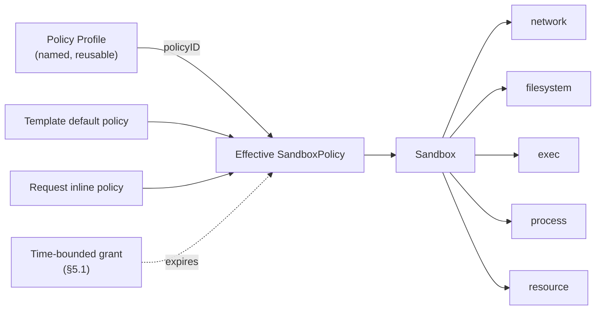

# Proposal 0001: Sandbox Security Policy — Overview

| | |
| --- | --- |
| **Status** | Draft — under community discussion |
| **Proposal** | 0001 (document set) |
| **Authors** | _(add yourself when you pick up a section)_ |
| **Created** | 2026-08 |
| **Discussion** | GitHub Issue: _**not yet opened — Phase 0 blocker.** Until the tracking issue exists, review comments have nowhere durable to live._ |
| **Source of truth** | The English documents under `specs/0001-sandbox-security-policy/en/` are normative. The `zh/` set is a translation that MAY lag; on any discrepancy the English text governs. |

The key words **MUST**, **MUST NOT**, **SHOULD**, and **MAY** are to be interpreted as described in RFC 2119.

---

## 1. Summary

Every cloud ECS instance ships with a security group: a declarative, reusable definition of *what the machine may talk to*. This proposal introduces the equivalent — and necessary superset — for CubeSandbox: a unified, declarative **Sandbox Security Policy** that defines the complete capability boundary of a single sandbox across five modules:

| Module | Spec |
| --- | --- |
| **Network** — what the sandbox may reach, and what may reach it | [network.md](./network.md) |
| **Filesystem** — which paths inside and outside the sandbox may be read, written, or executed | [filesystem.md](./filesystem.md) |
| **Exec** — which commands may run, as which user, for how long, and how many at once | [exec.md](./exec.md) |
| **Process** — what an already-running process may do: privilege gain, persistence, and system calls | [process.md](./process.md) |
| **Resource** — steady-state quotas, windowed limits (minute–month + lifetime), and LLM token accounting | [resource.md](./resource.md) |

A sandbox is not merely a network endpoint like an ECS instance. It is an **execution environment running partially trusted, agent-generated code**. Its "security group" must therefore govern not only network reachability, but also what that code can touch on disk, what it can execute, and how much it can consume — otherwise the boundary is incomplete.

## 2. Motivation

A security group works because it is:

- **Declarative** — users state intent ("allow 443 to this CIDR"), not mechanism.
- **Default-on** — every instance gets one, with a sane baseline.
- **Reusable** — one group binds many instances; changes propagate to all of them.
- **Uniform** — one grammar, one evaluation order, one audit story.

Sandboxes need exactly these properties, extended to the execution domain:

| ECS instance | Sandbox |
| --- | --- |
| Runs human-authored, trusted workloads | Runs agent-generated, partially trusted code |
| Boundary = network reachability | Boundary = network **+ filesystem + exec + process + resource** |
| Blast radius: data exfiltration | Blast radius: exfiltration **+ credential theft, host-mount abuse, privilege escalation, runaway loops, token burn** |

### 2.1 Gap analysis

The five modules are at very different levels of maturity today:

| Module | What exists today | Gap |
| --- | --- | --- |
| Network | Egress allow/deny at L3/L4, domain allow-listing with DNS learning, L7 HTTP/HTTPS rules with audit and header injection, public-ingress gating. | Fields are scattered across the create request; ingress is a single switch; no reusable policy object; no unified merge semantics across modules. |
| Filesystem | Host-mount prefix allowlist and per-mount `readOnly`. | No protection for sensitive paths *inside* the sandbox (`~/.ssh`, `~/.aws/credentials`, `/etc/shadow`); no path-level read-only/deny policy; the prefix allowlist is not part of the user-facing policy API. |
| Exec | Per-request `timeout`, `user`, `cwd` on command execution. | No sandbox-level policy: no command allowlist/denylist, no user restriction, no concurrency cap, no wall-clock ceiling, no audit trail. |
| Process | Nothing user-facing. Process and PID isolation between sandboxes is a property of the sandbox model (§12), not something a policy can state. | No policy surface at all: privilege gain, persistence, and system-call exposure cannot be constrained declaratively, even though the enforcement mechanisms already exist below the API — [filesystem.md](./filesystem.md) §11 already contemplates "equivalent syscall-level enforcement". |
| Resource | Steady-state CPU/memory quotas; idle timeout with kill/pause. | No windowed limits (minute–month) or lifetime budgets; no bandwidth ceiling; no LLM token metering; no exceed actions, notifications, or human-approval flow. |

### 2.2 Why a unified object

Without a single policy object, every module grows its own config style, merge rules, defaults, and audit format. Users must reason about five half-systems; template authors cannot express "this template's sandboxes are locked down" in one place; and future modules (device access, snapshot permissions, ...) would add a sixth and seventh dialect.

A unified policy gives CubeSandbox:

- One mental model: *"the sandbox may do exactly what its policy says."*
- One merge story (template default + request override), shared by all modules.
- One default security baseline, on by default.
- One place to audit and observe ("why was this denied?").

### 2.3 Defense-in-depth matrix

No single module is a boundary on its own. Each answers a specific threat, and they are only meaningful as layers. This matrix exists so that nobody sizes a threat model against the wrong module.

| Module | Primary threat it answers | Enforcement surface | Does **not** cover |
| --- | --- | --- | --- |
| **Network** | Data exfiltration; reaching internal services and metadata endpoints | Every packet leaving the sandbox, whichever process sent it | What the code does locally; data already leaked through an allowed channel |
| **Filesystem** | In-sandbox credential theft; host-mount abuse | Every filesystem access by **every** process | Secrets already in process memory or passed as env vars |
| **Resource** | Runaway loops, token burn, noisy-neighbour effects | Kernel accounting + outbound HTTP metering, per sandbox | Actions that are harmful but cheap |
| **Process** | Privilege gain, unwanted persistence, and syscall-surface abuse by processes the workload started **itself** | Every process the sandbox runs, at the kernel boundary | What a process may legitimately do within the privileges it was granted |
| **Exec** | Injected or mistaken commands arriving **through the control interface** | Only executions initiated through the sandbox control interface | Processes the workload starts on its own |

The asymmetry in the last row is deliberate and load-bearing:

- `exec` policy is a **control-interface gate**. It is the right tool against instructions that reach the sandbox through the API (a prompt-injected agent step, a compromised orchestrator) and against operator error (unbounded timeouts, wrong user).
- It is **not** a containment boundary for code already running inside the sandbox. A process admitted once by `exec` may `fork`/`exec` anything the image contains without further `exec` evaluation. In the agent-generated-code scenario the first admitted command is typically an interpreter or a build tool, so the *practical* protection surface of an `exec` allowlist is small — see [exec.md](./exec.md) §1 and §3.6.
- Containment for self-started processes comes from `filesystem` (what it may read and write), `network` (where it may send), `process` (what privileges it may gain and which system calls it may issue), and `resource` (how much it may consume). Those four are mandatory-enforcement layers under principle 5 (§6).

`process` is the module that answers the question `exec` explicitly declines: **what may a process do once it is running?** It does not make `exec` redundant, and `exec` does not make it redundant — they enforce at two different points, and only `process` survives contact with an admitted interpreter. See [process.md](./process.md) §1.

Therefore: size a threat model on **network + filesystem + process + resource**, and treat `exec` as hardening — never as the boundary.

### 2.3.1 Out of scope: detection and response

Behavioural detection — internal port scanning, connections to known-malicious destinations, anomalous login locations, zombie or malicious process identification — is **not** in scope for any module in this proposal, and no module MAY grow a field for it.

This is a consequence of principles 1 and 5, not an oversight. A policy field states a boundary that is *decidable at enforcement time*: this path, this destination, this syscall. "Malicious" and "anomalous" are verdicts produced by a detector after observing behaviour over time; expressing them as policy fields would mean shipping fields that cannot be enforced deterministically, which principle 5 forbids and which would quietly turn the whole object into a set of suggestions.

Detection and response is a legitimate and complementary capability. It belongs to a separate subsystem that consumes the audit stream (§4.1.6, §11.3) and acts through the control plane — for example by triggering a policy update, which is then versioned and snapshotted like any other. Where the two meet is the audit stream, not the policy object.

## 3. Document set

This proposal is a set of six documents. This overview defines the shared object model, merge semantics, error model, and compatibility rules that all module specs build on. Each module spec is a standalone, normative specification of one domain.

| Document | Scope |
| --- | --- |
| [overview.md](./overview.md) (this document) | Shared model, merge semantics, principles, tiers, shadow evaluation, time-bounded grants, compatibility, delivery phases |
| [network.md](./network.md) | Egress L3/L4/L7 policy, ingress gating, legacy-field mapping |
| [filesystem.md](./filesystem.md) | Host-mount boundary, in-sandbox path access policy |
| [exec.md](./exec.md) | Command execution policy |
| [process.md](./process.md) | Privilege gain, persistence, and system-call policy for running processes |
| [resource.md](./resource.md) | Quotas, windowed limits (minute–month + lifetime), LLM token accounting, exceed actions, hold & approval, notifications |

## 4. Shared object model



**SandboxPolicy** — a declarative object with a tier and five sub-policies. Every field is optional; an absent sub-policy means "server-side default" (§7), never "unrestricted".

```yaml
policy:
  tier:        baseline | restricted | unrestricted   # default: baseline — see §7.1
  tierVersion: string    # e.g. "tier/1"; default: platform default — see §7.1.7
  auditTier:   baseline | restricted | unrestricted   # optional; shadow-only — see §7.2
  network: { ... }       # see network.md
  filesystem: { ... }    # see filesystem.md
  exec: { ... }          # see exec.md
  process: { ... }       # see process.md
  resource: { ... }      # see resource.md
```

**Policy Profile** — a named `SandboxPolicy` stored server-side. Sandboxes reference it by `policyID` or inline a policy at create time. This is the security-group reuse mechanism: update the profile, and every sandbox created afterwards — and, where the module supports it, already-running sandboxes — picks up the change.

```
POST   /policies            create/update a named profile
GET    /policies            list profiles
GET    /policies/{id}       inspect a profile (with resolved defaults)
DELETE /policies/{id}       delete (refusing while sandboxes reference it)
```

### 4.1 Policy identity and versioning

An effective policy is not only computed, it is **identifiable**. Compliance review asks "which policy was this sandbox actually running at 14:03 yesterday?", and that question MUST be answerable from stored records, without re-running merge logic against sources that have since changed.

1. Every effective policy carries an `effectivePolicyVersion`: an integer starting at 1 for the sandbox, incremented on every change to that sandbox's effective policy — including hot updates and changes picked up from a profile.
2. Every effective policy carries `policySources`: the identity and revision of each contributing source — `{template, templateRevision, policyID, policyRevision, inline}`.
3. Policy Profiles are **revisioned**. `POST /policies` against an existing name creates a new immutable revision; it MUST NOT mutate an existing one in place. A revision MUST be retained while any snapshot or audit record references it, even after the profile is deleted.
4. Every change to a sandbox's effective policy MUST produce an immutable **snapshot** holding the fully resolved policy, its version, its sources, and the timestamp and principal that caused the change.
5. Snapshots MUST be retrievable for the sandbox's whole lifetime, and for a deployment-configured retention period after termination.
6. Every denial audit event, in every module, MUST carry the `effectivePolicyVersion` in force at the moment of the denial, so a denial can be joined to the exact policy text that produced it.

```
GET /sandboxes/{id}/policy                  current effective policy + version + sources
GET /sandboxes/{id}/policy/history          snapshot list (version, at, principal, sources)
GET /sandboxes/{id}/policy/history/{ver}    one immutable snapshot
GET /policies/{id}/revisions                profile revision list
GET /policies/{id}/revisions/{rev}          one immutable profile revision
```

This is what makes profile reuse auditable: "already-running sandboxes pick up the change, where the module supports it" is observable precisely because each pickup is a new version with a snapshot. A module that cannot hot-update says so in its own spec; it MUST NOT silently diverge from the version it reports.

## 5. Shared merge semantics

When more than one policy source is present, the effective policy is computed once, at create time, by the following rules. Module specs define per-field refinements.

| Aspect | Rule |
| --- | --- |
| Source precedence | Inline request policy > referenced profile > template default. |
| `tier` | The most restrictive tier wins: `restricted` > `baseline` > `unrestricted` (§7.1). |
| `tierVersion` | The latest pinned version wins. Since a new tier version may only tighten what a tier expands to (§7.1.7), latest is also most restrictive. |
| `auditTier` | The most restrictive `auditTier` wins, and it is evaluated against the merged `tier` (§7.2). A shadow evaluation observes more; it never enforces, so widening it cannot widen the boundary. |
| Scalar fields | Explicit higher-precedence value overrides lower; absent keeps the lower value. |
| List fields (`allowOut`, `denyPaths`, ...) | Higher-precedence entries are appended to lower-precedence entries, then deduplicated. |
| Rule lists (`rules`, exec command rules) | Higher-precedence rules sort **before** lower-precedence rules; evaluation is first-match-wins. |
| Mode fields (`exec.mode`, `filesystem.mode`, `process.mode`, `process.syscall.mode`) | The most restrictive mode wins. |
| Violation actions (`onViolation`, `onExceeded`) | The most severe action wins (§8.1.7, [resource.md](./resource.md) §10). |
| **Narrow-only restrictions** | A restriction contributed by a lower-precedence source MUST NOT be removable, overridable, or punched through by a higher-precedence source. Higher precedence may narrow the boundary; it may never widen it. Module specs name the fields this governs — network binding denies and `allowInternetAccess`, `exec.allowedUsers`, `filesystem.mounts.allowedHostPrefixes` and `filesystem.baselineExceptions`, `process.noNewPrivileges` and `process.allowedCapabilities`, `resource.limits`. The single, bounded exception is a time-bounded grant (§5.1). |

Where a higher-precedence source asks for something the narrow-only rule forbids, the module spec MUST specify one of two outcomes and never a silent third: reject the request (`400`, for a direct contradiction such as flipping a boolean), or accept the request and report the ineffective part in a `policyWarnings` array on the response (for an entry that is merely shadowed).

### 5.1 Time-bounded grants

A policy computed once at create time cannot express "authorize this for the duration of one task, then reclaim it". Expressing that need by editing the policy is what produces permission sprawl: the widened policy stays in force because nobody remembers to narrow it again, and the sandbox keeps a capability it needed for ten minutes for the rest of its life.

A **grant** is therefore a first-class object: a named, time-bounded, additive relaxation of a sandbox's effective policy, issued through the control plane.

A grant is the *only* exception to narrow-only (§5), so it is fenced on all four sides. Every one of the following is normative, and a grant mechanism missing any of them is a privilege-escalation path rather than a feature.

1. **Authorized issuance.** A grant MUST be issued by an authenticated principal authorized to manage the sandbox. It MUST NOT be issuable from inside the sandbox and MUST NOT accept sandbox-scoped credentials — the same condition as the resource approval API ([resource.md](./resource.md) §7.4). Untrusted agent code MUST NOT be able to widen its own boundary.
2. **Mandatory expiry.** Every grant MUST carry a TTL, bounded by a deployment-configured maximum. A grant without a TTL, or with a TTL above the maximum, MUST be rejected with `400 POLICY_GRANT_INVALID`. There are no indefinite grants.
   - Expiry MUST be enforced by the platform. On expiry the grant is removed and the effective policy returns to its pre-grant value **automatically**. Expiry MUST NOT depend on the task, the agent, the orchestrator, or the sandbox reporting completion — a reclamation that relies on the party being constrained to announce it is not a reclamation.
   - Early revocation MUST be possible at any time, for any active grant.
3. **The grant ceiling.** A grant MUST NOT widen the boundary beyond what the **outer boundary** permits. The outer boundary is the set of restrictions contributed by the `template` and `profile` sources — the same provenance distinction that makes a network deny binding ([network.md](./network.md) §4.6).

   | A grant may reopen | A grant may NOT reopen |
   | --- | --- |
   | Something the tier default (§7.1) narrowed | Anything a template restriction closed |
   | Something the request-level inline policy narrowed | Anything a profile restriction closed |
   | | Anything unconditionally denied by a module (e.g. network built-in private-CIDR denies) |

   An attempt to exceed the ceiling MUST be rejected with `400 POLICY_GRANT_EXCEEDS_CEILING`, carrying the restriction and its source. Without this rule an administrator's boundary is merely a suggestion to anyone who can issue grants, and §5 becomes advisory.
4. **Explicit target.** A grant MUST name exactly what it widens: module, field, and entries. Wildcard grants, "unrestricted for 10 minutes", and tier downgrades MUST be rejected. A grant is a hole of known shape, or it is not a grant.
5. **Fully versioned.** Issuance, expiry, and revocation each change the effective policy and therefore each MUST produce a new `effectivePolicyVersion` and an immutable snapshot (§4.1.4), and MUST be audited with the issuing principal, the target, the TTL, and the reason. A grant is never invisible, and neither is its expiry.
6. **Exposed while live.** Active grants MUST appear in the effective policy exposed by the API, each with its remaining TTL, so that "why can this sandbox reach X *right now*?" is answerable without correlating logs.
7. **Independent lifetimes.** Grants do not merge. Overlapping grants each expire on their own schedule; the effective relaxation is the union of active grants, and each entry survives exactly until its own grant expires.
8. **Per-module opt-in.** Each module spec MUST name its grantable fields or state that it has none. A module that names none has no grants: absence is not permission.

```
POST   /sandboxes/{id}/grants              issue {module, field, entries, ttlSec, reason}
GET    /sandboxes/{id}/grants              list active grants with remaining TTL
DELETE /sandboxes/{id}/grants/{grantID}    revoke early
```

> **Terminology.** This `grant` — a time-bounded policy relaxation — is not the `grant` field of the resource approval payload ([resource.md](./resource.md) §7.3), which adds an *allowance* to a usage counter. The two are unrelated mechanisms that unfortunately share an English word; whether the resource field should be renamed to `allowance` is open question §11.7.

## 6. Shared principles

1. **Declarative.** The policy states intent. It does not reference mechanisms, components, or configuration paths.
2. **Absent ≠ unrestricted.** An absent sub-policy or field resolves to the server-side default, which is itself a documented, safe value.
3. **Safe by default, explicit opt-out.** Baseline protections are on by default; opting out is a positive, visible act (e.g. `mode: unrestricted`), never a side effect of omission.
4. **Denials are explainable.** Every denial carries the reason (matched rule, resource dimension, exceeded limit) in a structured form so that callers and agents can react programmatically.
5. **Enforcement is mandatory, not advisory.** Every rule in the module specs is enforced at a point the sandbox workload cannot bypass. Where a rule cannot be enforced mandatorily, the spec says so explicitly instead of pretending.
6. **One representation downstream.** Regardless of how a policy was expressed (legacy fields, inline policy, profile), the effective policy is computed once and exposed as one object.

## 7. Shared defaults

Defaults follow the "safe by default" principle. Which set of defaults applies is selected by `policy.tier` (§7.1); the table below is the `baseline` tier, which is the default. Exact values are normative in each module spec.

| Module | Default baseline | Opt-out |
| --- | --- | --- |
| Network | Today's behavior: internet egress allowed, with built-in private-CIDR denies. | `allowInternetAccess: false`. |
| Filesystem | Sensitive credential paths denied — versioned baseline set `baseline/1` (`~/.ssh`, `~/.aws`, `~/.gnupg`, `/etc/shadow`, ...). | `mode: unrestricted` for all of it, or `baselineExceptions` for named paths. |
| Exec | `unrestricted` mode with a wall-clock timeout ceiling. | Allowlist mode. |
| Process | Escape-adjacent system calls denied — versioned syscall baseline set `syscall/1`. Privilege gain and backgrounding are permitted, because both are common in legitimate images. | `mode: unrestricted`. |
| Resource | Quota defaults from template; no windowed limits. | Explicit limits. |

### 7.1 Policy tiers

Operators asked the same question for every module: *"just give me a locked-down sandbox."* Answering it per module means five independent decisions and five chances to forget one. `policy.tier` answers it once.

```yaml
policy:
  tier: baseline | restricted | unrestricted   # default: baseline
```

The tier is a **default selector and nothing more**. This restraint is what keeps it from becoming a sixth policy dialect:

1. A tier MUST NOT introduce enforcement semantics of its own. Every effect of a tier MUST be expressible as default values of module fields, and MUST appear as those expanded field values in the resolved effective policy.
2. **Expansion happens before merge.** A tier expands to module field defaults, and those defaults inherit the **provenance of the source that set the tier** (§4.6 of [network.md](./network.md) for the provenance model). A `restricted` tier set by a template therefore contributes template-provenance restrictions, and narrow-only (§5) protects them exactly as it protects an explicitly written template field.
3. **An explicit field beats the tier default of the same source.** A source that sets `tier: restricted` and also writes `exec.maxTimeoutSec: 600` gets 600. The tier fills gaps; it does not overwrite intent.
4. `tier: unrestricted` MUST be explicit and MUST be recorded as such in the effective policy. It never arises from omission (principle 3).
5. The resolved effective policy MUST record both the resolved tier **and** the fully expanded field values. Reading a snapshot from six months ago MUST NOT require knowing what `restricted` expanded to on that date.
6. Changing what a tier expands to is an announced platform change with a deprecation window, on the same terms as rolling the default filesystem baseline version ([filesystem.md](./filesystem.md) §6.2.4). It MUST NOT silently alter already-running sandboxes; a tier redefinition reaches a running sandbox only through a policy update, which produces a new `effectivePolicyVersion`.
7. **Tier expansions are versioned and pinnable.** Rule 6 tells an operator that a redefinition will be announced; it does not let them decline one. `tierVersion` does, on exactly the terms the module baseline sets already use ([filesystem.md](./filesystem.md) §6.2, [process.md](./process.md) §4.3):
   - A published tier version (`tier/1`, ...) is **immutable**. The expansion table below is `tier/1`.
   - A new version MAY only **tighten** what a tier expands to. Loosening an expansion weakens every policy resolving to that version and MUST go through an announced deprecation cycle.
   - `tierVersion` pins the set. An unpinned policy resolves to the platform default version, and the effective policy MUST record the **resolved** version either way, so it appears in the snapshot (§4.1).
   - An unknown `tierVersion` MUST be rejected with `400 INVALID_POLICY`.
   - Setting `tierVersion` without setting `tier` is valid: it pins the expansion of the default tier.

Expansion, as published in `tier/1`:

| Module | `tier: baseline` | `tier: restricted` |
| --- | --- | --- |
| Network | `allowInternetAccess: true`, built-in private-CIDR denies | `allowInternetAccess: false` (deny-all egress; only explicit `allowOut`, port/protocol rules, and L7 destinations pass), `ingress.allowPublicTraffic: false` |
| Filesystem | `mode: baseline`, `baseline/1` | `mode: baseline`, `mounts.defaultReadOnly: true` |
| Exec | `mode: unrestricted`, `maxTimeoutSec: 3600` | `mode: unrestricted`, `maxTimeoutSec: 3600`, `audit: metadata` |
| Process | `mode: baseline`, `syscall.mode: baseline` | `mode: baseline`, `syscall.mode: baseline`, `noNewPrivileges: true`, `runAsNonRoot: true`, `allowDaemonize: false`, `audit: metadata` |
| Resource | template quotas, no windowed limits | template quotas, `onExceeded: hold` |

`tier: unrestricted` expands to each module's documented opt-out — `network.allowInternetAccess: true` with no added denies beyond the built-ins (which no tier can lift), `filesystem.mode: unrestricted`, `exec.mode: unrestricted`, `process.mode: unrestricted`. It is the tier for trusted, human-authored workloads, and every use of it is visible in the effective policy and its snapshot.

Two consequences worth stating plainly rather than discovering later:

- **`restricted` does not narrow `exec.mode`, and that is deliberate.** `allowlist` requires a non-empty `allowedCommands` ([exec.md](./exec.md) §5), so a tier that selected it would make `tier: restricted` alone fail validation — the one-field promise broken by the one field. The deeper reason is that it would buy nothing: `exec` is a control-interface gate, not a containment boundary, and an allowlist admitting an interpreter bounds almost nothing ([exec.md](./exec.md) §3.6). What `restricted` actually restricts lives in `network`, `filesystem`, and `process`, which enforce below the control interface. The tier turns on `exec` auditing, because that is the part it can supply without inventing the caller's command list. The same restraint applies wherever a tier would have to guess a workload-specific value: `filesystem.writableRoots` ([filesystem.md](./filesystem.md) §6.5) and every `resource` budget ([resource.md](./resource.md) §6) are left alone for this reason. A tier that guesses is a tier that breaks workloads for a posture it did not improve.
- The tier values `baseline` and `unrestricted` deliberately reuse the words used by `filesystem.mode`, `exec.mode`, and `process.mode`. They live at different levels and do different jobs: the tier is policy-level and only selects defaults, while a module `mode` is a module field and is enforced. Where both are present, rule 3 applies — the explicit module field wins.

### 7.2 Shadow evaluation (`auditTier`)

§7.1 gives an operator a locked-down sandbox in one field. It does not tell them **whether turning it on will break the fleet**, and that is the question that actually blocks adoption. Three of the protections in this proposal — the `baseline/1` credential paths, the `syscall/1` deny set, and everything `tier: restricted` expands to — can break a workload at a point far from the policy that caused it. An operator with a thousand running sandboxes has no way to find out except by switching and watching what fails.

`auditTier` is that way.

```yaml
policy:
  tier:      baseline      # enforced
  auditTier: restricted    # evaluated in parallel, reported, never enforced
```

1. **A shadow evaluation never changes an outcome.** The enforced boundary is `tier` and the module fields, exactly as if `auditTier` were absent. `auditTier` produces audit events and nothing else — no denial, no `EPERM`, no `policyWarnings` entry that alters a request, no counter, no hold.
2. **It MUST be stricter than what is enforced.** An `auditTier` equal to or looser than the resolved `tier` MUST be rejected with `400 INVALID_POLICY`. A shadow that reports what a *looser* policy would have allowed answers a question nobody asked, and a shadow equal to the enforced tier is dead configuration that reads as protection.
3. **Shadow events MUST be distinguishable from real denials**, in the same stream and by a field, not by inference. Every event carries `shadow: true`, the resolved `auditTier`, and the expanded field value that produced it, alongside the `effectivePolicyVersion` every denial event already carries (§4.1.6). An operator who cannot tell "this was blocked" from "this would have been blocked" has a worse audit stream than one with no shadow at all.
4. **It MUST NOT be observable from inside the sandbox.** A shadow evaluation is not a side channel: the workload MUST NOT be able to detect which operations would have been denied, whether by error codes, timing, or event visibility. Otherwise a policy meant for the operator becomes an oracle for the code being constrained.
5. **Per-module opt-in, stated either way.** Each module spec MUST state whether it supports shadow evaluation, and for which of its fields. A module that cannot evaluate a second, stricter rule set says so; it MUST NOT silently ignore an `auditTier` that names it. Absence of a statement is a spec defect, not a permission.
6. **Recorded like any other policy field.** The resolved `auditTier`, its `tierVersion`, and its fully expanded values MUST appear in the effective policy and in every snapshot (§4.1.4), for the same reason the enforced expansion does: a shadow report from six months ago is unreadable without knowing what it was shadowing.
7. **Volume is a real cost.** A workload that trips a shadow rule usually trips it in a loop. Implementations **SHOULD** aggregate identical shadow findings rather than emitting one event per occurrence, on the same terms as syscall denial aggregation ([process.md](./process.md) §6). A shadow mode that floods the audit stream will be turned off, which defeats it.

The intended workflow is the reason this field exists, so it is worth stating outright: run `tier: baseline` with `auditTier: restricted`, read the shadow findings, fix or exempt what they name, then promote `tier` to `restricted` and drop `auditTier`. The shadow report is also what makes the stricter fourth tier contemplated in §11.4 introducible at all — a tier nobody can evaluate before adopting is a tier nobody adopts.

Shadow evaluation is deliberately **not** a general dry-run of an arbitrary policy. It shadows a *tier*, because a tier is a single value with a published expansion, which is what keeps the feature from becoming a second policy object with its own merge semantics. Simulating an arbitrary candidate policy is a different feature, recorded as §11.12.

## 8. Shared error model

- All policy errors use the `POLICY_` prefix: `POLICY_NETWORK_*`, `POLICY_FS_*`, `POLICY_EXEC_*`, `POLICY_PROCESS_*`, `POLICY_RESOURCE_*`, `POLICY_GRANT_*`.
- Policy **configuration** errors (invalid, conflicting, over-limit) are reported at create/update time as HTTP `400` with code `INVALID_POLICY` and a machine-readable `field` pointer.
- Policy **enforcement** errors are reported to the operation that was denied, as structured errors carrying the matched rule name or exhausted dimension. Exceptions: filesystem and process enforcement surface as standard OS error codes (`EACCES`/`EROFS`, `EPERM`) because they apply below the API layer.
- Every module defines its error codes and their payloads in its spec.

### 8.1 Violation response model

§8 says how a denial is *reported*. It does not say what the platform *does* about it, and until now each module answered that separately: `process` had a configurable `syscall.onViolation`, `resource` had `onExceeded`, and `network`, `filesystem`, and the rest of `process` had a hard-coded outcome with no field at all. This section is the shared model.

#### 8.1.1 Two kinds of event, deliberately not merged

| | Meaning | Field | Actions |
| --- | --- | --- | --- |
| **Violation** | The workload crossed a boundary it was told not to cross. | `onViolation` | `deny`, `kill` |
| **Exceedance** | The workload stayed inside its boundaries and ran out of budget. | `onExceeded` ([resource.md](./resource.md) §6) | `warn`, `pause`, `hold`, `kill` |

These stay two words with two action sets, and the reason is not history. A violation is a statement about intent — nothing legitimate needed that path, that destination, that syscall — so the only sensible responses are refusing it and ending the process that asked. An exceedance says nothing about intent; a workload that used its whole token budget did exactly what it was permitted to do, just more of it. That is why `hold` (suspend and ask a human) makes sense for one and not the other: there is something for a human to decide about "needs more budget", and nothing to decide about "tried to read `/etc/shadow`".

#### 8.1.2 There is no `warn` for violations, and that is the important part

`onViolation` MUST NOT accept a `warn`-style action — detect, report, and allow. Such an action is a switch that turns a protection off while leaving it configured, which is the single most misleading state a security policy can be in.

The capability people reach for `warn` to get already exists and is strictly better: shadow evaluation (§7.2). The difference is where the observation happens.

| | What is enforced | What is observed |
| --- | --- | --- |
| A hypothetical `onViolation: warn` | **Nothing** — the rule is off | The rule that is off |
| `auditTier` (§7.2) | The current tier, fully | A **stricter** tier, in parallel |

Shadow evaluation lowers no protection; `warn` lowers exactly the protection it names. An operator who wants "tell me what this rule would block, without blocking it" wants a shadow of a stricter tier, not a disabled rule reported as if it were active. This is recorded here rather than in each module because the question — "resource has `warn`, why don't we?" — will be asked of every module, and the answer is the same one every time.

#### 8.1.3 What `kill` terminates is not uniform

`kill` ends something, but *what* it ends depends on where the module enforces, and the difference is load-bearing rather than incidental:

| Module | `deny` surfaces as | `kill` terminates | Why that granularity |
| --- | --- | --- | --- |
| **network** | Connection failure (TCP reset / drop) | The **sandbox** | L3/L4 enforcement sees packets, not process identity. Attributing a connection to a process is unreliable at that layer, and a best-effort attribution would kill the wrong process — worse than not killing at all. |
| **filesystem** | `EACCES` / `EROFS` | The offending **process** | Enforcement sits on the syscall/VFS path, which knows its caller exactly. |
| **process** | `EPERM` / OS-level failure | The offending **process** | Same. |
| **exec** | `POLICY_EXEC_DENIED` (`400`) | *not applicable* — see §8.1.6 | |
| **resource** | *not applicable* — `onExceeded` instead | The sandbox | Consumption is a sandbox-level quantity; there is no single guilty process. |

The asymmetry in the first row MUST be stated in `network`'s own spec rather than left to a reader of this table: `onViolation: kill` is a blunter instrument there than anywhere else, and a deployment that sets it should know it is choosing "one bad connection ends the sandbox".

#### 8.1.4 Violations are always audited

A violation event MUST be emitted regardless of a module's `audit` field. A module's `audit` level governs the recording of **ordinary operations**; it MUST NOT be able to suppress the record of a denial.

This is a change in the reading of `audit: none`, and it is deliberate. Under the previous reading, a `baseline`-tier sandbox — the default — would refuse a read of `~/.aws/credentials` and leave **no trace of it anywhere**. That cannot be squared with principle 4: a denial that is explainable in principle and invisible in practice is not explainable. The audit level decides how much is recorded about what the workload did; it does not decide whether the platform admits to having stopped it.

Every violation event MUST carry: the module, the matched rule or field, the action taken (`denied` or `killed`), the `effectivePolicyVersion` in force (§4.1.6), and `shadow: false` — the last so that real violations and shadow findings (§7.2.3) share one schema and are told apart by a field rather than by which stream they arrived on.

#### 8.1.5 The side channel `kill` opens, and why it is accepted

Every module forbids leaking rule identity to the workload through the error channel ([process.md](./process.md) §4.5.5, [filesystem.md](./filesystem.md) §8). `kill` does not violate that rule — a terminated process learns nothing — but it does move the signal: a *sibling* process can observe that its peer disappeared and infer where the boundary is.

This is accepted rather than solved, for two reasons. The inference costs the workload one process per probe, which makes mapping a policy expensive and noisy in the audit stream. And `deny` is the default everywhere, so a deployment only takes this trade when it has decided that a process which crossed the line should not continue.

#### 8.1.6 Modules that have no `onViolation`, and why

Per the same rule as grantable fields (§5.1.8) and shadow support (§7.2.5), a module states its position either way; silence is a spec defect.

- **`exec`** has no `onViolation`. Its enforcement point is the control interface, so a violation is caught *before* the process exists: there is nothing to kill, and the denial is already a structured `400` to the caller rather than something the sandbox experiences. `deny` is the only coherent action, so it is not a field.
- **`resource`** has no `onViolation`. It has `onExceeded` instead, per §8.1.1, and adding both would put two fields on one module for two things a reader would reasonably expect to be one.

#### 8.1.7 Merge and tier

- `onViolation` merges as **most severe wins**: `kill` > `deny`, from any source. This is the existing rule for `syscall.onViolation` ([process.md](./process.md) §7), applied uniformly.
- **No tier changes `onViolation`.** Both `baseline` and `restricted` resolve to `deny`. This is the §7.1 restraint applied honestly: `deny` versus `kill` is not a question of how strict a deployment wants to be, it is a question of whether a process that crossed the line should be allowed to keep running — and only the deployment knows whether its workload can survive that. Unlike `restricted`'s other expansions, the failure here is neither immediate nor legible: a killed process surfaces as a partial result or a hung task, far from the policy that caused it. `resource`'s `onExceeded: hold` is a tier default precisely because `hold` is safe and reversible; `kill` is neither.

## 9. Compatibility

- **E2B parity:** the E2B-compatible surface (`allow_internet_access`, `network{}`) is untouched. Requests without `policy` behave exactly as today; internally they are normalized to the default policy, which becomes the single representation downstream (principle 6).
- **Conflict policy:** a request that supplies *both* a legacy field and the corresponding `policy.*` sub-policy MUST be rejected with `400 POLICY_NETWORK_CONFLICT` (or the module-specific conflict code) rather than silently guessing precedence.
- **Templates:** existing templates gain a default policy equivalent to their current behavior. Zero behavior change.
- **Tiers:** an absent `tier` resolves to `baseline`, whose expansion is today's behavior for `network`, `exec`, and `resource`. `filesystem` and `process` baselines additionally deny things no compatible workload should depend on — credential paths and escape-adjacent system calls. Those two are the deliberate, documented exceptions to "zero behavior change", and both are versioned sets (`baseline/1`, `syscall/1`) so the exception is inspectable and pinnable rather than rolling.
- **Tier versions:** an absent `tierVersion` resolves to the platform default, recorded in the effective policy. Since a new tier version may only tighten (§7.1.7), pinning is how a deployment declines a future tightening — not how it obtains today's behavior, which it already has.
- **Shadow evaluation:** an absent `auditTier` means no shadow evaluation and no shadow events. When present it changes no outcome by construction (§7.2.1), so it is compatible by definition. It is also the supported way to de-risk the two exceptions above: shadow the stricter tier, read what it would have denied, then adopt it.
- **Violation actions:** an absent `onViolation` resolves to `deny` in every module, which is each module's existing hard-coded behavior. No workload changes. The one visible change is §8.1.4: denials now produce audit events even at `audit: none`. That adds events to the audit stream where there were none — a new output, not a new denial — and no sandbox behaves differently because of it.
- **SDKs:** minor versions add a `policy=` parameter and typed policy errors; existing signatures are unchanged.
- **Migration:** a mapping from every legacy field to its policy location is defined in [network.md](./network.md) §8.

## 10. Delivery phases

Each phase is independently valuable and shippable.

| Phase | Scope |
| --- | --- |
| **0** | This proposal set reviewed in a tracking issue; open questions triaged into decisions. |
| **1** | `SandboxPolicy` API model; legacy-field normalization; `policy.network` end-to-end; conflict detection; effective-policy versioning and snapshots (§4.1); the violation response model and its always-on violation events (§8.1); SDK `policy=`. |
| **2** | Resource: quota merge, windowed limits (`minute`–`month` + `lifetime`), `onExceeded` actions (`warn`/`pause`/`hold`/`kill`), notifications and webhook, hold approval API, usage exposure. |
| **3** | Filesystem: baseline sensitive-path protection, `readOnlyPaths` / `denyPaths` / `writableRoots`, host-mount policy surface. |
| **4** | Exec: modes, user restriction, timeout ceiling, concurrency, audit, typed denials. |
| **5** | Policy Profiles (`/policies`), profile revisions, `policyID` binding, hot updates where supported, LLM token accounting. |
| **6** | Policy tiers (`policy.tier`): `baseline` / `restricted` / `unrestricted` expansion, provenance inheritance, versioned expansions (`tierVersion`, §7.1.7), tier recorded in effective policy and snapshots. Shadow evaluation (`policy.auditTier`, §7.2): the field, its validation, the `shadow: true` event schema, and support in every module already shipped by this point. |
| **7** | Process: `noNewPrivileges`, `runAsNonRoot`, `allowDaemonize`, capability restriction, versioned syscall baseline set, `allowlist`/`denylist` syscall modes, typed denials, and this module's shadow support. |
| **8** | Time-bounded grants (§5.1): grant API, ceiling enforcement, platform-side expiry, per-module grantable fields, grant events in the audit stream. |

One ordering tension is worth naming rather than discovering during rollout: shadow evaluation exists to de-risk the filesystem baseline (phase 3) and the syscall baseline (phase 7), but the field itself cannot land before tiers (phase 6). Phase 3 therefore ships its baseline without a shadow path, which is tolerable only because `baseline/1` is pinnable and escapable per path from the start ([filesystem.md](./filesystem.md) §6.3). A deployment that would rather not take even that risk should sequence 6 before 3; the phases are independently shippable precisely so that this is a choice.

## 11. Cross-cutting open questions

1. **Profile scope and authority over policy content.** Cluster-global, per-namespace, or per-template? Who may create profiles? Two adjacent questions belong here rather than in separate entries, because all three are about authority rather than mechanism: (a) should a deployment be able to constrain what a policy may *say* — "no template in this namespace may set `tier: unrestricted`", the role Kubernetes gives admission constraints — which is a different axis from the merge rules in §5, since narrow-only governs how sources combine, not what any single source is allowed to write; and (b) should quotas and limits be expressible in aggregate across a tenant's sandboxes, rather than only per sandbox as [resource.md](./resource.md) defines them today.
2. **Hot updates.** Which modules support `PATCH /sandboxes/{id}/policy` at runtime, and what are the semantics for already-running processes and connections? Identity, versioning and snapshot semantics are settled (§4.1); what remains open is per-module runtime re-application. Note that grant issuance and expiry are themselves policy changes (§5.1.5): a module that cannot re-apply policy at runtime cannot accept grants, and MUST say so.
3. **Audit unification.** Should denials across all modules share one event schema and sink, so operators get a single audit stream? (Whatever the answer, every denial event carries `effectivePolicyVersion` per §4.1.6.) This is also the interface the out-of-scope detection subsystem consumes (§2.3.1), which raises the bar on getting it uniform. §8.1.4 settles part of this — violation events are mandatory and carry a fixed minimum payload — but the sink, the transport, and whether all five modules use literally one schema remain open.
4. **Tier extensibility.** The graded-levels question formerly open here is settled by §7.1. What remains: may a deployment define additional named tiers, or is the three-value set closed? A deployment-defined tier would need its own versioning and announcement story (§7.1.6), and now also its own published expansion version (§7.1.7). A concrete candidate is a tier stricter than `restricted` that *does* require an `exec` allowlist and named `filesystem.writableRoots` — the values §7.1 refuses to guess. Such a tier is only coherent if it is legitimate for a tier to be unusable without accompanying fields, which is the question to answer first. §7.2 removes the second obstacle it faced: an operator can now shadow such a tier before adopting it, so the objection "nobody can tell whether it would break them" no longer stands on its own.
5. **Snapshot interaction.** When a sandbox is cloned or restored from a snapshot, which parts of the effective policy and of the accumulated usage travel with it? Active grants included: dropping them is the safe answer, since inheriting a grant whose originating task no longer exists is a silent widening.
6. **Grant authority.** Which principals may issue grants — sandbox owner, namespace operator, both? Should the maximum TTL vary by tier (shorter under `restricted`), and should some fields be permanently non-grantable regardless of the ceiling?
7. **`grant` vs `allowance`.** §5.1 introduces a policy-level `grant`, while [resource.md](./resource.md) §7.3 already uses `grant` for a usage-counter allowance. Should the resource field be renamed to `allowance` before either ships, rather than leaving one word meaning two things?
8. **Task-scoped policy.** Requirements ask for per-agent and per-task policy, but the smallest scope defined here is the sandbox. Is a task a first-class scope with its own effective policy and audit identity, or is per-task authorization exactly what §5.1 grants already provide? If the former, what identifies a task across the control plane?
9. **Reachability vs consumption.** Egress port/protocol rules live in `network`, bandwidth lives in `resource.quota`. Is that seam (what may be reached vs how much may be consumed) the right one, or should a user be able to state "443 to this CIDR, at most 10 Mbit/s" in one place?
10. **Composing profiles.** A sandbox references at most one profile (§4). A cloud security group is composable — an instance carries several, and the effective rule set is their combination — which is how "base lockdown" and "may reach GitHub" stay separate, reusable objects instead of being copied into every profile that needs both. Should a sandbox reference several profiles? The merge rule would have to be stated carefully, because profiles are *peers* with no precedence between them: allow-type lists would union, deny-type lists would union and every one of them would be binding (§4.6 of [network.md](./network.md)), modes and scalars would take the most restrictive value, and the intersection fields (`allowedCapabilities`, `syscall.allowedSyscalls`, `baselineExceptions`) would intersect. Note this is deliberately *not* the security-group rule, which unions allows and has no denies at all; unioning allows across peers here would let a permissive profile widen a strict one, which §5 forbids.
11. **Identity-based egress targets.** Every egress target is an address, a CIDR, or a name that resolves to one (§2.1 of [network.md](./network.md)). A security group can instead name *another security group* as the peer, and a Kubernetes NetworkPolicy can select pods by label — identity-based microsegmentation, which survives address reassignment and expresses "these workloads may talk to each other" without anyone writing a CIDR. The multi-agent case wants exactly this: two sandboxes cooperating on one task. Two obstacles have to be cleared first. There is no sandbox grouping concept to point at, and sandbox-to-sandbox traffic rides on the very ranges §4.2 of [network.md](./network.md) denies unconditionally with "user policy MUST NOT be able to allow these ranges" — so support would require a platform-resolved exception that users cannot hand-write, which is the one place in this proposal where an unconditional deny would gain a hole. Worth doing, not worth doing cheaply.
12. **Simulating a candidate policy.** §7.2 shadows a *tier*, deliberately, because a tier is one value with a published expansion. It does not answer "what would this policy I am about to write do?" — the question a security group's `DryRun` and a reachability analyzer answer. With five modules, tier expansion, provenance, binding denies, shadowing warnings, and grants all composing, an author cannot currently predict the effective result except by creating a sandbox. Should there be a read-only `POST /policies:simulate` returning the fully expanded effective policy, and a `POST /sandboxes/{id}/policy:explain` returning the verdict, matched rule, and contributing source for a hypothetical operation? Both are read-only and change no semantics, which makes this a question of scope rather than of risk.
13. **Escalation on repeated violation.** §8.1 gives each violation an independent verdict: the hundredth attempt to read `~/.aws/credentials` is answered exactly like the first. Repetition is one of the strongest signals available — a legitimate workload does not retry a credential path in a loop — and nothing in the policy object can currently express "after N of these, stop being polite". A field would be shaped roughly as `onRepeatedViolation: {count, withinSec, action}`. Two objections keep it out of v1. A threshold is a value nobody can choose correctly in advance, which is the same trap §7.1 refuses to walk into for `writableRoots` and every `resource` budget; and "this pattern of behaviour is an attack" is a verdict produced by observing behaviour over time, which §2.3.1 places outside every module in this proposal. The consistent position is therefore that the audit stream carries the repetitions and a detection subsystem escalates by updating the policy — versioned and snapshotted like any other change. What has to be decided is whether that indirection is acceptable, or whether repeated-violation escalation is the one behavioural judgement cheap enough and unambiguous enough to belong in the policy object after all.

## 12. Non-normative notes

- The sandbox model (one MicroVM per sandbox, each with its own kernel) is what makes principle 5 achievable at reasonable cost: kernel-level mechanisms can be enabled per sandbox without affecting the host. Module specs intentionally leave the choice of mechanism open.
- That model is also what makes `process` a policy module rather than a wish. A per-sandbox kernel means a per-sandbox system-call surface: it can be narrowed for one tenant without coordinating with any other, and without the host-wide blast radius that makes syscall filtering unattractive on shared kernels. Inter-sandbox process isolation, by contrast, is a *property* of that model and deliberately absent from the policy object — there is no field for it because there is nothing for a user to decide.
- Analogues studied: AWS Security Groups (including their stateful connection tracking and peer-group references), Kubernetes NetworkPolicy, Pod Security Standards and Pod Security Admission (whose `enforce`/`audit`/`warn` triple is what §7.2 adapts), E2B sandbox configuration.
- The shape of §7.2 is a direct lesson from PodSecurityPolicy's replacement: the successor mechanism's most consequential addition was not a new control but the ability to *evaluate a stricter level without enforcing it*, because a security level nobody can rehearse is a security level nobody adopts. This proposal has three protections with exactly that adoption problem, which is why the mechanism is specified alongside the tiers rather than deferred.

## 13. References

- [Egress Network Policy](../../../guide/network-policy.md) — current egress chain
- [Security Proxy](../../../guide/security-proxy.md) — current L7 rule grammar
- [Restrict Public Access](../../../guide/restrict-public-access.md) — current ingress gating
- [Authentication](../../../guide/authentication.md)
