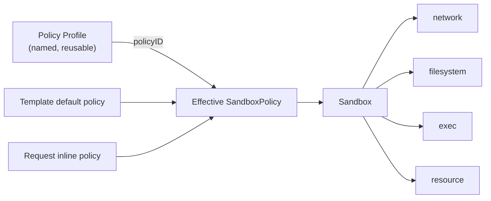

# Proposal 0001: Sandbox Security Policy — Overview

| | |
| --- | --- |
| **Status** | Draft — under community discussion |
| **Proposal** | 0001 (document set) |
| **Authors** | _(add yourself when you pick up a section)_ |
| **Created** | 2026-08 |
| **Discussion** | GitHub Issue: _**not yet opened — Phase 0 blocker.** Until the tracking issue exists, review comments have nowhere durable to live._ |
| **Source of truth** | The English documents under `specs/0001-sandbox-security-policy/en/` are normative. The `zh/` set is a translation that MAY lag; on any discrepancy the English text governs. |

The key words **MUST**, **MUST NOT**, **SHOULD**, and **MAY** are to be interpreted as described in RFC 2119.

---

## 1. Summary

Every cloud ECS instance ships with a security group: a declarative, reusable definition of *what the machine may talk to*. This proposal introduces the equivalent — and necessary superset — for CubeSandbox: a unified, declarative **Sandbox Security Policy** that defines the complete capability boundary of a single sandbox across four modules:

| Module | Spec |
| --- | --- |
| **Network** — what the sandbox may reach, and what may reach it | [network.md](./network.md) |
| **Filesystem** — which paths inside and outside the sandbox may be read, written, or executed | [filesystem.md](./filesystem.md) |
| **Exec** — which commands may run, as which user, for how long, and how many at once | [exec.md](./exec.md) |
| **Resource** — steady-state quotas, windowed limits (minute–month + lifetime), and LLM token accounting | [resource.md](./resource.md) |

A sandbox is not merely a network endpoint like an ECS instance. It is an **execution environment running partially trusted, agent-generated code**. Its "security group" must therefore govern not only network reachability, but also what that code can touch on disk, what it can execute, and how much it can consume — otherwise the boundary is incomplete.

## 2. Motivation

A security group works because it is:

- **Declarative** — users state intent ("allow 443 to this CIDR"), not mechanism.
- **Default-on** — every instance gets one, with a sane baseline.
- **Reusable** — one group binds many instances; changes propagate to all of them.
- **Uniform** — one grammar, one evaluation order, one audit story.

Sandboxes need exactly these properties, extended to the execution domain:

| ECS instance | Sandbox |
| --- | --- |
| Runs human-authored, trusted workloads | Runs agent-generated, partially trusted code |
| Boundary = network reachability | Boundary = network **+ filesystem + exec + resource** |
| Blast radius: data exfiltration | Blast radius: exfiltration **+ credential theft, host-mount abuse, runaway loops, token burn** |

### 2.1 Gap analysis

The four modules are at very different levels of maturity today:

| Module | What exists today | Gap |
| --- | --- | --- |
| Network | Egress allow/deny at L3/L4, domain allow-listing with DNS learning, L7 HTTP/HTTPS rules with audit and header injection, public-ingress gating. | Fields are scattered across the create request; ingress is a single switch; no reusable policy object; no unified merge semantics across modules. |
| Filesystem | Host-mount prefix allowlist and per-mount `readOnly`. | No protection for sensitive paths *inside* the sandbox (`~/.ssh`, `~/.aws/credentials`, `/etc/shadow`); no path-level read-only/deny policy; the prefix allowlist is not part of the user-facing policy API. |
| Exec | Per-request `timeout`, `user`, `cwd` on command execution. | No sandbox-level policy: no command allowlist/denylist, no user restriction, no concurrency cap, no wall-clock ceiling, no audit trail. |
| Resource | Steady-state CPU/memory quotas; idle timeout with kill/pause. | No windowed limits (minute–month) or lifetime budgets; no LLM token metering; no exceed actions, notifications, or human-approval flow. |

### 2.2 Why a unified object

Without a single policy object, every module grows its own config style, merge rules, defaults, and audit format. Users must reason about four half-systems; template authors cannot express "this template's sandboxes are locked down" in one place; and future modules (device access, snapshot permissions, ...) would add a fifth and sixth dialect.

A unified policy gives CubeSandbox:

- One mental model: *"the sandbox may do exactly what its policy says."*
- One merge story (template default + request override), shared by all modules.
- One default security baseline, on by default.
- One place to audit and observe ("why was this denied?").

### 2.3 Defense-in-depth matrix

No single module is a boundary on its own. Each answers a specific threat, and they are only meaningful as layers. This matrix exists so that nobody sizes a threat model against the wrong module.

| Module | Primary threat it answers | Enforcement surface | Does **not** cover |
| --- | --- | --- | --- |
| **Network** | Data exfiltration; reaching internal services and metadata endpoints | Every packet leaving the sandbox, whichever process sent it | What the code does locally; data already leaked through an allowed channel |
| **Filesystem** | In-sandbox credential theft; host-mount abuse | Every filesystem access by **every** process | Secrets already in process memory or passed as env vars |
| **Resource** | Runaway loops, token burn, noisy-neighbour effects | Kernel accounting + outbound HTTP metering, per sandbox | Actions that are harmful but cheap |
| **Exec** | Injected or mistaken commands arriving **through the control interface** | Only executions initiated through the sandbox control interface | Processes the workload starts on its own |

The asymmetry in the last row is deliberate and load-bearing:

- `exec` policy is a **control-interface gate**. It is the right tool against instructions that reach the sandbox through the API (a prompt-injected agent step, a compromised orchestrator) and against operator error (unbounded timeouts, wrong user).
- It is **not** a containment boundary for code already running inside the sandbox. A process admitted once by `exec` may `fork`/`exec` anything the image contains without further `exec` evaluation. In the agent-generated-code scenario the first admitted command is typically an interpreter or a build tool, so the *practical* protection surface of an `exec` allowlist is small — see [exec.md](./exec.md) §1 and §3.6.
- Containment for self-started processes comes from `filesystem` (what it may read and write), `network` (where it may send), and `resource` (how much it may consume). Those three are mandatory-enforcement layers under principle 5 (§6).

Therefore: size a threat model on **network + filesystem + resource**, and treat `exec` as hardening — never as the boundary.

## 3. Document set

This proposal is a set of five documents. This overview defines the shared object model, merge semantics, error model, and compatibility rules that all module specs build on. Each module spec is a standalone, normative specification of one domain.

| Document | Scope |
| --- | --- |
| [overview.md](./overview.md) (this document) | Shared model, merge semantics, principles, compatibility, delivery phases |
| [network.md](./network.md) | Egress L3/L4/L7 policy, ingress gating, legacy-field mapping |
| [filesystem.md](./filesystem.md) | Host-mount boundary, in-sandbox path access policy |
| [exec.md](./exec.md) | Command execution policy |
| [resource.md](./resource.md) | Quotas, windowed limits (minute–month + lifetime), LLM token accounting, exceed actions, hold & approval, notifications |

## 4. Shared object model



**SandboxPolicy** — a declarative object with four sub-policies. Every field is optional; an absent sub-policy means "server-side default" (§7), never "unrestricted".

```yaml
policy:
  network: { ... }       # see network.md
  filesystem: { ... }    # see filesystem.md
  exec: { ... }          # see exec.md
  resource: { ... }        # see resource.md
```

**Policy Profile** — a named `SandboxPolicy` stored server-side. Sandboxes reference it by `policyID` or inline a policy at create time. This is the security-group reuse mechanism: update the profile, and every sandbox created afterwards — and, where the module supports it, already-running sandboxes — picks up the change.

```
POST   /policies            create/update a named profile
GET    /policies            list profiles
GET    /policies/{id}       inspect a profile (with resolved defaults)
DELETE /policies/{id}       delete (refusing while sandboxes reference it)
```

### 4.1 Policy identity and versioning

An effective policy is not only computed, it is **identifiable**. Compliance review asks "which policy was this sandbox actually running at 14:03 yesterday?", and that question MUST be answerable from stored records, without re-running merge logic against sources that have since changed.

1. Every effective policy carries an `effectivePolicyVersion`: an integer starting at 1 for the sandbox, incremented on every change to that sandbox's effective policy — including hot updates and changes picked up from a profile.
2. Every effective policy carries `policySources`: the identity and revision of each contributing source — `{template, templateRevision, policyID, policyRevision, inline}`.
3. Policy Profiles are **revisioned**. `POST /policies` against an existing name creates a new immutable revision; it MUST NOT mutate an existing one in place. A revision MUST be retained while any snapshot or audit record references it, even after the profile is deleted.
4. Every change to a sandbox's effective policy MUST produce an immutable **snapshot** holding the fully resolved policy, its version, its sources, and the timestamp and principal that caused the change.
5. Snapshots MUST be retrievable for the sandbox's whole lifetime, and for a deployment-configured retention period after termination.
6. Every denial audit event, in every module, MUST carry the `effectivePolicyVersion` in force at the moment of the denial, so a denial can be joined to the exact policy text that produced it.

```
GET /sandboxes/{id}/policy                  current effective policy + version + sources
GET /sandboxes/{id}/policy/history          snapshot list (version, at, principal, sources)
GET /sandboxes/{id}/policy/history/{ver}    one immutable snapshot
GET /policies/{id}/revisions                profile revision list
GET /policies/{id}/revisions/{rev}          one immutable profile revision
```

This is what makes profile reuse auditable: "already-running sandboxes pick up the change, where the module supports it" is observable precisely because each pickup is a new version with a snapshot. A module that cannot hot-update says so in its own spec; it MUST NOT silently diverge from the version it reports.

## 5. Shared merge semantics

When more than one policy source is present, the effective policy is computed once, at create time, by the following rules. Module specs define per-field refinements.

| Aspect | Rule |
| --- | --- |
| Source precedence | Inline request policy > referenced profile > template default. |
| Scalar fields | Explicit higher-precedence value overrides lower; absent keeps the lower value. |
| List fields (`allowOut`, `denyPaths`, ...) | Higher-precedence entries are appended to lower-precedence entries, then deduplicated. |
| Rule lists (`rules`, exec command rules) | Higher-precedence rules sort **before** lower-precedence rules; evaluation is first-match-wins. |
| Mode fields (`exec.mode`, `filesystem.mode`) | The most restrictive mode wins. |
| **Narrow-only restrictions** | A restriction contributed by a lower-precedence source MUST NOT be removable, overridable, or punched through by a higher-precedence source. Higher precedence may narrow the boundary; it may never widen it. Module specs name the fields this governs — network binding denies and `allowInternetAccess`, `exec.allowedUsers`, `filesystem.mounts.allowedHostPrefixes` and `filesystem.baselineExceptions`, `resource.limits`. |

Where a higher-precedence source asks for something the narrow-only rule forbids, the module spec MUST specify one of two outcomes and never a silent third: reject the request (`400`, for a direct contradiction such as flipping a boolean), or accept the request and report the ineffective part in a `policyWarnings` array on the response (for an entry that is merely shadowed).

## 6. Shared principles

1. **Declarative.** The policy states intent. It does not reference mechanisms, components, or configuration paths.
2. **Absent ≠ unrestricted.** An absent sub-policy or field resolves to the server-side default, which is itself a documented, safe value.
3. **Safe by default, explicit opt-out.** Baseline protections are on by default; opting out is a positive, visible act (e.g. `mode: unrestricted`), never a side effect of omission.
4. **Denials are explainable.** Every denial carries the reason (matched rule, resource dimension, exceeded limit) in a structured form so that callers and agents can react programmatically.
5. **Enforcement is mandatory, not advisory.** Every rule in the module specs is enforced at a point the sandbox workload cannot bypass. Where a rule cannot be enforced mandatorily, the spec says so explicitly instead of pretending.
6. **One representation downstream.** Regardless of how a policy was expressed (legacy fields, inline policy, profile), the effective policy is computed once and exposed as one object.

## 7. Shared defaults

Defaults follow the "safe by default" principle. Exact values are normative in each module spec.

| Module | Default baseline | Opt-out |
| --- | --- | --- |
| Network | Today's behavior: internet egress allowed, with built-in private-CIDR denies. | `allowInternetAccess: false`. |
| Filesystem | Sensitive credential paths denied — versioned baseline set `baseline/1` (`~/.ssh`, `~/.aws`, `~/.gnupg`, `/etc/shadow`, ...). | `mode: unrestricted` for all of it, or `baselineExceptions` for named paths. |
| Exec | `unrestricted` mode with a wall-clock timeout ceiling. | Allowlist mode. |
| Resource | Quota defaults from template; no windowed limits. | Explicit limits. |

## 8. Shared error model

- All policy errors use the `POLICY_` prefix: `POLICY_NETWORK_*`, `POLICY_FS_*`, `POLICY_EXEC_*`, `POLICY_RESOURCE_*`.
- Policy **configuration** errors (invalid, conflicting, over-limit) are reported at create/update time as HTTP `400` with code `INVALID_POLICY` and a machine-readable `field` pointer.
- Policy **enforcement** errors are reported to the operation that was denied, as structured errors carrying the matched rule name or exhausted dimension. Exceptions: filesystem enforcement surfaces as standard OS error codes (`EACCES`/`EROFS`) because it applies below the API layer.
- Every module defines its error codes and their payloads in its spec.

## 9. Compatibility

- **E2B parity:** the E2B-compatible surface (`allow_internet_access`, `network{}`) is untouched. Requests without `policy` behave exactly as today; internally they are normalized to the default policy, which becomes the single representation downstream (principle 6).
- **Conflict policy:** a request that supplies *both* a legacy field and the corresponding `policy.*` sub-policy MUST be rejected with `400 POLICY_NETWORK_CONFLICT` (or the module-specific conflict code) rather than silently guessing precedence.
- **Templates:** existing templates gain a default policy equivalent to their current behavior. Zero behavior change.
- **SDKs:** minor versions add a `policy=` parameter and typed policy errors; existing signatures are unchanged.
- **Migration:** a mapping from every legacy field to its policy location is defined in [network.md](./network.md) §8.

## 10. Delivery phases

Each phase is independently valuable and shippable.

| Phase | Scope |
| --- | --- |
| **0** | This proposal set reviewed in a tracking issue; open questions triaged into decisions. |
| **1** | `SandboxPolicy` API model; legacy-field normalization; `policy.network` end-to-end; conflict detection; effective-policy versioning and snapshots (§4.1); SDK `policy=`. |
| **2** | Resource: quota merge, windowed limits (`minute`–`month` + `lifetime`), `onExceeded` actions (`warn`/`pause`/`hold`/`kill`), notifications and webhook, hold approval API, usage exposure. |
| **3** | Filesystem: baseline sensitive-path protection, `readOnlyPaths` / `denyPaths` / `writableRoots`, host-mount policy surface. |
| **4** | Exec: modes, user restriction, timeout ceiling, concurrency, audit, typed denials. |
| **5** | Policy Profiles (`/policies`), profile revisions, `policyID` binding, hot updates where supported, LLM token accounting. |

## 11. Cross-cutting open questions

1. **Profile scope.** Cluster-global, per-namespace, or per-template? Who may create profiles?
2. **Hot updates.** Which modules support `PATCH /sandboxes/{id}/policy` at runtime, and what are the semantics for already-running processes and connections? Identity, versioning and snapshot semantics are settled (§4.1); what remains open is per-module runtime re-application.
3. **Audit unification.** Should denials across all modules share one event schema and sink, so operators get a single audit stream? (Whatever the answer, every denial event carries `effectivePolicyVersion` per §4.1.6.)
4. **Baseline levels.** Single default vs graded levels (`baseline` / `restricted` / `unrestricted`) shared by all modules?
5. **Snapshot interaction.** When a sandbox is cloned or restored from a snapshot, which parts of the effective policy and of the accumulated usage travel with it?

## 12. Non-normative notes

- The sandbox model (one MicroVM per sandbox, each with its own kernel) is what makes principle 5 achievable at reasonable cost: kernel-level mechanisms can be enabled per sandbox without affecting the host. Module specs intentionally leave the choice of mechanism open.
- Analogues studied: AWS Security Groups, Kubernetes NetworkPolicy and Pod Security Standards, E2B sandbox configuration.

## 13. References

- [Egress Network Policy](../../../guide/network-policy.md) — current egress chain
- [Security Proxy](../../../guide/security-proxy.md) — current L7 rule grammar
- [Restrict Public Access](../../../guide/restrict-public-access.md) — current ingress gating
- [Authentication](../../../guide/authentication.md)
