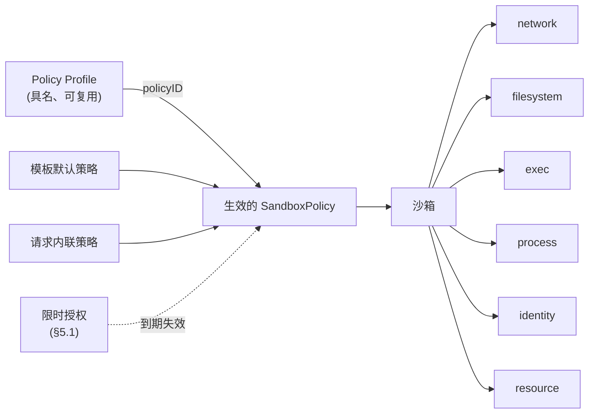

# 提案 0001：沙箱安全策略（Sandbox Security Policy）— 总览

| | |
| --- | --- |
| **状态** | 草案 — 社区讨论中 |
| **提案编号** | 0001（文档集） |
| **作者** | _（认领章节时请在此署名）_ |
| **创建时间** | 2026-08 |
| **讨论入口** | GitHub Issue：_**尚未开启 —— 阶段 0 的阻塞项。** 跟踪 Issue 不存在之前，评审意见无处可以长久沉淀。_ |
| **事实源** | `specs/0001-sandbox-security-policy/en/` 下的英文文档是规范文本。`zh/` 一套是译文，**可能**有滞后；一旦不一致，以英文为准。 |

本文档中的关键词 **必须（MUST）**、**不得（MUST NOT）**、**应该（SHOULD）**、**可以（MAY）** 依据 RFC 2119 解释。

---

## 1. 概述

每一台云上的 ECS 实例默认都带有安全组：一份声明式、可复用的 *"这台机器可以与谁通信"* 的定义。本提案为 CubeSandbox 引入与之对等、且必要的超集 —— 统一的、声明式的 **沙箱安全策略（Sandbox Security Policy）**，在六个模块上定义单个沙箱的完整能力边界：

| 模块 | 规格文档 |
| --- | --- |
| **网络（Network）** — 沙箱可以访问什么、什么可以访问沙箱 | [network.md](./network.md) |
| **文件系统（Filesystem）** — 沙箱内外哪些路径可读、可写、可执行 | [filesystem.md](./filesystem.md) |
| **命令执行（Exec）** — 可以执行哪些命令、以哪个用户身份、最长多久、最多几个并发 | [exec.md](./exec.md) |
| **进程（Process）** — 已在运行的进程可以做什么：提权、持久化、系统调用 | [process.md](./process.md) |
| **身份（Identity）** — 沙箱可以使用哪些凭据，以及它们以何种形式抵达沙箱 | [identity.md](./identity.md) |
| **资源（Resource）** — 请求/磁盘速率上限、按窗口的 Token 预算（分钟–月 + 生命周期）与 Token 计量 | [resource.md](./resource.md) |

沙箱与 ECS 实例不同，它不只是网络端点，而是一个**执行着部分可信、由 Agent 生成的代码的执行环境**。因此它的"安全组"不仅要治理网络可达性，还必须治理这些代码能触碰哪些文件、能执行什么命令、能消耗多少资源 —— 否则边界就是不完整的。

## 2. 动机

安全组之所以好用，是因为它：

- **声明式** — 用户表达意图（"允许 443 端口访问该 CIDR"），而非机制。
- **默认开启** — 每台实例都有，且带合理的基线。
- **可复用** — 一个安全组绑定多台实例，变更对所有实例生效。
- **统一** — 一套语法、一套求值顺序、一套审计口径。

沙箱需要完全相同的属性，并扩展到执行域：

| ECS 实例 | 沙箱 |
| --- | --- |
| 运行人类编写、可信的工作负载 | 运行 Agent 生成的、部分可信的代码 |
| 边界 = 网络可达性 | 边界 = 网络 **+ 文件系统 + 命令执行 + 进程 + 资源** |
| 爆炸半径：数据外泄 | 爆炸半径：外泄 **+ 凭据窃取、宿主挂载滥用、提权、失控循环、Token 烧钱** |

### 2.1 差距分析

六个模块目前的成熟度差异很大：

| 模块 | 现状 | 差距 |
| --- | --- | --- |
| 网络 | 出站 L3/L4 允许/拒绝、域名白名单与 DNS 学习、带审计与头部注入的 L7 HTTP/HTTPS 规则、公开入站门控。 | 字段散落在创建请求各处；入站只有一个开关；没有可复用的策略对象；各模块之间没有统一的合并语义。 |
| 文件系统 | 无面向用户的字段。哪些宿主路径可挂载是部署在本对象之外已经做出的准入决定（[filesystem.md](./filesystem.md) §1）。 | 对沙箱**内部**敏感路径（`~/.ssh`、`~/.aws/credentials`、`/etc/shadow`）零保护；没有任何路径级只读/禁读策略。 |
| 命令执行 | 每请求级 `timeout`、`user`、`cwd`。 | 没有沙箱级策略：没有命令允许/拒绝列表、没有用户限制、没有并发上限、没有总时长上限、没有审计轨迹。 |
| 进程 | 面向用户的能力为零。沙箱之间的进程与 PID 隔离是基质的**属性**（§12.3），不是策略能声明的东西。 | 完全没有策略面：提权、持久化与系统调用暴露面都无法被声明式地约束 —— 尽管强制执行机制早已存在于 API 之下，[filesystem.md](./filesystem.md) §11 已经在设想"等效的系统调用级强制执行"。 |
| 身份 | 什么都没有。凭据以环境变量或文件的形式抵达沙箱，而沙箱内任何代码都能读到它们。 | 没有任何策略面：没有工作负载身份、没有目的地绑定的注入、没有暴露模式、没有 TTL 或吊销。§2.3 的纵深防御矩阵已经承认 `denyPaths` 保护不了已在进程内存里、或经环境变量传入的秘密 —— 而那正是秘密今天所在的地方。 |
| 资源 | 稳态 CPU/内存配额，由普通编排配置设定；空闲超时支持 kill/pause。 | 出站请求与磁盘 I/O 没有速率上限；没有按窗口的 Token 预算（分钟–月）与生命周期预算；没有 Token 计量；没有超限动作、通知与人工审批流程。 |

### 2.2 为什么需要统一对象

如果没有统一的策略对象，每个模块会长出自己的配置风格、合并规则、默认值和审计格式。用户要理解五套半成品系统；模板作者无法在一处表达"这个模板的沙箱是锁死的"；未来新增模块（设备访问、快照权限……）还会引入第六、第七种方言。

统一策略能为 CubeSandbox 带来：

- 统一的心智模型：*"沙箱只能做策略允许的事"*。
- 统一的合并语义（模板默认 + 请求覆盖），被所有模块共享。
- 统一的默认安全基线，默认开启。
- 统一的审计与观测入口（"这个操作为什么被拒绝了？"）。

### 2.3 纵深防御矩阵

没有任何单一模块自身就是一道边界。每个模块应对的是特定威胁，只有作为分层才有意义。本矩阵的存在意义，就是避免任何人把威胁模型挂到错的模块上。

| 模块 | 主要应对的威胁 | 强制执行面 | **不**覆盖 |
| --- | --- | --- | --- |
| **网络** | 数据外泄；触及内部服务与元数据端点 | 离开沙箱的每一个包，无论由哪个进程发出 | 代码在本地做了什么；已经从允许通道流出的数据 |
| **文件系统** | 沙箱内凭据窃取；对沙箱能在磁盘上触及之物（无论是否挂载）的滥用 | **所有**进程的每一次文件系统访问 | 已进入进程内存或以环境变量传入的凭据；以及那些宿主路径当初是否被挂载进来 |
| **资源** | Token 烧钱、吵邻效应 | 基质速率限制器 + 出站 HTTP 计量，按沙箱统计 | 有害但很便宜的行为；不花 Token 的失控循环（[resource.md](./resource.md) §1） |
| **进程** | 工作负载**自行**启动的进程的提权、非预期持久化、系统调用面滥用 | 沙箱运行的每一个进程，在内核边界上 | 进程在已获授权范围内的正当行为 |
| **身份** | 沙箱内代码对长期凭据的窃取与复用 | 沙箱之外的凭据签发与出站代理路径 | 一个工作负载在其作用域内正当使用过的凭据，在该作用域存续期间 |
| **命令执行** | 通过**控制接口**抵达的注入命令或误操作 | 仅限由沙箱控制接口发起的执行 | 工作负载自行启动的进程 |

最后一行的不对称是刻意的，也是承重的：

- `exec` 策略是一道**控制接口门禁**。它适用于应对经 API 抵达沙箱的指令（被提示词注入的 Agent 步骤、被入侵的编排器），以及应对运维失误（无上限的超时、用错身份）。
- 它**不是**已在沙箱内运行的代码的围堵边界。一旦被 `exec` 放行，该进程可以 `fork`/`exec` 镜像里的任何东西，不再经过 `exec` 求值。在 Agent 生成代码的场景里，首个被放行的命令典型就是解释器或构建工具，因此 `exec` 白名单的***实际***防护面很小 —— 见 [exec.md](./exec.md) §1 与 §3.6。
- 针对自启进程的围堵来自 `filesystem`（能读写什么）、`network`（能发往哪里）、`process`（能获得哪些权限、能发起哪些系统调用）与 `resource`（能消耗多少）。这四道在原则 5（§6）下是强制执行层。

`process` 正是回答 `exec` 明确拒答的那个问题的模块：**进程一旦跑起来，它可以做什么？** 它不让 `exec` 变得多余，`exec` 也不让它变得多余 —— 两者在两个不同的点上强制执行，而在遭遇一个被放行的解释器之后，只有 `process` 还活着。见 [process.md](./process.md) §1。

因此：威胁模型应基于 **网络 + 文件系统 + 进程 + 资源** 来定尺寸，而把 `exec` 当作加固手段 —— 绝不当作边界。

### 2.3.1 不在范围内：检测与响应

行为型检测 —— 内网端口扫描、连接已知恶意目标、异常登录地点、僵尸或恶意进程识别 —— **不**在本提案任何模块的范围内，且任何模块都**不可以（MAY NOT）**为此长出字段。

这是原则 1 与原则 5 的推论，不是遗漏。策略字段陈述的是一条*在强制执行时刻可判定*的边界：这个路径、这个目标、这个系统调用。而"恶意"与"异常"是检测器在观察一段时间的行为之后给出的判决；把它们表达成策略字段，就等于交付一批无法确定性强制执行的字段 —— 原则 5 禁止这样做，而这样做会悄悄把整个策略对象降格成一组建议。

检测与响应是一项正当且互补的能力。它属于一个独立的子系统：消费审计流（§4.1.6、§11.3），并通过控制面动作 —— 例如触发一次策略更新，而该更新会像任何其他更新一样被版本化与快照。两者的交汇点是审计流，而不是策略对象。

## 3. 文档集

本提案由七份文档组成。本总览定义所有模块规格共享的对象模型、合并语义、错误模型与兼容性规则；每份模块规格是一个独立、规范性的领域规格。

| 文档 | 范围 |
| --- | --- |
| [overview.md](./overview.md)（本文档） | 共享模型、合并语义、原则、分级、影子评估、限时授权、兼容性、交付阶段 |
| [network.md](./network.md) | 出站 L3/L4/L7 策略、入站门控、遗留字段映射 |
| [filesystem.md](./filesystem.md) | 宿主挂载边界、沙箱内路径访问策略 |
| [exec.md](./exec.md) | 命令执行策略 |
| [process.md](./process.md) | 运行中进程的提权、持久化与系统调用策略 |
| [identity.md](./identity.md) | 工作负载身份、秘密暴露模式、目的地绑定、凭据 TTL 与吊销 |
| [resource.md](./resource.md) | 配额、按窗口限额（分钟–月 + 生命周期）、LLM Token 计量、超限动作、hold 与审批、通知 |

## 4. 共享对象模型



**SandboxPolicy** — 声明式对象，含一个分级字段与六个子策略。所有字段均可缺省；缺省的子策略表示"服务端默认值"（§7），而**绝不是"不限制"**。

```yaml
policy:
  tier:        compatibility | baseline | restricted | unrestricted
                         # 策略存在时的默认值：restricted —— 见 §7
  tierVersion: string    # 如 "tier/1"；默认：平台默认版本 —— 见 §7.1.7
  auditTier:   compatibility | baseline | restricted | unrestricted
                         # 可选；只观察不强制 —— 见 §7.2
  enforcement: strict | bestEffort   # 默认：strict —— 见 §8.2
  network: { ... }       # 见 network.md
  filesystem: { ... }    # 见 filesystem.md
  exec: { ... }          # 见 exec.md
  process: { ... }       # 见 process.md
  identity: { ... }      # 见 identity.md
  resource: { ... }      # 见 resource.md
```

**Policy Profile（策略档）** — 存储在服务端的具名 `SandboxPolicy`。沙箱通过 `policyID` 引用，或在创建时内联一份策略。这就是安全组的复用机制：更新策略档，之后创建的所有沙箱——以及（在支持的模块中）已在运行的沙箱——都会生效。

```
POST   /policies            创建/更新具名策略档
GET    /policies            列出策略档
GET    /policies/{id}       查看策略档（含解析后的默认值）
DELETE /policies/{id}       删除（仍有沙箱引用时拒绝）
```

### 4.1 策略身份与版本化

生效策略不只是被计算出来的，它还必须是**可识别**的。合规排查会问「昨天 14:03 这个沙箱实际跑的是哪份策略？」，而这个问题**必须**能从已存储的记录中回答，而不需要拿那些早已变更的来源重跑一次合并逻辑。

1. 每份生效策略携带 `effectivePolicyVersion`：该沙箱从 1 开始的整数，沙箱生效策略的每一次变更均递增 —— 包括热更新和从策略档拉取到的变更。
2. 每份生效策略携带 `policySources`：每个贡献来源的身份与修订号 —— `{template, templateRevision, policyID, policyRevision, inline}`。
3. 策略档是**带修订号**的。对已存在名称执行 `POST /policies` 会创建一个新的不可变修订，**不得**原地修改已有修订。只要仍有快照或审计记录引用某修订，即使策略档已被删除，该修订也**必须**保留。
4. 沙箱生效策略的每一次变更**必须**产生一份不可变**快照**，包含完整解析后的策略、其版本号、其来源，以及引发变更的时间戳与主体。
5. 快照**必须**在沙箱整个生命周期内可检索，并在终止后保留一个由部署方配置的保留期。
6. 所有模块的每一条拒绝审计事件**必须**携带拒绝发生时生效的 `effectivePolicyVersion`，使拒绝可与产生它的确切策略文本关联。

```
GET /sandboxes/{id}/policy                  当前生效策略 + 版本 + 来源
GET /sandboxes/{id}/policy/history          快照列表（版本、时间、主体、来源）
GET /sandboxes/{id}/policy/history/{ver}    单份不可变快照
GET /policies/{id}/revisions                策略档修订列表
GET /policies/{id}/revisions/{rev}          单份不可变策略档修订
```

这正是策略档复用可审计的基础：「已在运行的沙箱在模块支持的前提下拉取变更」之所以可观测，正是因为每一次拉取都是一个带快照的新版本。无法热更新的模块必须在自己的规格中明说；它**不得**静默地与自己上报的版本不一致。

### 4.2 并发与原子性

版本号记录已经发生的事；它并不阻止两个调用方同时发生。策略档更新、授权到期、资源审批与运行时策略补丁，全都是对同一份生效策略的变更，而它们可以重叠。没有 compare-and-swap，最后写入者静默胜出 —— 而对一条安全边界而言，那意味着一次收窄可以在无人看到错误的情况下丢失。

1. 每一个变更类策略操作都**必须**接受 `expectedPolicyVersion`（沙箱级变更）或 `expectedRevision`（策略档变更），并**必须**在不匹配时以 `409 POLICY_VERSION_CONFLICT` 拒绝、携带当前值。传输层若有 `ETag` / `If-Match`，**可以**用它承载同样的信息。
2. 省略了期望版本的变更，在 `enforcement: strict` 之下**必须**被拒绝。对一条安全边界做盲写，其便利性不值得它所打开的那种失败模式。
3. 每次变更**必须跨字段原子**。一个设置三个字段的请求，要么作为一个新的 `effectivePolicyVersion` 整体生效，要么完全不生效。一份被部分施加的策略，是一份没有人写过的配置。
4. 变更类操作**必须**接受幂等键，并**必须**在重放时返回原始结果，使一次被重试的授权签发不会产出两份带两个到期时间的授权。
5. 对给定沙箱，快照**必须**按 `effectivePolicyVersion` 全序。并发变更在墙钟时间上可以交错，但版本序列**不得**出现空洞或重复。

**一次收窄何时生效**与它何时被记录是两个问题，而答案因模块而异。每份模块规格都**必须**说明：对一次在运行时施加的收窄，已经在途的工作会怎样 —— 已建立的连接、正在运行的进程、已打开的会话。这是 §11.2 属于各模块的那一半，而一个无法回答它的模块也就不能接受授权（§5.1.5）—— 因为一次到期却没有关上它所打开之物的授权，在任何有意义的层面上都没有到期。

### 4.3 `status`：平台承诺了什么

生效策略、它的版本、它的来源、解析出的能力集（§8.2）以及失效字段清单，全都是平台计算出来的。它们合在一起回答的是与请求体不同的一个问题：不是*我提交了什么*，而是**系统实际承诺什么**。

1. 以上全部**必须**作为只读的、平台生成的状态暴露。请求**不得**能够设置、影响或伪造其中任何一项；在只读字段上提交了值**必须**以 `400 INVALID_POLICY` 拒绝，而不是被忽略。
2. 它**必须**至少包含：解析后的策略、它的 `effectivePolicyVersion`、解析后策略的内容哈希、带修订号的 `policySources`、解析出的 `tier` 与 `tierVersion`、能力集版本、每一个 `unsupported` 或 `partial` 字段（§8.2.3），以及每一份活跃授权及其剩余 TTL（§5.1.6）。
3. 内容哈希**必须**在一种规范化序列化之上计算，使两个部署在解析出同一份策略时产出同一个哈希。规范化规则属于机器可读 schema（§11.16）而不属于散文 —— 因为一个用散文定义的哈希，是一个没人能复现的哈希。

## 5. 共享合并语义

当存在多个策略来源时，生效策略在创建时按以下规则一次性计算。各模块规格定义逐字段的细化规则。

| 方面 | 规则 |
| --- | --- |
| 来源优先级 | 请求内联策略 > 引用的策略档 > 模板默认。哪些主体有资格贡献各来源，定义在 §5.2。 |
| `tier` | 最严格的分级胜出：`restricted` > `baseline` > `compatibility` > `unrestricted`（§7.1）。 |
| `tierVersion` | 最新被 pin 的版本胜出。由于新版分级只能收紧其展开内容（§7.1.7），最新也就是最严格。 |
| `auditTier` | 最严格的 `auditTier` 胜出，并以合并后的 `tier` 为比较基准（§7.2）。影子评估只是观察得更多；它从不强制，所以放宽它不可能放宽边界。 |
| 标量字段 | 高优先级的显式值覆盖低优先级；缺省保持低优先级值。 |
| 列表字段（`denyPaths`、`allowedSyscalls` 等） | 高优先级条目追加到低优先级条目之后，再去重。 |
| 规则列表（`network.egress.rules`、`network.ingress.rules`） | 规则跨来源追加，并按显式 `priority` 顺序求值，而非按来源顺序（[network.md](./network.md) §4.5）。优先级为规则排序；它从不授予权限（同文档 §4.5.4）。 |
| 模式字段（`exec.mode`、`filesystem.mode`、`process.mode`、`process.syscall.mode`） | 最严格者胜出。 |
| 违规动作（`onViolation`、`onExceeded`） | 最严重的动作胜出（§8.1.7、[resource.md](./resource.md) §10）。 |
| `enforcement` | `strict` 胜出。低优先级的 `strict` **不得**被降级为 `bestEffort`（§8.2.2 规则 2），此类尝试被拒绝而不是被遮蔽。 |
| **只能收窄的限制** | 低优先级来源贡献的限制，**不得**被高优先级来源移除、覆盖或打洞。高优先级可以收窄边界，但永远不能放宽它。各模块规格逐一列出受本规则约束的字段 —— 网络的绑定性拒绝、`network.internal.mode` 与两个 `defaultAction` 字段、`exec.allowedUsers`、`filesystem.baselineExceptions`、`process.noNewPrivileges` 与 `process.allowedCapabilities`、`resource.rate` 与 `resource.limits`。唯一且有界的例外是限时授权（§5.1）。 |

当高优先级来源申请了只能收窄规则所禁止的事情，模块规格**必须**指定两种结果之一，而绝不允许静默的第三种：拒绝请求（`400`，用于直接矛盾，如把一个布尔值翻回去），或接受请求并在响应的 `policyWarnings` 数组中报告不生效的部分（用于仅被遮蔽的条目）。

### 5.1 限时授权（time-bounded grant）

在创建时一次性算出的策略，无法表达"为这一个任务的时长授权，随后收回"。用改策略的方式满足这个需求，正是权限膨胀的来源：放宽后的策略一直生效，因为没人记得再把它收回去，于是沙箱在余下的整个生命周期里，都握着一项它只需要十分钟的能力。

因此**授权（grant）**是一等对象：一份具名的、限时的、增量式的生效策略放宽，经控制面签发。

授权是只能收窄原则（§5）的*唯一*例外，因此它四面都被围栏挡住。以下每一条都是规范性的；缺少其中任何一条的授权机制，是一条提权路径，而不是一项功能。

1. **授权签发。** 授权**必须**由一个已认证、且有权管理该沙箱的主体签发。它**不得**能从沙箱内部签发，也**不得**接受沙箱作用域的凭据 —— 与资源审批 API 相同的条件（[resource.md](./resource.md) §7.4）。不可信的 Agent 代码**不得**能放宽自己的边界。
2. **强制到期。** 每一份授权**必须**携带 TTL，并受部署方配置的最大值约束。没有 TTL、或 TTL 超过最大值的授权，**必须**以 `400 POLICY_GRANT_INVALID` 拒绝。不存在无限期授权。
   - 到期**必须**由平台强制执行。到期时授权被移除，生效策略**自动**回到授权前的值。到期**不得**依赖任务、Agent、编排器或沙箱上报完成 —— 一种依赖被约束方自己宣告的回收，不是回收。
   - 对任何活跃授权，**必须**能随时提前撤销。
3. **授权上限（grant ceiling）。** 授权**不得**把边界放宽到超过**外层边界**允许的范围。外层边界是由 `template` 与 `profile` 两个来源贡献的限制集合 —— 与使网络拒绝具有绑定性的来源标记是同一套（[network.md](./network.md) §4.6）。

   | 授权可以重开 | 授权**不可以**重开 |
   | --- | --- |
   | 分级默认值（§7.1）收窄的东西 | 模板限制关闭的任何东西 |
   | 请求级内联策略收窄的东西 | 策略档限制关闭的任何东西 |
   | | 模块无条件拒绝的任何东西（如网络内置私网 CIDR 拒绝） |

   越过上限的尝试**必须**以 `400 POLICY_GRANT_EXCEEDS_CEILING` 拒绝，并携带那条限制及其来源。没有这条规则，管理员的边界对任何能签发授权的人来说只是一个建议，而 §5 也就退化为倡议。
4. **显式目标。** 授权**必须**指名它放宽了什么：模块、字段、条目。通配授权、"十分钟不限制"、分级降级都**必须**被拒绝。授权是一个形状已知的洞，否则它就不是授权。
5. **完整版本化。** 签发、到期、撤销各自都会改变生效策略，因此各自都**必须**产生一个新的 `effectivePolicyVersion` 与一份不可变快照（§4.1.4），并**必须**连同签发主体、目标、TTL 与理由一起审计。授权从不隐形，它的到期也不隐形。
6. **在生效期间可见。** 活跃授权**必须**出现在 API 暴露的生效策略中，各自带剩余 TTL，使「这个沙箱***此刻***为什么能访问 X？」无需关联日志即可回答。
7. **独立的生命周期。** 授权之间不合并。相互重叠的授权各按自己的时间表到期；生效的放宽是各活跃授权的并集，每个条目恰好存活到属于它的那份授权到期为止。
8. **逐模块选择加入。** 每份模块规格**必须**指名自己可被授权的字段，或声明自己没有。指名为空的模块就没有授权：缺省不是许可。

```
POST   /sandboxes/{id}/grants              签发 {module, field, entries, ttlSec, reason}
GET    /sandboxes/{id}/grants              列出活跃授权及剩余 TTL
DELETE /sandboxes/{id}/grants/{grantID}    提前撤销
```

> **术语提示。** 本文档中的 `grant`（限时策略放宽）是唯一被称为 grant 的东西。资源审批载荷用 `allowance` 表示另一个概念 —— 给用量计数器追加余量（[resource.md](./resource.md) §7.3）；两者曾一度共用同一个名字，而资源侧那个字段已被改名，而不是留着冲突。

### 5.2 权限：谁有资格贡献一个来源

§5 说的是各来源如何组合。它没有说谁有资格成为一个来源，而单靠合并规则也回答不了这件事：一个正确地算出「模板限制不能被请求放宽」的算法，在任何人都能发布那个模板时一文不值。优先级与资格是同一个问题，应当在同一处解决。

本节区分五类主体角色。一个部署**可以**把其中数类映射到同一个身份，但**不得**把**运维方**与**调用方**这两行合并 —— 那会抹掉 §5 中其他每一条规则所依赖的那条边界。

| 主体 | 是什么 |
| --- | --- |
| **运维方（operator）** | 运行平台的一方。设置部署级的兜底约束，如最大授权 TTL，以及那些完全位于本对象之外的准入决定 —— 哪些宿主路径可挂载即在其中（[filesystem.md](./filesystem.md) §1）。 |
| **租户管理员** | 拥有一个租户或命名空间。在其范围内管理策略档。 |
| **模板发布者** | 发布携带默认策略的模板。 |
| **沙箱调用方** | 创建沙箱，提供内联策略与 `policyID`。 |
| **工作负载身份** | 沙箱自身，从内部看。完全不持有任何策略权限 —— 见规则 5。 |

| 操作 | 运维方 | 租户管理员 | 模板发布者 | 调用方 | 工作负载 |
| --- | --- | --- | --- | --- | --- |
| 设置部署级兜底约束 | ✔ | ✘ | ✘ | ✘ | ✘ |
| 创建 / 更新策略档 | ✔ | ✔（本租户） | ✘ | ✘ | ✘ |
| 发布模板默认策略 | ✔ | ✔ | ✔（自有模板） | ✘ | ✘ |
| 以 `policyID` 引用策略档 | ✔ | ✔ | ✔ | ✔（可读策略档） | ✘ |
| 提供内联请求策略 | ✔ | ✔ | ✔ | ✔ | ✘ |
| 签发或撤销授权（§5.1） | ✔ | ✔ | ✘ | 由部署配置 | ✘ |
| 审批资源 hold（[resource.md](./resource.md) §7.4） | ✔ | ✔ | ✘ | 由部署配置 | ✘ |
| 读取生效策略与其快照 | ✔ | ✔ | ✔（自有模板） | ✔（自有沙箱） | 仅解析后的策略 |
| 读取审计流 | ✔ | ✔（本租户） | ✘ | 由部署配置 | ✘ |

1. **一个来源的来源标记就是提供它的那个角色**，而不是请求里的一个字段。`template`、`profile`、`request` 三种来源标记（[network.md](./network.md) §4.6）**必须**由平台依据已认证主体来指派。调用方**不得**能够把自己的贡献标注为模板来源标记，因为绑定性拒绝正建立在这个区分之上。
2. **引用一份策略档不是一次提权。** 一个可以引用某份自己无法编辑的策略档的调用方，得到的是该策略档的限制；它并不因此获得租户管理员那种修改它们的能力。
3. **被委派的权限不得超过其父权限。** 当一个部署签发受限凭据 —— 子密钥、服务账号、CI 令牌 —— 派生主体的策略权限**必须**是签发者权限的子集。这就是 §5 对策略内容所用的那条只能收窄规则，被应用到对策略的权限之上。
4. **跨租户引用必须被拒绝**，而不是被静默忽略。一个指向另一租户策略档的 `policyID` **必须**以 `403` 失败；把它解析成默认值，会产出一个其生效策略与其作者所读不同的沙箱。
5. **工作负载没有任何权限，而这一点是承重的。** 沙箱内的代码**不得**能够创建策略档、签发授权、审批 hold 或修改自己的生效策略，而沙箱作用域的凭据**不得**在上述任何端点上被接受 —— 这就是 §5.1.1 已为授权规定的条件，被推广开来。它**可以**读取自己解析后的策略，使一个行为良好的 Agent 能够适配而不是盲目失败；它**不得**读取审计流，那会让它观察到自己的哪些探测被注意到了。
6. **每一次权限决策都被审计**，条件与它所授权的那些策略变更相同：谁、什么、何时，以及它产生了哪个版本。

`break-glass`（应急突破）访问 —— 运维方在事故中绕过上述规则 —— 刻意不在此处规定。它既是真实的运维需要，也是真实的提权路径，且它属于与该部署自己的事故工具链同一场对话；§11.17 记录它，而不是发明它。

## 6. 共享原则

1. **声明式。** 策略表达意图，不引用机制、组件或配置路径。
2. **缺省 ≠ 不限制。** 缺省的子策略或字段解析为服务端默认值，而服务端默认值本身必须是已文档化的安全值。
3. **默认安全，显式退出。** 基线防护默认开启；退出必须是主动、可见的动作（如 `mode: unrestricted`），绝不因省略字段而产生。这里的「默认」指的是**一份存在的策略**的默认：一个不带 `tier` 的 `policy` 对象解析为 `restricted`（§7）。而完全不带 `policy` 的请求走遗留路径、解析为 `compatibility` —— 那*不是*一个安全默认，本文档也不声称它是（§7.1）。
4. **拒绝可解释。** 每次拒绝都以结构化形式携带原因（命中的规则、资源维度、超限的限额），使调用方与 Agent 能以程序化方式响应。
5. **强制而非建议。** 各模块规格中的每条规则都必须在沙箱负载无法绕过的位置强制执行。若某条规则无法强制执行，规格必须明说，而不是假装可以。本原则有且仅有一个可配置的例外 —— `policy.enforcement: bestEffort`（§8.2），供那些运行时根本无法强制某个字段的部署使用 —— 而那个例外被设了栏、默认关闭、并在生效策略中可见，理由与限时授权相同（§5.1）。
6. **下游单一表示。** 无论策略以何种方式表达（遗留字段、内联策略、策略档），生效策略只计算一次、只以一种对象暴露。

## 7. 共享默认值

采用哪一套默认值由 `policy.tier` 选择（§7.1）。有两条规则决定一个请求得到哪一档，而把它们分开正是让这个对象既默认安全、又不破坏既有 API 的关键：

| 请求形态 | 解析出的分级 | 理由 |
| --- | --- | --- |
| 带有 `policy` 对象但不带 `tier` | **`restricted`** | 一个伸手去用这个对象的调用方，要的就是一条边界。给它那个宽松档，等于回答了一个它没问的问题。 |
| 完全不带 `policy` —— 只有遗留字段，或什么都没有 | **`compatibility`** | E2B 兼容面必须与今天的行为完全一致（§9），而它是在一个名字如实反映其本质的分级之下做到这一点。 |

下表是 `restricted` 分级，也就是任何存在的策略的默认值。精确取值以各模块规格为准。

| 模块 | 默认值（`restricted`） | 退出方式 |
| --- | --- | --- |
| 网络 | 两个方向都全拒，且私有网络不可达：只有具名规则能通过。 | `egress.defaultAction: allow`、`ingress.defaultAction: allow`、`internal.mode`，或 `tier: baseline`。 |
| 文件系统 | 拒绝敏感凭据路径 —— 带版本的基线集合 `baseline/1`（`~/.ssh`、`~/.aws`、`~/.gnupg`、`/etc/shadow` 等）。 | `mode: unrestricted`，或为具名路径设 `baselineExceptions`。 |
| 命令执行 | `unrestricted` 模式 + 总时长超时上限，外加 metadata 审计。 | `allowlist` 模式更严；`audit: none` 是审计轨迹的退出方式。 |
| 进程 | 拒绝与逃逸相邻的系统调用（`syscall/1`）、不许提权、不许以 root 运行、不许后台化。 | `noNewPrivileges: false`、`runAsNonRoot: false`、`allowDaemonize: true`，或 `mode: unrestricted`。 |
| 身份 | 没有任何秘密以沙箱内代码可读的形式抵达沙箱（[identity.md](./identity.md) §6）。 | 为每个秘密显式指定 `exposure` 模式。 |
| 资源 | 无速率上限；无按窗口限额；`onExceeded: hold`。 | 显式设置上限、限额与另一个动作。 |

### 7.1 策略分级（policy tiers）

运维对每个模块都问了同一个问题：*"直接给我一个锁死的沙箱。"* 逐模块回答意味着五个独立决策，以及五次漏掉其中之一的机会。`policy.tier` 一次性回答它。

```yaml
policy:
  tier: compatibility | baseline | restricted | unrestricted   # 默认：restricted（§7）
```

分级是一个**默认值选择器，仅此而已**。正是这份克制，让它不会变成第六种策略方言：

1. 分级**不得**引入属于自己的强制执行语义。分级的每一个效果都**必须**可表达为模块字段的默认值，并**必须**以展开后的字段值出现在解析后的生效策略中。
2. **展开发生在合并之前。** 分级展开为模块字段默认值，而这些默认值继承**设置该分级的那个来源的来源标记**（来源标记模型见 [network.md](./network.md) §4.6）。因此模板设置的 `restricted` 分级贡献的是模板来源标记的限制，只能收窄原则（§5）像保护一条显式写出的模板字段那样保护它们。
3. **同一来源的显式字段胜过该来源的分级默认值。** 某个来源同时设置 `tier: restricted` 与 `exec.maxTimeoutSec: 600`，得到的是 600。分级只填空白，不覆盖意图。
4. `tier: unrestricted` **必须**显式书写，并**必须**在生效策略中被记录为显式值。它绝不因省略而产生（原则 3）。
5. 解析后的生效策略**必须**同时记录解析出的分级**与**完整展开的字段值。读一份六个月前的快照，**不得**要求读者知道 `restricted` 在那一天展开成了什么。
6. 修改某个分级的展开内容，是一次带弃用窗口的、需要公告的平台变更，条件与推进默认文件系统基线版本相同（[filesystem.md](./filesystem.md) §6.2.4）。它**不得**静默改变已在运行的沙箱；分级的重新定义只能通过一次策略更新抵达运行中的沙箱，而该更新会产生新的 `effectivePolicyVersion`。
7. **分级展开是带版本、可 pin 的。** 规则 6 告诉运维一次重新定义会被公告；它并不让运维有权拒绝这次重新定义。`tierVersion` 让运维有这个权利，条件与各模块基线集合已经在用的那一套完全相同（[filesystem.md](./filesystem.md) §6.2、[process.md](./process.md) §4.3）：
   - 已发布的分级版本（`tier/1` 等）是**不可变的**。下面的展开表就是 `tier/1`。
   - 新版本**只可以收紧**分级的展开内容。放松某项展开会削弱所有解析到该版本的策略，**必须**走公告过的弃用周期。
   - `tierVersion` 钉住该集合。未 pin 的策略解析到平台默认版本，而无论是否 pin，生效策略都**必须**记录**解析出的**版本，使其出现在快照中（§4.1）。
   - 未知的 `tierVersion` **必须**以 `400 INVALID_POLICY` 拒绝。
   - 只设 `tierVersion` 而不设 `tier` 是合法的：它钉住的是默认分级的展开内容。

展开内容，即 `tier/1` 所发布的：

| 模块 | `tier: compatibility` | `tier: baseline` | `tier: restricted` |
| --- | --- | --- | --- |
| 网络 | `egress.defaultAction: allow`、`ingress.defaultAction: allow`、`internal.mode: deny` | `egress.defaultAction: allow`、`ingress.defaultAction: deny`、`internal.mode: deny` | `egress.defaultAction: deny`、`ingress.defaultAction: deny`、`internal.mode: deny` |
| 文件系统 | `mode: baseline`、`baseline/1` | `mode: baseline`、`baseline/1` | `mode: baseline`、`baseline/1`、`audit: metadata` |
| 命令执行 | `mode: unrestricted`、`maxTimeoutSec: 3600` | `mode: unrestricted`、`maxTimeoutSec: 3600` | `mode: unrestricted`、`maxTimeoutSec: 3600`、`audit: metadata` |
| 进程 | `mode: baseline`、`syscall.mode: baseline` | `mode: baseline`、`syscall.mode: baseline` | `mode: baseline`、`syscall.mode: baseline`、`noNewPrivileges: true`、`runAsNonRoot: true`、`allowDaemonize: false`、`audit: metadata` |
| 身份 | `mode: unrestricted` | `mode: managed` | `mode: managed`、`defaultExposure: proxy` |
| 资源 | 无上限、无按窗口限额 | 无上限、无按窗口限额 | 无上限、`onExceeded: hold` |

`tier: unrestricted` 展开为各模块已文档化的退出方式 —— `network.egress.defaultAction: allow` 与 `ingress.defaultAction: allow` 且不追加任何拒绝、`filesystem.mode: unrestricted`、`exec.mode: unrestricted`、`process.mode: unrestricted`、`identity.mode: unrestricted`。它**不**放宽 `network.internal.mode`，后者在每个分级下都是 `deny`（[network.md](./network.md) §6）：访问私有网络是一个关于部署拓扑的陈述，没有一个分级能替它做出。它是给可信、人类编写的工作负载用的分级，且它的每一次使用都可见于生效策略及其快照。

**排序。** 由最严到最宽：`restricted` > `baseline` > `compatibility` > `unrestricted`。合并时最严格的分级胜出（§5）。`compatibility` 位于 `baseline` **之下**，因为它是唯一一个把公共入站留着开的分级。

有三个推论值得直说，而不是留给日后发现：

- **`restricted` 不收窄 `exec.mode`，这是刻意的。** `allowlist` 要求 `allowedCommands` 非空（[exec.md](./exec.md) §5），因此一个选择了它的分级会让单独写 `tier: restricted` 直接校验失败 —— 一个字段的承诺，被这一个字段自己打破。更深的理由是它换不到东西：`exec` 是控制接口门禁，不是围堵边界，而一个放行了解释器的白名单几乎什么都没有约束住（[exec.md](./exec.md) §3.5）。`restricted` 真正约束的东西在 `network`、`filesystem`、`process` 与 `identity` 里，它们在控制接口之下强制执行。分级打开的是 `exec` 审计，因为这是它无需臆测调用方命令清单就能提供的部分。同样的克制适用于任何分级不得不猜测工作负载专属数值的地方：`filesystem.writableRoots`（[filesystem.md](./filesystem.md) §6.5）与全部 `resource` 预算（[resource.md](./resource.md) §6）都因此被留在原样。会猜的分级，就是会为了一个它并未改善的安全姿态而弄坏工作负载的分级。
- 分级取值 `baseline` 与 `unrestricted` 刻意复用了 `filesystem.mode`、`exec.mode`、`process.mode` 用的同一批词。它们处在不同层级、做不同的事：分级是策略级的、只选择默认值，而模块 `mode` 是模块字段、会被强制执行。两者同时出现时适用规则 3 —— 显式的模块字段胜出。
- **`compatibility` 可以被显式选到，而这是有意的。** 它为遗留路径而存在（§7），但一个正在迁移到 `policy` 的调用方，可能需要一个发布周期停在今天的行为上再收紧。写 `tier: compatibility` 就能得到它；而与旧的那个静默默认值不同，它会出现在生效策略里、快照里、审计轨迹里 —— 于是「这批 fleet 还停在宽松档上」成了一次查询，而不是一个假设。

**`compatibility` 不是一个安全默认，而本文档也不把它描述成安全默认。**

在本次修订之前，默认分级同时允许互联网出站**与**公共入站，而 §6 原则 3 却称这个对象默认安全。这两句话不可能同时为真。一个默认可从公网访问的沙箱是一个可用性默认，不是一个安全默认；而把它说成后者，会让采用者对自己的暴露面产生错误认知 —— 那比暴露本身更糟，因为它拿走了去看一眼的理由。

§7 的拆分在不破坏任何人的前提下解决了它：

1. `compatibility` 以其用途命名，并且**不作任何安全声明**。它是遗留请求所解析到的那一档，因此今天的调用方看到的正是今天的行为（§9）。
2. 一份*存在*的策略默认为 `restricted`。写下 `policy:` 的人会得到一条边界，因为这个对象就是为此而存在的。
3. `baseline` 作为中间地带保留 —— 互联网出站开、公共入站关 —— 供那些需要拉取依赖、但绝不该被拨入的工作负载使用。公共入站是这两个默认值中危险得多的那个，其兼容性理由也弱得多，这正是 `baseline` 丢掉它、而 `compatibility` 成为唯一保留它的那一档的原因。

部署方**不得**在自己的文档中把 `compatibility` 描述为一种安全配置，而平台**应该**在它向运维暴露的任何清单中呈现它的使用情况。一个没人能清点的宽松档，正是本节存在所要终结的那种状态。

### 7.2 影子评估（`auditTier`）

§7.1 用一个字段就给了运维一个被锁定的沙箱。它没有告诉运维的是，**把它打开会不会弄坏整个 fleet** —— 而这恰恰是真正卡住落地的那个问题。本提案中有三项保护 —— `baseline/1` 的凭据路径、`syscall/1` 的拒绝集合，以及 `tier: restricted` 展开的全部内容 —— 都可能在离肇因策略很远的地方弄坏一个工作负载。手上有一千个运行中沙箱的运维，除了切过去然后看什么挂掉，没有别的办法弄清这件事。

`auditTier` 就是那个办法。

```yaml
policy:
  tier:      baseline      # 强制执行
  auditTier: restricted    # 并行求值、上报，绝不强制
```

1. **影子评估绝不改变任何结果。** 被强制执行的边界就是 `tier` 与各模块字段，与 `auditTier` 不存在时完全一样。`auditTier` 只产生审计事件，别无其他 —— 不产生拒绝、不产生 `EPERM`、不产生任何会改变请求结果的 `policyWarnings` 条目、不产生计数、不产生 held 状态。
2. **它必须比被强制执行的那一档更严。** 等于或宽于解析后 `tier` 的 `auditTier` **必须**以 `400 INVALID_POLICY` 拒绝。一个上报"更宽松的策略本来会放行什么"的影子回答的是没人问过的问题；而一个与强制档相等的影子是死配置，却读起来像是保护。
3. **影子事件必须与真实拒绝可区分** —— 在同一条流里、靠一个字段区分，而不是靠推断。每个事件都携带 `shadow: true`、解析出的 `auditTier`，以及产生它的那个展开后字段值，与每条拒绝事件本来就携带的 `effectivePolicyVersion` 并列（§4.1.6）。一个分不清"这被拦了"和"这本来会被拦"的运维，手上的审计流比完全没有影子还要糟。
4. **它不得从沙箱内部被观察到。** 影子评估不是侧信道：工作负载**不得**能够探测出哪些操作本来会被拒绝，无论是通过错误码、时序还是事件可见性。否则一个本该给运维看的策略，就变成了被约束方手上的一个 oracle。
5. **逐模块选择性支持，无论支持与否都要写明。** 每份模块规格都**必须**声明它是否支持影子评估，以及对哪些字段支持。无法并行求值第二套更严规则集的模块要说出来；它**不得**静默忽略一个指向它的 `auditTier`。缺少这项声明是规格缺陷，而不是一种许可。
6. **像任何其他策略字段一样被记录。** 解析出的 `auditTier`、它的 `tierVersion` 以及它完整展开后的值，都**必须**出现在生效策略与每一份快照中（§4.1.4），理由与强制档的展开值相同：一份六个月前的影子报告，若不知道它当时在影子什么，是读不懂的。
7. **事件量是真实成本。** 触发一条影子规则的工作负载通常是在循环里触发它。实现**应该**聚合相同的影子发现，而不是每次出现就发一个事件，条件与系统调用拒绝的聚合相同（[process.md](./process.md) §6）。一个把审计流刷爆的影子模式会被关掉，而那就等于它不存在。

这个字段存在的理由就是它预期的工作流，所以值得直说：先跑 `tier: baseline` 配 `auditTier: restricted`，读影子发现，修掉或豁免它指名的东西，然后把 `tier` 提升到 `restricted` 并去掉 `auditTier`。影子报告也是 §11.4 所设想的那个更严的第四档分级能够被引入的前提 —— 一个没人能在采纳前评估的分级，是一个没人会采纳的分级。

影子评估刻意**不是**对任意策略的通用 dry-run。它影子的是一个**分级**，因为分级是单个取值加一份已发布的展开内容，正是这一点让这个特性不会长成第二个带自己合并语义的策略对象。模拟一份任意的候选策略是另一个特性，记为 §11.12。

## 8. 共享错误模型

- 所有策略错误使用 `POLICY_` 前缀：`POLICY_NETWORK_*`、`POLICY_FS_*`、`POLICY_EXEC_*`、`POLICY_PROCESS_*`、`POLICY_RESOURCE_*`、`POLICY_GRANT_*`、`POLICY_UNSUPPORTED`、`POLICY_VERSION_CONFLICT`。
- 策略**配置**错误（非法、冲突、超限）在创建/更新时以 HTTP `400` + 错误码 `INVALID_POLICY` 返回，并带机器可读的 `field` 指针。
- 策略**执行**错误在被拒绝的操作上以结构化错误返回，携带命中的规则名或耗尽的维度。例外：文件系统与进程的强制执行以标准 OS 错误码（`EACCES`/`EROFS`、`EPERM`）呈现，因为它们作用于 API 层之下。
- 每个模块在其规格中定义自己的错误码与载荷。

### 8.1 违规响应模型

§8 说的是一次拒绝如何被*上报*。它没有说平台对这次拒绝*做什么*，而在此之前各模块是各自回答这个问题的：`process` 有一个可配置的 `syscall.onViolation`，`resource` 有 `onExceeded`，而 `network`、`filesystem` 以及 `process` 的其余部分则是硬编码的结果，连字段都没有。本节就是那个共享模型。

#### 8.1.1 两类事件，刻意不合并

| | 含义 | 字段 | 动作 |
| --- | --- | --- | --- |
| **违规（violation）** | 工作负载越过了一条它被告知不要越过的边界。 | `onViolation` | `deny`、`kill` |
| **超限（exceedance）** | 工作负载待在自己的边界之内，但把预算花完了。 | `onExceeded`（[resource.md](./resource.md) §6） | `warn`、`pause`、`hold`、`kill` |

它们保持为两个词、两套动作集，而理由不是历史包袱。违规是一个关于意图的判断 —— 任何正当的东西都不需要那个路径、那个目标、那个系统调用 —— 所以唯一讲得通的回应就是拒绝它，以及结束那个发起请求的进程。超限则完全不谈意图；一个用完了自己全部 Token 预算的工作负载，做的恰恰是它被许可做的事，只是做得更多。这就是为什么 `hold`（挂起并询问人）对其中一个成立而对另一个不成立：关于"需要更多预算"有东西可供人来决定，而关于"试图读取 `/etc/shadow`"没有。

#### 8.1.2 违规没有 `warn`，而这才是要点

`onViolation` **不得**接受任何 `warn` 式动作 —— 检测、上报、然后放行。这样一个动作是一个把保护关掉、却把它留在配置里的开关，而这是一份安全策略所能处于的、最具误导性的状态。

人们伸手去拿 `warn` 时真正想要的那个能力已经存在，而且严格更好：影子评估（§7.2）。区别在于观察发生在哪里。

| | 被强制执行的是什么 | 被观察的是什么 |
| --- | --- | --- |
| 假想的 `onViolation: warn` | **什么都没有** —— 那条规则是关着的 | 那条关着的规则 |
| `auditTier`（§7.2） | 当前分级，完整强制 | 一个**更严的**分级，并行求值 |

影子评估不降低任何保护；`warn` 恰好降低它所指名的那一项保护。一个想要"告诉我这条规则会拦什么，但先别拦"的运维，要的是一个更严分级的影子，而不是一条被关掉却读起来像在生效的规则。这一点记录在此处而不是各模块内，因为"resource 有 `warn`，我们为什么没有"这个问题会被对每一个模块问一遍，而每一遍的答案都是同一个。

#### 8.1.3 `kill` 终止的东西并不统一

`kill` 会结束某个东西，但结束*什么*取决于模块在哪里强制执行，而这个差异是有承重作用的，不是偶然的：

| 模块 | `deny` 呈现为 | `kill` 终止 | 为何是那个粒度 |
| --- | --- | --- | --- |
| **network** | 连接失败（TCP reset / 丢包），或被拒 L7 请求收到 `403` | **沙箱** | L4 强制执行看到的是数据包，不是进程身份。在那一层把一个连接归因到某个进程是不可靠的，而一次尽力而为的归因会杀错进程 —— 那比不杀更糟。当强制点是一个共享网关时，终止还额外是异步的（[network.md](./network.md) §4.8.3）。 |
| **filesystem** | `EACCES` / `EROFS` | 那个违规**进程** | 强制执行点位于系统调用/VFS 路径上，它精确地知道自己的调用者。 |
| **process** | `EPERM` / OS 级失败 | 那个违规**进程** | 同上。 |
| **exec** | `POLICY_EXEC_DENIED`（`400`） | *不适用* —— 见 §8.1.6 | |
| **resource** | *不适用* —— 改用 `onExceeded` | 沙箱 | 消耗量是一个沙箱级的量；不存在单一的"罪魁进程"。 |

第一行的这处不对称**必须**在 `network` 自己的规格里写明，而不是留给本表的读者去发现：`onViolation: kill` 在那里是一件比在别处更钝的工具，而一个设置它的部署应该知道自己选的是"一个坏连接终结整个沙箱"。

#### 8.1.4 违规总是被审计

违规事件**必须**被产生，与模块的 `audit` 字段无关。模块的 `audit` 级别治理的是**普通操作**的记录；它**不得**能够压掉一次拒绝的记录。

这是对 `audit: none` 读法的一次改变，而它是刻意的。按此前的读法，一个 `baseline` 分级的沙箱 —— 也就是默认那个 —— 会拒绝一次对 `~/.aws/credentials` 的读取，然后**在任何地方都不留下痕迹**。这与原则 4 无法自圆其说：一次原理上可解释、实践中不可见的拒绝，不是可解释的。审计级别决定的是关于工作负载做了什么记录多少；它不决定平台是否承认自己拦下了什么。

每条违规事件都**必须**携带：模块、命中的规则或字段、所采取的动作（`denied` 或 `killed`）、当时生效的 `effectivePolicyVersion`（§4.1.6），以及 `shadow: false` —— 最后这一项是为了让真实违规与影子发现（§7.2.3）共用一套模式，并靠一个字段而不是靠"它从哪条流里来"来区分。

#### 8.1.5 `kill` 打开的那个侧信道，以及为什么接受它

每个模块都禁止通过错误通道把规则身份泄露给工作负载（[process.md](./process.md) §4.5.5、[filesystem.md](./filesystem.md) §8）。`kill` 并不违反那条规则 —— 一个被终止的进程什么也学不到 —— 但它把信号挪了个位置：一个**兄弟**进程可以观察到自己的同伴消失了，并由此推断边界在哪里。

这一点是被接受而不是被解决的，理由有两条。这种推断让工作负载每探测一次就损失一个进程，从而使测绘一份策略既昂贵又在审计流里格外吵闹。而且 `deny` 在所有模块都是默认值，所以一个部署只有在它已经决定"越线的进程不该继续跑"之后，才会去做这个取舍。

#### 8.1.6 哪些模块没有 `onViolation`，以及为什么

按与可授权字段（§5.1.8）、影子支持（§7.2.5）相同的规则，模块无论支持与否都要声明立场；沉默是规格缺陷。

- **`exec`** 没有 `onViolation`。它的强制执行点是控制接口，所以违规是在进程*存在之前*被抓住的：没有东西可杀，而那次拒绝本来就是一个结构化的 `400` 返回给调用方，而不是沙箱经历的某件事。`deny` 是唯一讲得通的动作，所以它不是一个字段。
- **`resource`** 没有 `onViolation`。按 §8.1.1，它有的是 `onExceeded`；而同时给出两者，等于为两件读者会合理地认为是同一件事的东西，在一个模块上放两个字段。

#### 8.1.7 合并与分级

- `onViolation` 按**最严重者胜出**合并：`kill` > `deny`，来自任一来源。这就是 `syscall.onViolation` 既有的规则（[process.md](./process.md) §7），只是被统一应用。
- **没有任何分级改动 `onViolation`。** `baseline` 与 `restricted` 都解析为 `deny`。这是 §7.1 的克制被诚实地应用：`deny` 还是 `kill` 不是"一个部署想要多严格"的问题，而是"一个越线的进程是否该被允许继续运行"的问题 —— 而只有那个部署知道自己的工作负载能不能扛住。与 `restricted` 的其他展开不同，这里的失败既不即时也不可读：一个被杀掉的进程表现为一份不完整的结果或一个卡住的任务，离肇因策略很远。`resource` 的 `onExceeded: hold` 之所以能成为分级默认值，恰恰是因为 `hold` 安全且可逆；而 `kill` 两者都不是。

### 8.2 强制能力

本提案中的每一条要求都固定一个*属性*、而把机制留待开放。正是这一点让同一份规格既能面向"每沙箱一个 VM"的运行基质、也能面向容器运行基质（§12.1）。它同时也造成一个规范必须回答、而不能假装不存在的问题：**这两种基质无法强制执行完全相同的一组字段。** 这个对象的大部分映射是完全一致的 —— seccomp 过滤器、能力集、`no_new_privs`、cgroup 计量与连接跟踪在两边都存在 —— 但有两个面存在实质差异，它们在 §12.2 中被指名。

一份指名了本部署无法强制的字段的策略，恰恰是原则 2 所针对的那个局面：缺省不得意味着不限制，而*存在但失效*同样不得意味着不限制。

#### 8.2.1 声明的能力

1. 每个部署都**必须**发布自己强制执行哪些策略字段。所发布的能力集是平台契约的一部分，不是文档。
2. 能力集**必须**是**带版本的**，且当时生效的版本**必须**被记录进生效策略与每一份快照（§4.1）。六个月后，"为什么这个沙箱没拦住那件事？"**必须**能从存档记录中回答 —— 而没有能力版本就回答不了。
3. 每个字段以三种状态之一被声明，而中间那个状态才是让这份声明有用的原因：

   | 状态 | 含义 |
   | --- | --- |
   | `enforced` | 该字段以其模块所规定的完整语义被强制执行。 |
   | `partial` | 该字段被强制执行，但作用范围比模块所规定的更窄，且该收窄已被文档化。这个收窄**必须**被描述出来，而不只是被标记。 |
   | `unsupported` | 该字段在本部署上完全没有任何强制执行。 |
4. `partial` **不得**被用来掩盖一个改变了字段含义的近似实现。把 `denyPaths` 实现为只读挂载不是对一条拒绝的部分强制，而是一条名字相似的不同规则；把一条域名允许条目实现为"在创建时解析一次并把地址钉死"不是对域名策略的部分强制，而是一条 IP 策略。要么按规定强制执行、要么更窄但被诚实描述、要么 `unsupported`。把一个近似上报为强制执行，就是 §8.1.2 为 `warn` 所拒绝的那种失败形态，只是换了一扇门进来。
5. **一项声明是一个主张，而主张需要证据。** 一个自报的 `enforced` 告诉读者的是平台*打算*强制某个字段，而不是有任何机制真的在强制它。因此每一个被声明的字段都**必须**携带：

   | 属性 | 为何必需 |
   | --- | --- |
   | `enforcementPoint` | 该规则实际被施加的位置 —— 内核过滤器、CNI 数据路径、出站代理、控制面。两个都声称 `enforced` 但强制点不同的部署，对一个能绕过其中之一的工作负载提供的保证有实质差异。 |
   | `provider` 与 `providerVersion` | 实施强制的组件及其版本。「由某个 CNI 强制」是不可反驳的；「由*这个* CNI 的*这个*版本强制」可以对照已知局限来核查。 |
   | `scope` | 该强制所覆盖的单位 —— 进程、沙箱，还是网络命名空间。[network.md](./network.md) §4.9 之所以存在，正是因为它们不同。 |
   | `knownLimitations` | 结构化的，而不是自由文本。对 `partial` 而言，规则 3 所说的那个收窄就写在这里，且它**必须**是机器可读的，使调用方能以程序化方式判断这处缺口对自己是否要紧。这里也是记录**信任前提**的地方：当一个字段只在某个别的条件成立期间才被强制时 —— 就像 `process` 与 `filesystem` 在 VM 基质上那样，那里的强制执行位于工作负载**旁边**而不是其**之上**（§12.2）—— 该条件**必须**出现在这里。一个有条件成立的保证被无条件地发布出去，正是规则 6 要防的那种失败，只是降了一层出现。 |
   | `conformanceSuiteVersion` 与 `conformanceResult` | 该部署所运行的合规性套件版本（§11.16）及其结果。这就是「一个主张」与「一个经过测试的主张」之间的差别。 |

6. 一份能力集若对某个它声明为 `enforced` 或 `partial` 的字段省略了规则 5 中任何属性，客户端**必须**把该字段当作 `unsupported`。一个没有证据的主张与没有主张携带同样的信息量，而对两者的安全读法是同一个。
7. 能力集**必须**既为整个部署发布、又能按沙箱解析出来，因为一个节点的内核、CNI 或 runtime class 可能与整个 fleet 不同。按沙箱的那个取值正是 §4.3 所记录、并被快照保留的那个。

```
GET /capabilities        强制能力集及其版本
```

#### 8.2.2 `policy.enforcement`

```yaml
policy:
  enforcement: strict | bestEffort   # 默认：strict
```

| 取值 | 一份指名了 `unsupported` 字段的策略 |
| --- | --- |
| `strict`（默认） | 以 `400 POLICY_UNSUPPORTED` 拒绝，携带 `{field, state, capabilityVersion}`。 |
| `bestEffort` | 被接受。该字段是失效的，而这个事实按 §8.2.3 被显式呈现。 |

`bestEffort` 之所以存在，是因为同一个策略对象本意是可以跨运行基质移植的，而在 `strict` 之下，一份为 VM 部署写的策略会被一个无法强制其中某个字段的容器部署直接拒绝。这是一项真实的代价，而 `bestEffort` 就是那个出口。

它同时也不可避免地是一个把"我的策略到底有没有被强制"变成配置问题的开关。原则 5 现在把它列为自己唯一的例外（§6）。正因如此，它被以与授权相同的方式设栏：

1. **默认关闭。** 缺省的 `enforcement` 解析为 `strict`。一个部署无需申请就获得 fail-closed 行为，而 `bestEffort` 绝不因省略而抵达（原则 3）。
2. **只能收窄。** 合并时 `strict` 胜出。设置了 `strict` 的模板或策略档**不得**被更高优先级的来源降级为 `bestEffort`；此类请求**必须**以 `400 POLICY_CONFLICT` 拒绝。没有这条规则，`bestEffort` 就是一条提权路径：任何调用方都能静默关掉管理员模板所依赖的每一个字段。
3. **绝不成为无条件拒绝上的洞。** `bestEffort` 只适用于一个部署无法强制的字段。它**不得**放松本规范无条件拒绝的任何东西 —— 内置私网 CIDR 拒绝（[network.md](./network.md) §4.2）在其中 —— 因为那些不是能力问题。一个无法强制它们的部署，也就没有资格承载沙箱。
4. **在解析后的策略中可见**，依 §8.2.3。一份读起来像是被强制执行的 `bestEffort` 策略，比一次拒绝更糟。

#### 8.2.3 一个失效字段必须长什么样

在 `bestEffort` 之下，对每一个解析为 `unsupported` 或 `partial` 的字段：

1. API 暴露的生效策略**必须**为该字段标注其状态，以及决定该状态的能力版本。生效策略的读者**必须**能够在不查阅另一份文档的前提下，看出其中哪些部分是真的。
2. 创建/更新响应**必须**携带 `policyWarnings` 条目 `{field, state, reason, capabilityVersion}`。
3. 沙箱创建**必须**产生一条指名每一个失效字段的审计事件。一条 `policyWarnings` 条目只会被那个发起调用的人读一次；而这处缺口会持续沙箱的一生，所以它同样属于审计流 —— 与把 `baselineExceptions` 放进审计流是同一个理由（[filesystem.md](./filesystem.md) §9.4）。
4. 一个 `partial` 字段**必须**上报那个收窄本身，而不只是状态。"已强制，但只到挂载粒度"是可据以行动的；单说"partial"不是。

#### 8.2.4 与影子评估、限时授权的交互

- 对一个 `unsupported` 字段做**影子评估**（§7.2）什么也产不出，而它**必须**把这一点说出来，而不是报告一个干净的结果。一份"因为什么都没求值所以是空的"影子报告，在读者看来与一份"因为什么都没违规所以是空的"影子报告无法区分 —— 而这两者是相反的结论。因此影子报告**必须**携带与 §8.2.3 相同的失效字段清单。
- 针对一个 `unsupported` 字段的**限时授权**（§5.1）**必须**以 `400 POLICY_GRANT_INVALID` 拒绝。为一条从未生效的限制授予临时放宽，是一次空操作，却会产出一条暗示相反含义的审计轨迹，那比报错更糟。

### 8.3 生命周期：策略在克隆、恢复与暂停后还剩什么

在创建时算出的最小权限，可以被一次复制沙箱的操作撤销。一份在某次授权仍活跃时拍下的快照，一周后被恢复，会连同那条被放宽的边界一起重现 —— 而当初让这次放宽正当的那些条件一个都不在了，且没有任何报错，因为从平台的角度看它忠实地恢复了自己所记录的东西。下面这些安全默认值是规范性的；其余细节是 §11.5。

| 被克隆或恢复携带的东西 | 默认 | 为什么 |
| --- | --- | --- |
| 解析后的策略与 `tier` | **继承** | 那是该沙箱创建时所带的边界；丢弃它会让被恢复的沙箱受约束更少。 |
| `tierVersion`、`baselineVersion`、能力集版本 | **继承，并被记录** | 一次静默升级到今天各版本的恢复，等于在没有策略更新的情况下改变了边界。 |
| 策略档引用（`policyID`） | **按引用继承，并重新解析** | 被恢复的沙箱得到该策略档*当前*的修订，而新的 `effectivePolicyVersion` 记录是哪一个。改为钉住旧修订是一个部署选择，但无论哪种都**必须**被记录。 |
| **活跃授权**（§5.1） | **不继承** | 一份授权的作用域是一个已经不存在的任务。继承它是一次没有批准人、也没有理由附着的静默放宽。 |
| **公共入站暴露** | **不继承** | 授予某个沙箱实例的可达性，不是它文件系统镜像的属性。被恢复的沙箱从未暴露开始，必须被再一次显式暴露。 |
| **秘密绑定**（[identity.md](./identity.md)） | **不继承** | 凭据是为一个工作负载实例、在一段有界时间内签发的。一次重现它们的恢复，会把它们的寿命延长到超过一切曾治理它们的 TTL。 |
| 累计用量计数器（[resource.md](./resource.md) §4.2） | 由部署配置，且**必须**被记录 | 两种读法都讲得通 —— 克隆是一个新的消费者，或者克隆延续父的预算 —— 但一个未被说明的选择会让生命周期限额失去意义。 |

1. 每一次克隆、恢复或恢复运行都**必须**产生一个新的 `effectivePolicyVersion` 与一份不可变快照（§4.1.4），并指名源沙箱或源快照。血缘**必须**是可重建的。
2. 一份快照**不得**包含在拍摄时被 `denyPaths` 拒绝的路径的内容。否则 `denyPaths` 一边保护一个文件不被工作负载读到、一边把它装进镜像运出去，那是一条只剩名字的边界。若某个部署无法排除这类路径，它**必须**对设置了 `denyPaths` 的策略把快照功能声明为 `unsupported`（§8.2），而不是照拍不误。
3. 一个**被暂停**的沙箱保留其策略。恢复运行**必须**重新解析策略，且**不得**以一条比现在做一次创建时求值所得更宽的边界恢复 —— 否则暂停就成了无限期持有一条陈旧、更宽边界的手段。
4. 当一份快照被恢复进一个其能力集已不再覆盖原策略所依赖字段的部署时，这次恢复与一次创建同等受 §8.2.2 约束：在 `strict` 下被拒绝，在 `bestEffort` 下失效并被上报。恢复不是一条特权路径。

## 9. 兼容性

- **E2B 兼容：** E2B 兼容面（`allow_internet_access`、`network{}`）原样保留。不带 `policy` 的请求行为与今天完全一致；内部被规范化为默认策略，成为下游的唯一表示（原则 6）。
- **冲突策略：** 同一请求中同时出现遗留字段与对应的 `policy.*` 子策略时，**必须**返回 `400 POLICY_NETWORK_CONFLICT`（或模块专属冲突码），不得静默猜测优先级。
- **模板：** 存量模板获得与其当前行为等价的默认策略。零行为变化。
- **分级：** 一个不带 `policy` 对象的请求解析为 `compatibility`，而它对 `network`、`exec`、`resource` 的展开就是今天的行为（§7）。`filesystem` 与 `process` 依然拒绝一些任何兼容的工作负载都不该依赖的东西 —— 凭据路径与与逃逸相邻的系统调用 —— 且两者都是带版本的集合（`baseline/1`、`syscall/1`），因此这个例外是可检视、可 pin 的，而不是滚动漂移的。对遗留调用方而言，这两处仍是「零行为变化」刻意的、已文档化的例外。
- **一份存在的 `policy` 的默认分级是 `restricted`，而这是相对本文档上一版的一次破坏性变更。** 一份写了 `policy: {}` 并依赖宽松网络默认值的策略，现在会解析为全拒出站、无公共入站。这是有意的 —— 旧的那个默认值无法与原则 3 自圆其说（§7.1）—— 但它是一次真实的迁移，所以把它写清楚而不是埋起来：

  | 之前 | 现在 | 要保留旧行为 |
  | --- | --- | --- |
  | 不带 `policy` 字段 | 不变：`compatibility` | 无需动作 |
  | `policy: {}` 或不带 `tier` 的 `policy` | `restricted` | 显式写 `tier: compatibility` 或 `tier: baseline` |
  | 带显式 `tier` 的 `policy` | 不变 | 无需动作 |

  部署方**应该**在采纳新默认值之前，先对既有 fleet 跑一遍 `auditTier: restricted`（§7.2）—— 它会准确上报这次变更本来会约束哪些沙箱，而不约束任何一个。分级同样是可 pin 的：`tierVersion` 固定各分级的展开内容（§7.1.7），因此一个部署可以采纳新的默认取值，而不必连带继承它未来的各次收紧。
- **分级版本：** 缺省的 `tierVersion` 解析为平台默认版本，并被记录在生效策略中。由于新版分级只能收紧（§7.1.7），pin 是一个部署用来拒绝未来某次收紧的手段 —— 而不是用来获得今天行为的手段，今天的行为它本来就已经有了。
- **影子评估：** 缺省的 `auditTier` 意味着不做影子评估、不产生影子事件。它存在时按构造不改变任何结果（§7.2.1），所以它按定义就是兼容的。它也是为上面那两处例外降风险的受支持方式：影子那个更严的分级，读它本来会拒绝什么，然后再采纳它。
- **违规动作：** 缺省的 `onViolation` 在每个模块都解析为 `deny`，而那正是各模块既有的硬编码行为。没有工作负载发生变化。唯一可见的变化是 §8.1.4：拒绝现在即便在 `audit: none` 下也会产生审计事件。那是在原本没有事件的地方往审计流里加事件 —— 一个新的输出，而不是一次新的拒绝 —— 没有任何沙箱因此行为不同。
- **强制能力：** 缺省的 `enforcement` 解析为 `strict`，因此一个所发布的能力集覆盖了自己全部交付内容的部署不会看到任何变化。而在某个部署无法强制某字段的地方，`strict` 把一处本来会静默存在的缺口变成创建时的 `400`。对那些指名了此类字段的策略而言这是一次行为变化，而且是有意为之的：另一种结果是调用方以为受保护的那个沙箱。迁移期间需要旧的宽容行为的部署显式设置 `bestEffort`，并随之获得 §8.2.3 的失效字段上报。
- **SDK：** 次版本新增 `policy=` 参数与带类型的策略错误；既有签名不变。
- **迁移：** 每个遗留字段到策略位置的映射见 [network.md](./network.md) §8。

## 10. 交付阶段

每个阶段都独立有价值、可独立发布。

| 阶段 | 范围 |
| --- | --- |
| **0** | 本提案集在跟踪 Issue 中评审；开放问题逐项收敛为决策。 |
| **1** | `SandboxPolicy` API 模型；遗留字段规范化；`policy.network` 端到端 —— 两个方向、优先级排序、四层规则与 `internal.mode`；冲突检测；生效策略的版本化与快照（§4.1）；违规响应模型及其常开的违规事件（§8.1）；能力集、`GET /capabilities`、`policy.enforcement` 与失效字段上报（§8.2）；并发控制与 `status`（§4.2、§4.3）；主体与权限矩阵（§5.2）；机器可读 schema 与合规性套件（§11.16）；SDK `policy=`。 |
| **2** | 资源域：带整形计数的速率上限、按窗口的 Token 预算（`minute`–`month` + `lifetime`）、`onExceeded` 动作（`warn`/`pause`/`hold`/`kill`）、通知与 webhook、hold 审批 API、用量暴露。 |
| **3** | 文件系统：基线敏感路径保护、`readOnlyPaths` / `denyPaths` / `writableRoots`。 |
| **4** | 命令执行：模式、用户限制、超时上限、并发、审计、带类型的拒绝。 |
| **5** | 策略档（`/policies`）、策略档修订、`policyID` 绑定、支持模块的热更新、LLM Token 计量。 |
| **6** | 策略分级（`policy.tier`）：`baseline` / `restricted` / `unrestricted` 展开、来源标记继承、带版本的展开内容（`tierVersion`，§7.1.7）、分级记录进生效策略与快照。影子评估（`policy.auditTier`，§7.2）：字段本身、它的校验、`shadow: true` 事件模式，以及到此阶段为止已发布的每个模块的支持。 |
| **7** | 进程：`noNewPrivileges`、`runAsNonRoot`、`allowDaemonize`、能力限制、带版本的系统调用基线集合、`allowlist`/`denylist` 系统调用模式、带类型的拒绝，以及本模块的影子支持。 |
| **8** | 限时授权（§5.1）：授权 API、上限强制、平台侧到期、逐模块可授权字段、审计流中的授权事件。 |

有一处顺序上的张力值得点名，而不是留到铺开时才发现：影子评估存在的目的是为文件系统基线（阶段 3）与系统调用基线（阶段 7）降风险，但这个字段本身无法早于分级（阶段 6）落地。因此阶段 3 会在没有影子路径的情况下发布它的基线 —— 这之所以可以接受，仅仅因为 `baseline/1` 从一开始就是可 pin、且可逐路径豁免的（[filesystem.md](./filesystem.md) §6.3）。宁愿连这点风险也不承担的部署，应该把阶段 6 排在阶段 3 之前；各阶段之所以被设计成可独立发布，正是为了让这成为一个可以做的选择。

## 11. 横切开放问题

1. **策略档作用域与对策略内容的权限。** 集群全局、按命名空间，还是按模板？谁可以创建策略档？另有两个相邻问题归在此处而非各自单列，因为这三者都关乎权限而非机制：（a）部署方是否应该能够约束一份策略**可以说什么** —— "本命名空间内任何模板都不得设 `tier: unrestricted`"，即 Kubernetes 交给准入约束去做的那件事 —— 这与 §5 的合并规则是不同的轴，因为只能收窄管的是各来源如何组合，而不是任何单一来源被允许写什么；以及（b）配额与限额是否应该能够在一个租户的多个沙箱之间聚合表达，而不是像 [resource.md](./resource.md) 今天定义的那样只能按单个沙箱表达。
2. **热更新。** 哪些模块支持运行时 `PATCH /sandboxes/{id}/policy`？对已运行进程与既有连接的语义是什么？身份、版本化与快照语义已定（§4.1）；待定的是各模块的运行时重施加。注意授权的签发与到期本身就是策略变更（§5.1.5）：无法在运行时重施加策略的模块，就不能接受授权，并**必须**明说这一点。
3. **审计统一。** 所有模块的拒绝是否共用同一事件模式与汇聚点，让运维拿到一条审计流？（无论结论如何，每条拒绝事件都按 §4.1.6 携带 `effectivePolicyVersion`。）这同时也是不在范围内的检测子系统（§2.3.1）所消费的接口，这让"把它做统一"的要求更高了。§8.1.4 已经解决了其中一部分 —— 违规事件是强制的，且携带一份固定的最小载荷 —— 但汇聚点、传输方式，以及五个模块是否真的用字面上同一套模式，仍然待定。
4. **分级可扩展性。** 原先在此处开放的"基线分级"问题已由 §7.1 收敛。仍待定的是：部署方是否可以定义额外的具名分级，还是这三个取值是封闭集合？部署方自定义的分级需要有自己的版本化与公告故事（§7.1.6），如今还需要有自己已发布的展开版本（§7.1.7）。一个具体的候选是比 `restricted` 更严的分级 —— 它*确实*要求 `exec` 白名单与具名的 `filesystem.writableRoots`，也就是 §7.1 拒绝去猜的那些值。这样的分级只有在"一个分级可以在缺少配套字段时不可用"是正当的前提下才成立，而这才是要先回答的问题。§7.2 移除了它面临的第二道障碍：运维现在可以在采纳之前影子这样一个分级，所以"没人能判断它会不会弄坏自己"这条反对意见已不能单独成立。
5. **快照交互。** 沙箱被克隆或从快照恢复时，生效策略与累计用量各有哪些部分随之迁移？活跃授权也在其中：丢弃它们是安全的答案，因为继承一份其原始任务已不存在的授权，是一次静默的放宽。
6. **授权主体。** 哪些主体可以签发授权 —— 沙箱所有者、命名空间运维，还是两者皆可？最大 TTL 是否应随分级不同（`restricted` 下更短）？是否有些字段无论上限如何都应永久不可授权？
7. **聚合与按窗口的资源治理。** 命名冲突已通过把 [resource.md](./resource.md) 的那个字段改名为 `allowance` 解决，其后仍留下两处缺口：`onExceeded` 是否应当可以按窗口而不是按维度设置（那里的 §13.7），以及固定窗口在其边界处是否需要突发平滑。两者都是对一个已可工作的模型的细化，而不是阻塞项。
8. **任务级策略。** 需求方要求按 Agent、按任务的策略，而本文档定义的最小作用域是沙箱。任务是否是一等作用域，带自己的生效策略与审计身份；还是说"按任务授权"恰好就是 §5.1 的授权已经提供的东西？若是前者，什么东西在控制面上标识一个任务？
9. **可达性与消耗量。** 出站端口/协议规则在 `network`，请求速率上限在 `resource.rate`。这条缝（可以访问什么 vs 可以用得多快）划得对吗，还是用户应该能在一处写出"到这个 CIDR 的 443，最多 10 请求/秒"？
10. **组合策略档。** 一个沙箱最多引用一份策略档（§4）。云安全组是可组合的 —— 一台实例挂载多个，生效规则集是它们的组合 —— 这就是"基础锁定"与"可访问 GitHub"能够保持为各自独立、可复用的对象，而不必被复制进每一份两者都需要的策略档的原因。沙箱是否应该能引用多份策略档？合并规则必须写得很小心，因为多份策略档是**对等的**、彼此之间没有优先级：allow 类列表会取并集，deny 类列表会取并集且其中每一条都是绑定性的（[network.md](./network.md) §4.6），mode 与标量取最严格的值，而交集类字段（`allowedCapabilities`、`syscall.allowedSyscalls`、`baselineExceptions`）取交集。注意这刻意**不是**安全组的规则 —— 安全组对 allow 取并集且完全没有 deny；在这里对对等来源的 allow 取并集会让一份宽松的策略档放宽一份严格的策略档，而这是 §5 所禁止的。
11. **身份型出站目标 —— 部分解决。** [network.md](./network.md) §2.2 现在定义了带 `allowedPeers` 列表的 `internal.mode: identity`，而 §2.3 给一条四层规则一个 `sandboxGroup` 对象，所以基于身份的可达性的*语法*已经存在，而过去挡住它的那条无条件私网拒绝也已消失。仍未解决的是名字背后的一切：控制面里仍没有一个沙箱分组概念，所以没有东西定义一个组是什么、谁可以把一个沙箱加进去、成员身份本身是否是一个策略字段。在那存在之前，`identity` 模式是一个其对象无法被解析的字段。这个问题原来的提法 —— 每个出站目标都是一个地址、一个 CIDR，或一个解析到其一的名字 ——
12. **模拟一份候选策略。** §7.2 影子的是一个**分级**，这是刻意的，因为分级是单个取值加一份已发布的展开内容。它不回答"我正要写的这份策略会产生什么效果" —— 也就是安全组的 `DryRun` 与可达性分析器所回答的那个问题。当五个模块、分级展开、来源标记、绑定性拒绝、遮蔽警告与限时授权全部叠加在一起时，作者除了真去创建一个沙箱，无法预判生效结果。是否应该提供只读的 `POST /policies:simulate`（返回完整展开后的生效策略）与 `POST /sandboxes/{id}/policy:explain`（针对一个假设的操作返回判定、命中规则与贡献来源）？两者都是只读且不改变任何语义的，这让它成为一个范围问题而不是风险问题。
13. **反复违规的升级。** §8.1 给每一次违规一个独立的判定：第一百次尝试读 `~/.aws/credentials`，得到的回答与第一次一模一样。而重复是可得的最强信号之一 —— 一个正当的工作负载不会在循环里重试一个凭据路径 —— 可策略对象里现在没有任何地方能表达"这种事发生 N 次之后，就别客气了"。字段的形状大致会是 `onRepeatedViolation: {count, withinSec, action}`。有两条反对意见把它挡在 v1 之外。阈值是一个没人能事先选对的值，而这正是 §7.1 拒绝为 `writableRoots` 与全部 `resource` 预算走进去的同一个陷阱；而"这种行为模式是一次攻击"是一个通过长期观察行为才能得出的判断，而 §2.3.1 把这类判断放在本提案每一个模块之外。因此自洽的立场是：审计流承载这些重复，而由检测子系统通过更新策略来升级 —— 那次更新像任何其他变更一样被版本化并快照。需要决定的是，这层间接是否可以接受，还是说"反复违规升级"恰好是那唯一一个足够廉价、足够无歧义、因而终究该进策略对象的行为判断。
14. **同一沙箱内需要不同姿态的容器。** §12.1 把容器基质上的沙箱单位定为一个 Pod，这让 `policy.network` 恰好落在沙箱自己的作用域上，并消除了按容器为单位所造成的归属问题。它是把张力挪了位置，而不是化解了它：`securityContext` 是按容器的，于是一份 `policy.process` 和一份 `policy.filesystem` 会展开到该 Pod 内的每一个容器上，而工作负载旁边的 mesh 代理或遥测 agent 合理地需要比工作负载更宽的姿态 —— 一个要编程数据路径的代理需要 `NET_ADMIN`，而它旁边那份由 agent 生成的代码要的是 `allowedCapabilities: ["none"]`。把工作负载的策略施加到 sidecar 上会让 sidecar 起不来；把 sidecar 的策略施加到工作负载上是 §5 所禁止的静默放宽。有三条出路。**只在声明为工作负载的容器上展开**，把平台注入的容器留在沙箱策略之外，并要求能力集说明这一点 —— 这站得住，因为 sidecar 是部署方自己选择并信任的组件，而策略对象存在的意义是围堵它*不*信任的代码；但它把 sidecar 留成了一片不受约束的攻击面，而那片攻击面与工作负载共享网络命名空间、可能还共享卷。**允许按容器覆盖**，这是诚实的，但重新引入了第二条合并轴与第二样要审计的东西。**在 `tier: restricted` 的沙箱上彻底禁止同处容器**，这可强制执行，却排除了许多集群强制要求的 mesh 部署形态。无论选哪一条，答案都**必须**说明一份已解析的策略管辖哪些容器，因为一份主体不明的策略不是边界。这不能带过阶段 1。
15. **规范性依赖尚未自包含 —— 发布阻塞项。** [network.md](./network.md) §1 以*引用并入*的方式纳入既有出站语法、L7 规则语法、DNS 学习行为与当前入站语义，而它所用的仓库相对路径解析到本仓库之外。因此一个只读本仓库的第三方无法实现域名条目、DNS 学习或 L7 规则面：那处引用点了它们的名字，却没有定义它们。这不是一个设计问题，而是一个打包缺陷，且它**必须**在本文档集作为可实现规范对外提供之前被关闭。两种可接受的解决方式：把被引用的材料作为带版本的 bundle 发布进本仓库，或把每处引用提升为不可变的公开 URL 并记录其版本与 SHA-256。无论选哪种，任何被「引用并入」的内容都**必须**与此处正文同等地参与合规性（§11.16）—— 一个在测试套件之外的依赖，是一个没人验证过的依赖。
16. **机器可读 schema 与合规性套件 —— 发布阻塞项。** 本文档集约有 2,500 行散文，描述合并顺序、来源标记、分级展开、授权上限、能力状态、警告与错误载荷。验收标准散落在各模块规格中，而没有任何东西阻止两个看起来都正确的实现把同一份 YAML 解析成不同的生效策略。在被采纳之前必需：一份 `SandboxPolicy` JSON Schema、规范化序列化规则（§4.3.3 已经依赖它来算策略哈希）、一份字段弃用策略，以及一套与适配器无关的合规性套件 —— 其 fixture 以 `{各来源, 能力集, 时钟}` 为输入、以 `{生效策略, 判定, 审计事件}` 为输出。该套件**必须**至少覆盖：来源合并、绑定性拒绝、授权的签发与到期、两种 `enforcement` 取值下的 `unsupported` 字段、分级展开的 pin、快照与恢复（§8.3），以及 §4.2 的并发更新场景。
17. **应急突破（break-glass）访问。** §5.2 定义了谁可以做什么，并刻意省略了运维方在事故中如何绕过它。每个部署都会需要这样一条路径，而一条未被规定的路径往往会变成一条未被记录的路径。需要决定的是：break-glass 是否是一个带自己审计类别的独立主体、是否要求双人授权、是否像授权那样限时（§5.1），以及一个被它触碰过的沙箱是否在其余生中都被标记。
18. **入站认证与镜像相对其爆炸半径而言规定不足。****入站：** 结构性的那一半现在关闭了 —— [network.md](./network.md) §2.1 给了入站与出站相同的规则形状，带端口、协议、来源对象、优先级与七层匹配器。仍缺的是*认证*：令牌绑定、到期、吊销，以及「可达」与「可被一个已认证调用方访问」之间的差别。一个公共 URL 是一次能力授予，不是一个网络属性，而使它成为能力授予的那些字段还都不存在。

## 12. 运行基质与非规范性说明

### 12.1 各基质上的沙箱单位

本提案是针对两种运行基质写成的，而其中每一条规范性要求都固定属性而非机制，以便两者都能满足它。除明确声明之外，本节内容均非规范性；其目的是让这个对象可被实现，而不是停留在愿望层面。

| | **VM 基质** | **容器基质** |
| --- | --- | --- |
| 沙箱单位 | 一个 MicroVM，独占内核 | **一个 Pod** |
| 策略附着点 | VM 配置 + 客户机内强制执行 | 容器 `securityContext`、Pod cgroup，以及 CNI/数据路径 |
| 沙箱间隔离 | VM 边界的属性 | 命名空间与该节点隔离姿态的属性 |

容器基质上的沙箱单位是**一个 Pod，而不是一个容器**，理由在网络。Pod 是拥有网络命名空间的最小单位，所以让 Pod 成为沙箱，正是让 `policy.network` 能在它被写就的那个作用域上强制执行。若改选容器，每一个网络字段都会落在比沙箱**更宽**的作用域上，而随之而来的失败并非纸上推演：出网路径上的强制点是按源地址归属连接的，而一个 Pod 内的每个容器共用同一个源地址。它无法判断该施加哪个沙箱的策略，而且没有任何诚实的选项可用 —— 不是取最严的值，不是取并集，也不是取最近的，因为这三者都是在用一个沙箱的策略静默管辖另一个沙箱的流量。

这个选择的代价是一个展开步骤，值得精确写明，因为那是这套映射唯一对不齐的地方：

**`securityContext` 是按容器的。** 因此一份 `policy.process` 和一份 `policy.filesystem` 必须展开到该 Pod 内的每一个容器上。这个展开是机械的 —— 每个容器收到同一套已解析的值 —— 但它引出一个问题：一个合理地需要与它旁边的工作负载**不同**姿态的容器该怎么办。这是 [network.md](./network.md) §4.9 那个问题在进程侧的对应物，被记为 §11.14。`policy.resource` 无需展开：Pod cgroup 本就是沙箱级消耗预算的自然附着点，于是单位与计量作用域已经重合。

### 12.2 两种基质在哪里分岔

这个对象的大部分是与基质无关的。下面这些机制在两边都是通用件，而任一基质上的部署都被期望把它们声明为 `enforced` —— 在 VM 基质上，这受下面那条信任前提的约束：

| 策略面 | 两种基质上的机制 |
| --- | --- |
| `process.syscall.*` | 在进程创建时安装的 seccomp 式过滤器 |
| `process.noNewPrivileges` | 内核的 no-new-privileges 标记 |
| `process.allowedCapabilities` | bounding 能力集 |
| `process.runAsNonRoot` | 启动时的解析 uid 检查，加上拒绝 `setuid(0)` |
| `resource.rate.disk.*` | 基质 I/O 路径上的字节速率与操作速率限制 |
| `network` 连接状态（§4.7） | 数据路径中的连接跟踪 |
| `network` 四层规则用于地址与 CIDR | 在 L3/L4 按优先级顺序做包过滤 |
| `network` 七层规则 | 路径上的 HTTP/HTTPS 代理，对 `https` 终结 TLS |

**VM 基质上的信任前提，之所以写出来，是因为把它弄错会让原则 5 反转。** 当一个沙箱独占自己的内核时，上面那些机制是在*那个*内核**内部**、由一个与工作负载共享该内核的 supervisor 进程施加的。于是 supervisor 与它所约束的代码处在同一个信任域里，而容器基质的安排并非如此：在那里，同样这些机制由**宿主**内核施加，而容器内的 root 并不是强制执行之上的 root。

其后果是，在 VM 基质上，`process` 与 `filesystem` 的强制执行只在工作负载无法颠覆 supervisor 期间成立。承载这一点的有两个条件：

1. `runAsNonRoot: true`，使工作负载永不持有客户机 root —— 后者可以向 supervisor 发信号、替换它或调试它。
2. 读写另一进程内存的那些系统调用被拒绝 —— 而 `syscall/1` **并没有**做这件事，这正是 VM 基质拥有自己的基线集的原因（[process.md](./process.md) §4.3）。

VM 基质上无法同时满足这两条的部署，**必须**在它所声明的每一个 `process` 与 `filesystem` 字段的 `knownLimitations` 里记录这个缺口（§8.2.1 规则 5）。它**不得**在不加限定的情况下把它们声明为 `enforced`，因为能力集的读者有权假定 `enforced` 意味着工作负载无法越过它。这是本提案中唯一一处容器基质提供**更强**保证的地方，而 §12.3 的早期草稿暗示的正好相反。

有两个面确实不同，而这两个正是一份能力集必须诚实对待的：

1. **路径级文件系统策略**（`denyPaths`、`readOnlyPaths`、`writableRoots`）。在 VM 基质上，一个客户机内、带按进程规则集的 LSM 直接覆盖它。在容器基质上，等价物是内核提供的非特权按进程路径规则集接口（若有），或在没有该接口时由宿主管理、按沙箱生成的 LSM profile —— 后者需要策略对象无法强制要求的节点级配合。两者都不可用时，该字段是 `unsupported`，而一个只读 bind mount **不是**它的可接受替代品（§8.2.1 规则 4）。
2. **基于域名的出站**（`peer.domains` 条目及其 DNS 学习）。在 VM 基质上这是一个由 DNS 学习喂养的包过滤器。在容器基质上，原生网络策略原语选择的是地址与标签、不是名字，因此域名支持要么需要一个实现了名字型策略的 CNI，要么需要出站路径上本已存在的那个 L7 代理。两者都没有的部署把域名条目声明为 `unsupported`；在创建时解析一次名字并把地址钉死，是另一条规则，而不是一条部分实现的规则。

`process` 在两种基质上都负担得起，而本文档的一个早期版本对原因的说法是错的。seccomp 式过滤器是**按进程**的，所以在共享内核上收窄一个沙箱的系统调用面，与在独占内核上一样，都不可能波及邻居。独占内核多出来的不是过滤的能力，而是在*可以过滤什么*上的自由度：共享内核会把平台在宿主级设置上约束到"该节点上每个租户都能容忍"的交集，而按进程的过滤器仍然完全可用。这个区分之所以重要，是因为把它夸大，正是一份规格如何获得一项它其实并不需要的基质要求。

### 12.3 其他说明

- VM 基质的每沙箱一个内核模型，让内核级机制可以按沙箱启用而不影响宿主，而它不是本提案的前置条件。值得把这份自由度与由此得到的保证强度区分开，因为两者指向相反的方向：独占内核拓宽了**可以**配置什么，而 §12.2 的信任前提收窄了**可以依赖**什么 —— 因为强制执行位于工作负载旁边，而不在其之上。自由度与保证度不是同一个属性，而本提案需要的是第二个。
- 沙箱之间的进程隔离是所用基质的一项*属性*，刻意不出现在策略对象里 —— 之所以没有对应字段，是因为没有任何东西需要用户来决定。
- 参考过的类比对象：AWS Security Groups（含其有状态连接跟踪与对端安全组引用）、Kubernetes NetworkPolicy、Pod Security Standards 与 Pod Security Admission（其 `enforce`/`audit`/`warn` 三态正是 §7.2 所借鉴的）、E2B 沙箱配置。
- §7.2 的形态直接来自 PodSecurityPolicy 被替换这件事的教训：其后继机制最有分量的新增并不是一项新控制，而是**在不强制的前提下求值一个更严档位**的能力 —— 因为一个没人能预演的安全档位，就是一个没人会采纳的安全档位。本提案里恰好有三项保护面临完全相同的落地问题，这也是这个机制与分级一并被规范、而没有被推迟的原因。

## 13. 参考资料

- [出站网络策略](../../../guide/network-policy.md) — 现有出站链路
- [安全代理](../../../guide/security-proxy.md) — 现有 L7 规则语法
- [限制公开访问](../../../guide/restrict-public-access.md) — 现有入站门控
- [认证](../../../guide/authentication.md)
