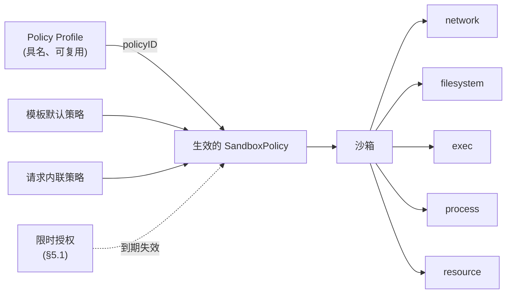

# 提案 0001：沙箱安全策略（Sandbox Security Policy）— 总览

| | |
| --- | --- |
| **状态** | 草案 — 社区讨论中 |
| **提案编号** | 0001（文档集） |
| **作者** | _（认领章节时请在此署名）_ |
| **创建时间** | 2026-08 |
| **讨论入口** | GitHub Issue：_**尚未开启 —— 阶段 0 的阻塞项。** 跟踪 Issue 不存在之前，评审意见无处可以长久沉淀。_ |
| **事实源** | `specs/0001-sandbox-security-policy/en/` 下的英文文档是规范文本。`zh/` 一套是译文，**可能**有滞后；一旦不一致，以英文为准。 |

本文档中的关键词 **必须（MUST）**、**不得（MUST NOT）**、**应该（SHOULD）**、**可以（MAY）** 依据 RFC 2119 解释。

---

## 1. 概述

每一台云上的 ECS 实例默认都带有安全组：一份声明式、可复用的 *"这台机器可以与谁通信"* 的定义。本提案为 CubeSandbox 引入与之对等、且必要的超集 —— 统一的、声明式的 **沙箱安全策略（Sandbox Security Policy）**，在五个模块上定义单个沙箱的完整能力边界：

| 模块 | 规格文档 |
| --- | --- |
| **网络（Network）** — 沙箱可以访问什么、什么可以访问沙箱 | [network.md](./network.md) |
| **文件系统（Filesystem）** — 沙箱内外哪些路径可读、可写、可执行 | [filesystem.md](./filesystem.md) |
| **命令执行（Exec）** — 可以执行哪些命令、以哪个用户身份、最长多久、最多几个并发 | [exec.md](./exec.md) |
| **进程（Process）** — 已在运行的进程可以做什么：提权、持久化、系统调用 | [process.md](./process.md) |
| **资源（Resource）** — 稳态配额、按窗口限额（分钟–月 + 生命周期）与 LLM Token 计量 | [resource.md](./resource.md) |

沙箱与 ECS 实例不同，它不只是网络端点，而是一个**执行着部分可信、由 Agent 生成的代码的执行环境**。因此它的"安全组"不仅要治理网络可达性，还必须治理这些代码能触碰哪些文件、能执行什么命令、能消耗多少资源 —— 否则边界就是不完整的。

## 2. 动机

安全组之所以好用，是因为它：

- **声明式** — 用户表达意图（"允许 443 端口访问该 CIDR"），而非机制。
- **默认开启** — 每台实例都有，且带合理的基线。
- **可复用** — 一个安全组绑定多台实例，变更对所有实例生效。
- **统一** — 一套语法、一套求值顺序、一套审计口径。

沙箱需要完全相同的属性，并扩展到执行域：

| ECS 实例 | 沙箱 |
| --- | --- |
| 运行人类编写、可信的工作负载 | 运行 Agent 生成的、部分可信的代码 |
| 边界 = 网络可达性 | 边界 = 网络 **+ 文件系统 + 命令执行 + 进程 + 资源** |
| 爆炸半径：数据外泄 | 爆炸半径：外泄 **+ 凭据窃取、宿主挂载滥用、提权、失控循环、Token 烧钱** |

### 2.1 差距分析

五个模块目前的成熟度差异很大：

| 模块 | 现状 | 差距 |
| --- | --- | --- |
| 网络 | 出站 L3/L4 允许/拒绝、域名白名单与 DNS 学习、带审计与头部注入的 L7 HTTP/HTTPS 规则、公开入站门控。 | 字段散落在创建请求各处；入站只有一个开关；没有可复用的策略对象；各模块之间没有统一的合并语义。 |
| 文件系统 | 宿主挂载前缀白名单与挂载级 `readOnly`。 | 对沙箱**内部**敏感路径（`~/.ssh`、`~/.aws/credentials`、`/etc/shadow`）零保护；没有路径级只读/禁读策略；前缀白名单不属于面向用户的策略 API。 |
| 命令执行 | 每请求级 `timeout`、`user`、`cwd`。 | 没有沙箱级策略：没有命令允许/拒绝列表、没有用户限制、没有并发上限、没有总时长上限、没有审计轨迹。 |
| 进程 | 面向用户的能力为零。沙箱之间的进程与 PID 隔离是沙箱模型的**属性**（§12），不是策略能声明的东西。 | 完全没有策略面：提权、持久化与系统调用暴露面都无法被声明式地约束 —— 尽管强制执行机制早已存在于 API 之下，[filesystem.md](./filesystem.md) §11 已经在设想"等效的系统调用级强制执行"。 |
| 资源 | 稳态 CPU/内存配额；空闲超时支持 kill/pause。 | 没有按窗口限额（分钟–月）与生命周期预算；没有带宽上限；没有 LLM Token 计量；没有超限动作、通知与人工审批流程。 |

### 2.2 为什么需要统一对象

如果没有统一的策略对象，每个模块会长出自己的配置风格、合并规则、默认值和审计格式。用户要理解五套半成品系统；模板作者无法在一处表达"这个模板的沙箱是锁死的"；未来新增模块（设备访问、快照权限……）还会引入第六、第七种方言。

统一策略能为 CubeSandbox 带来：

- 统一的心智模型：*"沙箱只能做策略允许的事"*。
- 统一的合并语义（模板默认 + 请求覆盖），被所有模块共享。
- 统一的默认安全基线，默认开启。
- 统一的审计与观测入口（"这个操作为什么被拒绝了？"）。

### 2.3 纵深防御矩阵

没有任何单一模块自身就是一道边界。每个模块应对的是特定威胁，只有作为分层才有意义。本矩阵的存在意义，就是避免任何人把威胁模型挂到错的模块上。

| 模块 | 主要应对的威胁 | 强制执行面 | **不**覆盖 |
| --- | --- | --- | --- |
| **网络** | 数据外泄；触及内部服务与元数据端点 | 离开沙箱的每一个包，无论由哪个进程发出 | 代码在本地做了什么；已经从允许通道流出的数据 |
| **文件系统** | 沙箱内凭据窃取；宿主挂载滥用 | **所有**进程的每一次文件系统访问 | 已进入进程内存或以环境变量传入的凭据 |
| **资源** | 失控循环、Token 烧钱、吵邻效应 | 内核记账 + 出站 HTTP 计量，按沙箱统计 | 有害但很便宜的行为 |
| **进程** | 工作负载**自行**启动的进程的提权、非预期持久化、系统调用面滥用 | 沙箱运行的每一个进程，在内核边界上 | 进程在已获授权范围内的正当行为 |
| **命令执行** | 通过**控制接口**抵达的注入命令或误操作 | 仅限由沙箱控制接口发起的执行 | 工作负载自行启动的进程 |

最后一行的不对称是刻意的，也是承重的：

- `exec` 策略是一道**控制接口门禁**。它适用于应对经 API 抵达沙箱的指令（被提示词注入的 Agent 步骤、被入侵的编排器），以及应对运维失误（无上限的超时、用错身份）。
- 它**不是**已在沙箱内运行的代码的围堵边界。一旦被 `exec` 放行，该进程可以 `fork`/`exec` 镜像里的任何东西，不再经过 `exec` 求值。在 Agent 生成代码的场景里，首个被放行的命令典型就是解释器或构建工具，因此 `exec` 白名单的***实际***防护面很小 —— 见 [exec.md](./exec.md) §1 与 §3.6。
- 针对自启进程的围堵来自 `filesystem`（能读写什么）、`network`（能发往哪里）、`process`（能获得哪些权限、能发起哪些系统调用）与 `resource`（能消耗多少）。这四道在原则 5（§6）下是强制执行层。

`process` 正是回答 `exec` 明确拒答的那个问题的模块：**进程一旦跑起来，它可以做什么？** 它不让 `exec` 变得多余，`exec` 也不让它变得多余 —— 两者在两个不同的点上强制执行，而在遭遇一个被放行的解释器之后，只有 `process` 还活着。见 [process.md](./process.md) §1。

因此：威胁模型应基于 **网络 + 文件系统 + 进程 + 资源** 来定尺寸，而把 `exec` 当作加固手段 —— 绝不当作边界。

### 2.3.1 不在范围内：检测与响应

行为型检测 —— 内网端口扫描、连接已知恶意目标、异常登录地点、僵尸或恶意进程识别 —— **不**在本提案任何模块的范围内，且任何模块都**不可以（MAY NOT）**为此长出字段。

这是原则 1 与原则 5 的推论，不是遗漏。策略字段陈述的是一条*在强制执行时刻可判定*的边界：这个路径、这个目标、这个系统调用。而"恶意"与"异常"是检测器在观察一段时间的行为之后给出的判决；把它们表达成策略字段，就等于交付一批无法确定性强制执行的字段 —— 原则 5 禁止这样做，而这样做会悄悄把整个策略对象降格成一组建议。

检测与响应是一项正当且互补的能力。它属于一个独立的子系统：消费审计流（§4.1.6、§11.3），并通过控制面动作 —— 例如触发一次策略更新，而该更新会像任何其他更新一样被版本化与快照。两者的交汇点是审计流，而不是策略对象。

## 3. 文档集

本提案由六份文档组成。本总览定义所有模块规格共享的对象模型、合并语义、错误模型与兼容性规则；每份模块规格是一个独立、规范性的领域规格。

| 文档 | 范围 |
| --- | --- |
| [overview.md](./overview.md)（本文档） | 共享模型、合并语义、原则、分级、限时授权、兼容性、交付阶段 |
| [network.md](./network.md) | 出站 L3/L4/L7 策略、入站门控、遗留字段映射 |
| [filesystem.md](./filesystem.md) | 宿主挂载边界、沙箱内路径访问策略 |
| [exec.md](./exec.md) | 命令执行策略 |
| [process.md](./process.md) | 运行中进程的提权、持久化与系统调用策略 |
| [resource.md](./resource.md) | 配额、按窗口限额（分钟–月 + 生命周期）、LLM Token 计量、超限动作、hold 与审批、通知 |

## 4. 共享对象模型



**SandboxPolicy** — 声明式对象，含一个分级字段与五个子策略。所有字段均可缺省；缺省的子策略表示"服务端默认值"（§7），而**绝不是"不限制"**。

```yaml
policy:
  tier: baseline | restricted | unrestricted   # 默认：baseline —— 见 §7.1
  network: { ... }       # 见 network.md
  filesystem: { ... }    # 见 filesystem.md
  exec: { ... }          # 见 exec.md
  process: { ... }       # 见 process.md
  resource: { ... }      # 见 resource.md
```

**Policy Profile（策略档）** — 存储在服务端的具名 `SandboxPolicy`。沙箱通过 `policyID` 引用，或在创建时内联一份策略。这就是安全组的复用机制：更新策略档，之后创建的所有沙箱——以及（在支持的模块中）已在运行的沙箱——都会生效。

```
POST   /policies            创建/更新具名策略档
GET    /policies            列出策略档
GET    /policies/{id}       查看策略档（含解析后的默认值）
DELETE /policies/{id}       删除（仍有沙箱引用时拒绝）
```

### 4.1 策略身份与版本化

生效策略不只是被计算出来的，它还必须是**可识别**的。合规排查会问「昨天 14:03 这个沙箱实际跑的是哪份策略？」，而这个问题**必须**能从已存储的记录中回答，而不需要拿那些早已变更的来源重跑一次合并逻辑。

1. 每份生效策略携带 `effectivePolicyVersion`：该沙箱从 1 开始的整数，沙箱生效策略的每一次变更均递增 —— 包括热更新和从策略档拉取到的变更。
2. 每份生效策略携带 `policySources`：每个贡献来源的身份与修订号 —— `{template, templateRevision, policyID, policyRevision, inline}`。
3. 策略档是**带修订号**的。对已存在名称执行 `POST /policies` 会创建一个新的不可变修订，**不得**原地修改已有修订。只要仍有快照或审计记录引用某修订，即使策略档已被删除，该修订也**必须**保留。
4. 沙箱生效策略的每一次变更**必须**产生一份不可变**快照**，包含完整解析后的策略、其版本号、其来源，以及引发变更的时间戳与主体。
5. 快照**必须**在沙箱整个生命周期内可检索，并在终止后保留一个由部署方配置的保留期。
6. 所有模块的每一条拒绝审计事件**必须**携带拒绝发生时生效的 `effectivePolicyVersion`，使拒绝可与产生它的确切策略文本关联。

```
GET /sandboxes/{id}/policy                  当前生效策略 + 版本 + 来源
GET /sandboxes/{id}/policy/history          快照列表（版本、时间、主体、来源）
GET /sandboxes/{id}/policy/history/{ver}    单份不可变快照
GET /policies/{id}/revisions                策略档修订列表
GET /policies/{id}/revisions/{rev}          单份不可变策略档修订
```

这正是策略档复用可审计的基础：「已在运行的沙箱在模块支持的前提下拉取变更」之所以可观测，正是因为每一次拉取都是一个带快照的新版本。无法热更新的模块必须在自己的规格中明说；它**不得**静默地与自己上报的版本不一致。

## 5. 共享合并语义

当存在多个策略来源时，生效策略在创建时按以下规则一次性计算。各模块规格定义逐字段的细化规则。

| 方面 | 规则 |
| --- | --- |
| 来源优先级 | 请求内联策略 > 引用的策略档 > 模板默认。 |
| `tier` | 最严格的分级胜出：`restricted` > `baseline` > `unrestricted`（§7.1）。 |
| 标量字段 | 高优先级的显式值覆盖低优先级；缺省保持低优先级值。 |
| 列表字段（`allowOut`、`denyPaths` 等） | 高优先级条目追加到低优先级条目之后，再去重。 |
| 规则列表（`rules`、exec 命令规则） | 高优先级规则排在低优先级规则**之前**；求值为首匹配生效。 |
| 模式字段（`exec.mode`、`filesystem.mode`、`process.mode`、`process.syscall.mode`） | 最严格者胜出。 |
| **只能收窄的限制** | 低优先级来源贡献的限制，**不得**被高优先级来源移除、覆盖或打洞。高优先级可以收窄边界，但永远不能放宽它。各模块规格逐一列出受本规则约束的字段 —— 网络的绑定性拒绝与 `allowInternetAccess`、`exec.allowedUsers`、`filesystem.mounts.allowedHostPrefixes` 与 `filesystem.baselineExceptions`、`process.noNewPrivileges` 与 `process.allowedCapabilities`、`resource.limits`。唯一且有界的例外是限时授权（§5.1）。 |

当高优先级来源申请了只能收窄规则所禁止的事情，模块规格**必须**指定两种结果之一，而绝不允许静默的第三种：拒绝请求（`400`，用于直接矛盾，如把一个布尔值翻回去），或接受请求并在响应的 `policyWarnings` 数组中报告不生效的部分（用于仅被遮蔽的条目）。

### 5.1 限时授权（time-bounded grant）

在创建时一次性算出的策略，无法表达"为这一个任务的时长授权，随后收回"。用改策略的方式满足这个需求，正是权限膨胀的来源：放宽后的策略一直生效，因为没人记得再把它收回去，于是沙箱在余下的整个生命周期里，都握着一项它只需要十分钟的能力。

因此**授权（grant）**是一等对象：一份具名的、限时的、增量式的生效策略放宽，经控制面签发。

授权是只能收窄原则（§5）的*唯一*例外，因此它四面都被围栏挡住。以下每一条都是规范性的；缺少其中任何一条的授权机制，是一条提权路径，而不是一项功能。

1. **授权签发。** 授权**必须**由一个已认证、且有权管理该沙箱的主体签发。它**不得**能从沙箱内部签发，也**不得**接受沙箱作用域的凭据 —— 与资源审批 API 相同的条件（[resource.md](./resource.md) §7.4）。不可信的 Agent 代码**不得**能放宽自己的边界。
2. **强制到期。** 每一份授权**必须**携带 TTL，并受部署方配置的最大值约束。没有 TTL、或 TTL 超过最大值的授权，**必须**以 `400 POLICY_GRANT_INVALID` 拒绝。不存在无限期授权。
   - 到期**必须**由平台强制执行。到期时授权被移除，生效策略**自动**回到授权前的值。到期**不得**依赖任务、Agent、编排器或沙箱上报完成 —— 一种依赖被约束方自己宣告的回收，不是回收。
   - 对任何活跃授权，**必须**能随时提前撤销。
3. **授权上限（grant ceiling）。** 授权**不得**把边界放宽到超过**外层边界**允许的范围。外层边界是由 `template` 与 `profile` 两个来源贡献的限制集合 —— 与使网络拒绝具有绑定性的来源标记是同一套（[network.md](./network.md) §4.6）。

   | 授权可以重开 | 授权**不可以**重开 |
   | --- | --- |
   | 分级默认值（§7.1）收窄的东西 | 模板限制关闭的任何东西 |
   | 请求级内联策略收窄的东西 | 策略档限制关闭的任何东西 |
   | | 模块无条件拒绝的任何东西（如网络内置私网 CIDR 拒绝） |

   越过上限的尝试**必须**以 `400 POLICY_GRANT_EXCEEDS_CEILING` 拒绝，并携带那条限制及其来源。没有这条规则，管理员的边界对任何能签发授权的人来说只是一个建议，而 §5 也就退化为倡议。
4. **显式目标。** 授权**必须**指名它放宽了什么：模块、字段、条目。通配授权、"十分钟不限制"、分级降级都**必须**被拒绝。授权是一个形状已知的洞，否则它就不是授权。
5. **完整版本化。** 签发、到期、撤销各自都会改变生效策略，因此各自都**必须**产生一个新的 `effectivePolicyVersion` 与一份不可变快照（§4.1.4），并**必须**连同签发主体、目标、TTL 与理由一起审计。授权从不隐形，它的到期也不隐形。
6. **在生效期间可见。** 活跃授权**必须**出现在 API 暴露的生效策略中，各自带剩余 TTL，使「这个沙箱***此刻***为什么能访问 X？」无需关联日志即可回答。
7. **独立的生命周期。** 授权之间不合并。相互重叠的授权各按自己的时间表到期；生效的放宽是各活跃授权的并集，每个条目恰好存活到属于它的那份授权到期为止。
8. **逐模块选择加入。** 每份模块规格**必须**指名自己可被授权的字段，或声明自己没有。指名为空的模块就没有授权：缺省不是许可。

```
POST   /sandboxes/{id}/grants              签发 {module, field, entries, ttlSec, reason}
GET    /sandboxes/{id}/grants              列出活跃授权及剩余 TTL
DELETE /sandboxes/{id}/grants/{grantID}    提前撤销
```

> **术语提示。** 这里的 `grant`（限时策略放宽）不是资源审批载荷里的 `grant` 字段（[resource.md](./resource.md) §7.3）—— 后者是给用量计数器追加的*额度（allowance）*。两者是不相干的机制，只是不幸共用了同一个英文词；资源侧的字段是否应改名为 `allowance`，是开放问题 §11.7。

## 6. 共享原则

1. **声明式。** 策略表达意图，不引用机制、组件或配置路径。
2. **缺省 ≠ 不限制。** 缺省的子策略或字段解析为服务端默认值，而服务端默认值本身必须是已文档化的安全值。
3. **默认安全，显式退出。** 基线防护默认开启；退出必须是主动、可见的动作（如 `mode: unrestricted`），绝不因省略字段而产生。
4. **拒绝可解释。** 每次拒绝都以结构化形式携带原因（命中的规则、资源维度、超限的限额），使调用方与 Agent 能以程序化方式响应。
5. **强制而非建议。** 各模块规格中的每条规则都必须在沙箱负载无法绕过的位置强制执行。若某条规则无法强制执行，规格必须明说，而不是假装可以。
6. **下游单一表示。** 无论策略以何种方式表达（遗留字段、内联策略、策略档），生效策略只计算一次、只以一种对象暴露。

## 7. 共享默认值

默认值遵循"默认安全"原则。采用哪一套默认值由 `policy.tier` 选择（§7.1）；下表是 `baseline` 分级，也就是默认。确切值以各模块规格的规范性定义为准。

| 模块 | 默认基线 | 退出方式 |
| --- | --- | --- |
| 网络 | 今天的既有行为：允许互联网出站，内置私网 CIDR 拒绝。 | `allowInternetAccess: false`。 |
| 文件系统 | 拒绝敏感凭据路径 —— 带版本的基线集合 `baseline/1`（`~/.ssh`、`~/.aws`、`~/.gnupg`、`/etc/shadow` 等）。 | 整体退出用 `mode: unrestricted`，按路径退出用 `baselineExceptions`。 |
| 命令执行 | `unrestricted` 模式 + 总时长超时上限。 | allowlist 模式。 |
| 进程 | 拒绝与逃逸相邻的系统调用 —— 带版本的系统调用基线集合 `syscall/1`。提权与后台化被允许，因为二者在正当镜像中都很常见。 | `mode: unrestricted`。 |
| 资源 | 配额默认继承模板；无按窗口限额。 | 显式设置限额。 |

### 7.1 策略分级（policy tiers）

运维对每个模块都问了同一个问题：*"直接给我一个锁死的沙箱。"* 逐模块回答意味着五个独立决策，以及五次漏掉其中之一的机会。`policy.tier` 一次性回答它。

```yaml
policy:
  tier: baseline | restricted | unrestricted   # 默认：baseline
```

分级是一个**默认值选择器，仅此而已**。正是这份克制，让它不会变成第六种策略方言：

1. 分级**不得**引入属于自己的强制执行语义。分级的每一个效果都**必须**可表达为模块字段的默认值，并**必须**以展开后的字段值出现在解析后的生效策略中。
2. **展开发生在合并之前。** 分级展开为模块字段默认值，而这些默认值继承**设置该分级的那个来源的来源标记**（来源标记模型见 [network.md](./network.md) §4.6）。因此模板设置的 `restricted` 分级贡献的是模板来源标记的限制，只能收窄原则（§5）像保护一条显式写出的模板字段那样保护它们。
3. **同一来源的显式字段胜过该来源的分级默认值。** 某个来源同时设置 `tier: restricted` 与 `exec.maxTimeoutSec: 600`，得到的是 600。分级只填空白，不覆盖意图。
4. `tier: unrestricted` **必须**显式书写，并**必须**在生效策略中被记录为显式值。它绝不因省略而产生（原则 3）。
5. 解析后的生效策略**必须**同时记录解析出的分级**与**完整展开的字段值。读一份六个月前的快照，**不得**要求读者知道 `restricted` 在那一天展开成了什么。
6. 修改某个分级的展开内容，是一次带弃用窗口的、需要公告的平台变更，条件与推进默认文件系统基线版本相同（[filesystem.md](./filesystem.md) §6.2.4）。它**不得**静默改变已在运行的沙箱；分级的重新定义只能通过一次策略更新抵达运行中的沙箱，而该更新会产生新的 `effectivePolicyVersion`。

展开内容：

| 模块 | `tier: baseline` | `tier: restricted` |
| --- | --- | --- |
| 网络 | `allowInternetAccess: true`，内置私网 CIDR 拒绝 | `allowInternetAccess: false`（全拒出站；只有显式 `allowOut`、端口/协议规则与 L7 目标能通过）、`ingress.allowPublicTraffic: false` |
| 文件系统 | `mode: baseline`、`baseline/1` | `mode: baseline`、`mounts.defaultReadOnly: true` |
| 命令执行 | `mode: unrestricted`、`maxTimeoutSec: 3600` | `mode: unrestricted`、`maxTimeoutSec: 3600`、`audit: metadata` |
| 进程 | `mode: baseline`、`syscall.mode: baseline` | `mode: baseline`、`syscall.mode: baseline`、`noNewPrivileges: true`、`allowDaemonize: false`、`audit: metadata` |
| 资源 | 模板配额、无按窗口限额 | 模板配额、`onExceeded: hold` |

`tier: unrestricted` 展开为各模块已文档化的退出方式 —— `network.allowInternetAccess: true` 且不追加内置拒绝之外的任何拒绝（内置拒绝是任何分级都无法解除的）、`filesystem.mode: unrestricted`、`exec.mode: unrestricted`、`process.mode: unrestricted`。它是给可信、人类编写的工作负载用的分级，且它的每一次使用都可见于生效策略及其快照。

有两个推论值得直说，而不是留给日后发现：

- **`restricted` 不收窄 `exec.mode`，这是刻意的。** `allowlist` 要求 `allowedCommands` 非空（[exec.md](./exec.md) §5），因此一个选择了它的分级会让单独写 `tier: restricted` 直接校验失败 —— 一个字段的承诺，被这一个字段自己打破。更深的理由是它换不到东西：`exec` 是控制接口门禁，不是围堵边界，而一个放行了解释器的白名单几乎什么都没有约束住（[exec.md](./exec.md) §3.6）。`restricted` 真正约束的东西在 `network`、`filesystem` 与 `process` 里，它们在控制接口之下强制执行。分级打开的是 `exec` 审计，因为这是它无需臆测调用方命令清单就能提供的部分。同样的克制适用于任何分级不得不猜测工作负载专属数值的地方：`filesystem.writableRoots`（[filesystem.md](./filesystem.md) §6.5）与全部 `resource` 预算（[resource.md](./resource.md) §6）都因此被留在原样。会猜的分级，就是会为了一个它并未改善的安全姿态而弄坏工作负载的分级。
- 分级取值 `baseline` 与 `unrestricted` 刻意复用了 `filesystem.mode`、`exec.mode`、`process.mode` 用的同一批词。它们处在不同层级、做不同的事：分级是策略级的、只选择默认值，而模块 `mode` 是模块字段、会被强制执行。两者同时出现时适用规则 3 —— 显式的模块字段胜出。

## 8. 共享错误模型

- 所有策略错误使用 `POLICY_` 前缀：`POLICY_NETWORK_*`、`POLICY_FS_*`、`POLICY_EXEC_*`、`POLICY_PROCESS_*`、`POLICY_RESOURCE_*`、`POLICY_GRANT_*`。
- 策略**配置**错误（非法、冲突、超限）在创建/更新时以 HTTP `400` + 错误码 `INVALID_POLICY` 返回，并带机器可读的 `field` 指针。
- 策略**执行**错误在被拒绝的操作上以结构化错误返回，携带命中的规则名或耗尽的维度。例外：文件系统与进程的强制执行以标准 OS 错误码（`EACCES`/`EROFS`、`EPERM`）呈现，因为它们作用于 API 层之下。
- 每个模块在其规格中定义自己的错误码与载荷。

## 9. 兼容性

- **E2B 兼容：** E2B 兼容面（`allow_internet_access`、`network{}`）原样保留。不带 `policy` 的请求行为与今天完全一致；内部被规范化为默认策略，成为下游的唯一表示（原则 6）。
- **冲突策略：** 同一请求中同时出现遗留字段与对应的 `policy.*` 子策略时，**必须**返回 `400 POLICY_NETWORK_CONFLICT`（或模块专属冲突码），不得静默猜测优先级。
- **模板：** 存量模板获得与其当前行为等价的默认策略。零行为变化。
- **分级：** 缺省的 `tier` 解析为 `baseline`，而它对 `network`、`exec`、`resource` 的展开就是今天的行为。`filesystem` 与 `process` 的基线额外拒绝了一些任何兼容的工作负载都不该依赖的东西 —— 凭据路径与与逃逸相邻的系统调用。这两处是"零行为变化"刻意的、已文档化的例外，且两者都是带版本的集合（`baseline/1`、`syscall/1`），因此这个例外是可检视、可 pin 的，而不是滚动漂移的。
- **SDK：** 次版本新增 `policy=` 参数与带类型的策略错误；既有签名不变。
- **迁移：** 每个遗留字段到策略位置的映射见 [network.md](./network.md) §8。

## 10. 交付阶段

每个阶段都独立有价值、可独立发布。

| 阶段 | 范围 |
| --- | --- |
| **0** | 本提案集在跟踪 Issue 中评审；开放问题逐项收敛为决策。 |
| **1** | `SandboxPolicy` API 模型；遗留字段规范化；`policy.network` 端到端；冲突检测；生效策略的版本化与快照（§4.1）；SDK `policy=`。 |
| **2** | 资源域：配额合并、按窗口限额（`minute`–`month` + `lifetime`）、`onExceeded` 动作（`warn`/`pause`/`hold`/`kill`）、通知与 webhook、hold 审批 API、用量暴露。 |
| **3** | 文件系统：基线敏感路径保护、`readOnlyPaths` / `denyPaths` / `writableRoots`、宿主挂载策略面。 |
| **4** | 命令执行：模式、用户限制、超时上限、并发、审计、带类型的拒绝。 |
| **5** | 策略档（`/policies`）、策略档修订、`policyID` 绑定、支持模块的热更新、LLM Token 计量。 |
| **6** | 策略分级（`policy.tier`）：`baseline` / `restricted` / `unrestricted` 展开、来源标记继承、分级记录进生效策略与快照。 |
| **7** | 进程：`noNewPrivileges`、`allowDaemonize`、能力限制、带版本的系统调用基线集合、`allowlist`/`denylist` 系统调用模式、带类型的拒绝。 |
| **8** | 限时授权（§5.1）：授权 API、上限强制、平台侧到期、逐模块可授权字段、审计流中的授权事件。 |

## 11. 横切开放问题

1. **策略档作用域。** 集群全局、按命名空间，还是按模板？谁可以创建策略档？
2. **热更新。** 哪些模块支持运行时 `PATCH /sandboxes/{id}/policy`？对已运行进程与既有连接的语义是什么？身份、版本化与快照语义已定（§4.1）；待定的是各模块的运行时重施加。注意授权的签发与到期本身就是策略变更（§5.1.5）：无法在运行时重施加策略的模块，就不能接受授权，并**必须**明说这一点。
3. **审计统一。** 所有模块的拒绝是否共用同一事件模式与汇聚点，让运维拿到一条审计流？（无论结论如何，每条拒绝事件都按 §4.1.6 携带 `effectivePolicyVersion`。）这同时也是不在范围内的检测子系统（§2.3.1）所消费的接口，这让"把它做统一"的要求更高了。
4. **分级可扩展性。** 原先在此处开放的"基线分级"问题已由 §7.1 收敛。仍待定的是：部署方是否可以定义额外的具名分级，还是这三个取值是封闭集合？部署方自定义的分级需要有自己的版本化与公告故事（§7.1.6）。一个具体的候选是比 `restricted` 更严的分级 —— 它*确实*要求 `exec` 白名单与具名的 `filesystem.writableRoots`，也就是 §7.1 拒绝去猜的那些值。这样的分级只有在"一个分级可以在缺少配套字段时不可用"是正当的前提下才成立，而这才是要先回答的问题。
5. **快照交互。** 沙箱被克隆或从快照恢复时，生效策略与累计用量各有哪些部分随之迁移？活跃授权也在其中：丢弃它们是安全的答案，因为继承一份其原始任务已不存在的授权，是一次静默的放宽。
6. **授权主体。** 哪些主体可以签发授权 —— 沙箱所有者、命名空间运维，还是两者皆可？最大 TTL 是否应随分级不同（`restricted` 下更短）？是否有些字段无论上限如何都应永久不可授权？
7. **`grant` 与 `allowance`。** §5.1 引入了策略级的 `grant`，而 [resource.md](./resource.md) §7.3 已经用 `grant` 表示用量计数器的额度。是否应在两者中任一发布之前，把资源侧字段改名为 `allowance`，而不是留着一个词表示两件事？
8. **任务级策略。** 需求方要求按 Agent、按任务的策略，而本文档定义的最小作用域是沙箱。任务是否是一等作用域，带自己的生效策略与审计身份；还是说"按任务授权"恰好就是 §5.1 的授权已经提供的东西？若是前者，什么东西在控制面上标识一个任务？
9. **可达性与消耗量。** 出站端口/协议规则在 `network`，带宽在 `resource.quota`。这条缝（可以访问什么 vs 可以消耗多少）划得对吗，还是用户应该能在一处写出"到这个 CIDR 的 443，最多 10 Mbit/s"？

## 12. 非规范性说明

- 沙箱模型（每沙箱一个 MicroVM、独占内核）是原则 5 能以合理成本达成的原因：可按沙箱粒度启用内核级机制而不影响宿主。各模块规格刻意不指定机制选型。
- 这个模型同样是 `process` 能成为一个策略模块、而不只是一个愿望的原因。每沙箱一个内核意味着每沙箱一份系统调用面：它可以为某一个租户收窄，而无需与任何其他租户协调，也没有那种让系统调用过滤在共享内核上不受欢迎的全宿主爆炸半径。反过来，沙箱之间的进程隔离是该模型的一个*属性*，刻意不出现在策略对象里 —— 之所以没有对应字段，是因为没有任何东西需要用户来决定。
- 参考过的类比对象：AWS Security Groups、Kubernetes NetworkPolicy 与 Pod Security Standards、E2B 沙箱配置。

## 13. 参考资料

- [出站网络策略](../../../guide/network-policy.md) — 现有出站链路
- [安全代理](../../../guide/security-proxy.md) — 现有 L7 规则语法
- [限制公开访问](../../../guide/restrict-public-access.md) — 现有入站门控
- [认证](../../../guide/authentication.md)
