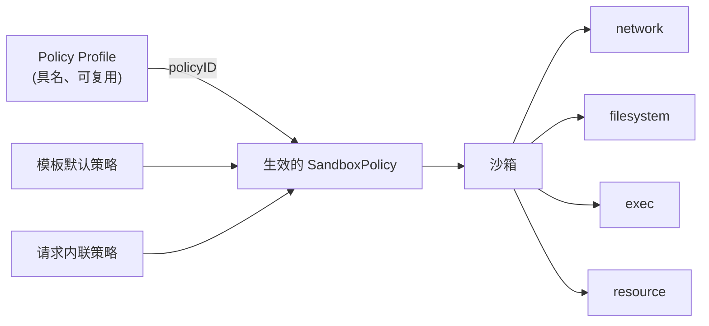

# 提案 0001：沙箱安全策略（Sandbox Security Policy）— 总览

| | |
| --- | --- |
| **状态** | 草案 — 社区讨论中 |
| **提案编号** | 0001（文档集） |
| **作者** | _（认领章节时请在此署名）_ |
| **创建时间** | 2026-08 |
| **讨论入口** | GitHub Issue：_（跟踪 Issue 建立后补充链接）_ |

本文档中的关键词 **必须（MUST）**、**不得（MUST NOT）**、**应该（SHOULD）**、**可以（MAY）** 依据 RFC 2119 解释。

---

## 1. 概述

每一台云上的 ECS 实例默认都带有安全组：一份声明式、可复用的 *"这台机器可以与谁通信"* 的定义。本提案为 CubeSandbox 引入与之对等、且必要的超集 —— 统一的、声明式的 **沙箱安全策略（Sandbox Security Policy）**，在四个模块上定义单个沙箱的完整能力边界：

| 模块 | 规格文档 |
| --- | --- |
| **网络（Network）** — 沙箱可以访问什么、什么可以访问沙箱 | [network.md](./network.md) |
| **文件系统（Filesystem）** — 沙箱内外哪些路径可读、可写、可执行 | [filesystem.md](./filesystem.md) |
| **命令执行（Exec）** — 可以执行哪些命令、以哪个用户身份、最长多久、最多几个并发 | [exec.md](./exec.md) |
| **资源（Resource）** — 稳态配额、按窗口限额（分钟–月 + 生命周期）与 LLM Token 计量 | [resource.md](./resource.md) |

沙箱与 ECS 实例不同，它不只是网络端点，而是一个**执行着部分可信、由 Agent 生成的代码的执行环境**。因此它的"安全组"不仅要治理网络可达性，还必须治理这些代码能触碰哪些文件、能执行什么命令、能消耗多少资源 —— 否则边界就是不完整的。

## 2. 动机

安全组之所以好用，是因为它：

- **声明式** — 用户表达意图（"允许 443 端口访问该 CIDR"），而非机制。
- **默认开启** — 每台实例都有，且带合理的基线。
- **可复用** — 一个安全组绑定多台实例，变更对所有实例生效。
- **统一** — 一套语法、一套求值顺序、一套审计口径。

沙箱需要完全相同的属性，并扩展到执行域：

| ECS 实例 | 沙箱 |
| --- | --- |
| 运行人类编写、可信的工作负载 | 运行 Agent 生成的、部分可信的代码 |
| 边界 = 网络可达性 | 边界 = 网络 **+ 文件系统 + 命令执行 + 资源** |
| 爆炸半径：数据外泄 | 爆炸半径：外泄 **+ 凭据窃取、宿主挂载滥用、失控循环、Token 烧钱** |

### 2.1 差距分析

四个模块目前的成熟度差异很大：

| 模块 | 现状 | 差距 |
| --- | --- | --- |
| 网络 | 出站 L3/L4 允许/拒绝、域名白名单与 DNS 学习、带审计与头部注入的 L7 HTTP/HTTPS 规则、公开入站门控。 | 字段散落在创建请求各处；入站只有一个开关；没有可复用的策略对象；各模块之间没有统一的合并语义。 |
| 文件系统 | 宿主挂载前缀白名单与挂载级 `readOnly`。 | 对沙箱**内部**敏感路径（`~/.ssh`、`~/.aws/credentials`、`/etc/shadow`）零保护；没有路径级只读/禁读策略；前缀白名单不属于面向用户的策略 API。 |
| 命令执行 | 每请求级 `timeout`、`user`、`cwd`。 | 没有沙箱级策略：没有命令允许/拒绝列表、没有用户限制、没有并发上限、没有总时长上限、没有审计轨迹。 |
| 资源 | 稳态 CPU/内存配额；空闲超时支持 kill/pause。 | 没有按窗口限额（分钟–月）与生命周期预算；没有 LLM Token 计量；没有超限动作、通知与人工审批流程。 |

### 2.2 为什么需要统一对象

如果没有统一的策略对象，每个模块会长出自己的配置风格、合并规则、默认值和审计格式。用户要理解四套半成品系统；模板作者无法在一处表达"这个模板的沙箱是锁死的"；未来新增模块（设备访问、快照权限……）还会引入第五、第六种方言。

统一策略能为 CubeSandbox 带来：

- 统一的心智模型：*"沙箱只能做策略允许的事"*。
- 统一的合并语义（模板默认 + 请求覆盖），被所有模块共享。
- 统一的默认安全基线，默认开启。
- 统一的审计与观测入口（"这个操作为什么被拒绝了？"）。

## 3. 文档集

本提案由五份文档组成。本总览定义所有模块规格共享的对象模型、合并语义、错误模型与兼容性规则；每份模块规格是一个独立、规范性的领域规格。

| 文档 | 范围 |
| --- | --- |
| [overview.md](./overview.md)（本文档） | 共享模型、合并语义、原则、兼容性、交付阶段 |
| [network.md](./network.md) | 出站 L3/L4/L7 策略、入站门控、遗留字段映射 |
| [filesystem.md](./filesystem.md) | 宿主挂载边界、沙箱内路径访问策略 |
| [exec.md](./exec.md) | 命令执行策略 |
| [resource.md](./resource.md) | 配额、按窗口限额（分钟–月 + 生命周期）、LLM Token 计量、超限动作、hold 与审批、通知 |

## 4. 共享对象模型



**SandboxPolicy** — 声明式对象，含四个子策略。所有字段均可缺省；缺省的子策略表示"服务端默认值"（§7），而**绝不是"不限制"**。

```yaml
policy:
  network: { ... }       # 见 network.md
  filesystem: { ... }    # 见 filesystem.md
  exec: { ... }          # 见 exec.md
  resource: { ... }        # 见 resource.md
```

**Policy Profile（策略档）** — 存储在服务端的具名 `SandboxPolicy`。沙箱通过 `policyID` 引用，或在创建时内联一份策略。这就是安全组的复用机制：更新策略档，之后创建的所有沙箱——以及（在支持的模块中）已在运行的沙箱——都会生效。

```
POST   /policies            创建/更新具名策略档
GET    /policies            列出策略档
GET    /policies/{id}       查看策略档（含解析后的默认值）
DELETE /policies/{id}       删除（仍有沙箱引用时拒绝）
```

## 5. 共享合并语义

当存在多个策略来源时，生效策略在创建时按以下规则一次性计算。各模块规格定义逐字段的细化规则。

| 方面 | 规则 |
| --- | --- |
| 来源优先级 | 请求内联策略 > 引用的策略档 > 模板默认。 |
| 标量字段 | 高优先级的显式值覆盖低优先级；缺省保持低优先级值。 |
| 列表字段（`allowOut`、`denyPaths` 等） | 高优先级条目追加到低优先级条目之后，再去重。 |
| 规则列表（`rules`、exec 命令规则） | 高优先级规则排在低优先级规则**之前**；求值为首匹配生效。 |
| 模式字段（`exec.mode`、`filesystem.mode`） | 最严格者胜出。 |

## 6. 共享原则

1. **声明式。** 策略表达意图，不引用机制、组件或配置路径。
2. **缺省 ≠ 不限制。** 缺省的子策略或字段解析为服务端默认值，而服务端默认值本身必须是已文档化的安全值。
3. **默认安全，显式退出。** 基线防护默认开启；退出必须是主动、可见的动作（如 `mode: unrestricted`），绝不因省略字段而产生。
4. **拒绝可解释。** 每次拒绝都以结构化形式携带原因（命中的规则、资源维度、超限的限额），使调用方与 Agent 能以程序化方式响应。
5. **强制而非建议。** 各模块规格中的每条规则都必须在沙箱负载无法绕过的位置强制执行。若某条规则无法强制执行，规格必须明说，而不是假装可以。
6. **下游单一表示。** 无论策略以何种方式表达（遗留字段、内联策略、策略档），生效策略只计算一次、只以一种对象暴露。

## 7. 共享默认值

默认值遵循"默认安全"原则。确切值以各模块规格的规范性定义为准。

| 模块 | 默认基线 | 退出方式 |
| --- | --- | --- |
| 网络 | 今天的既有行为：允许互联网出站，内置私网 CIDR 拒绝。 | `allowInternetAccess: false`。 |
| 文件系统 | 拒绝敏感凭据路径（`~/.ssh`、`~/.aws`、`~/.gnupg`、`/etc/shadow`）。 | `mode: unrestricted`。 |
| 命令执行 | `unrestricted` 模式 + 总时长超时上限。 | allowlist 模式。 |
| 资源 | 配额默认继承模板；无按窗口限额。 | 显式设置限额。 |

## 8. 共享错误模型

- 所有策略错误使用 `POLICY_` 前缀：`POLICY_NETWORK_*`、`POLICY_FS_*`、`POLICY_EXEC_*`、`POLICY_RESOURCE_*`。
- 策略**配置**错误（非法、冲突、超限）在创建/更新时以 HTTP `400` + 错误码 `INVALID_POLICY` 返回，并带机器可读的 `field` 指针。
- 策略**执行**错误在被拒绝的操作上以结构化错误返回，携带命中的规则名或耗尽的维度。例外：文件系统的强制执行以标准 OS 错误码（`EACCES`/`EROFS`）呈现，因为它作用于 API 层之下。
- 每个模块在其规格中定义自己的错误码与载荷。

## 9. 兼容性

- **E2B 兼容：** E2B 兼容面（`allow_internet_access`、`network{}`）原样保留。不带 `policy` 的请求行为与今天完全一致；内部被规范化为默认策略，成为下游的唯一表示（原则 6）。
- **冲突策略：** 同一请求中同时出现遗留字段与对应的 `policy.*` 子策略时，**必须**返回 `400 POLICY_NETWORK_CONFLICT`（或模块专属冲突码），不得静默猜测优先级。
- **模板：** 存量模板获得与其当前行为等价的默认策略。零行为变化。
- **SDK：** 次版本新增 `policy=` 参数与带类型的策略错误；既有签名不变。
- **迁移：** 每个遗留字段到策略位置的映射见 [network.md](./network.md) §8。

## 10. 交付阶段

每个阶段都独立有价值、可独立发布。

| 阶段 | 范围 |
| --- | --- |
| **0** | 本提案集在跟踪 Issue 中评审；开放问题逐项收敛为决策。 |
| **1** | `SandboxPolicy` API 模型；遗留字段规范化；`policy.network` 端到端；冲突检测；SDK `policy=`。 |
| **2** | 资源域：配额合并、按窗口限额（`minute`–`month` + `lifetime`）、`onExceeded` 动作（`warn`/`pause`/`hold`/`kill`）、通知与 webhook、hold 审批 API、用量暴露。 |
| **3** | 文件系统：基线敏感路径保护、`readOnlyPaths` / `denyPaths` / `writableRoots`、宿主挂载策略面。 |
| **4** | 命令执行：模式、用户限制、超时上限、并发、审计、带类型的拒绝。 |
| **5** | 策略档（`/policies`）、`policyID` 绑定、支持模块的热更新、LLM Token 计量。 |

## 11. 横切开放问题

1. **策略档作用域。** 集群全局、按命名空间，还是按模板？谁可以创建策略档？
2. **热更新。** 哪些模块支持运行时 `PATCH /sandboxes/{id}/policy`？对已运行进程与既有连接的语义是什么？
3. **审计统一。** 所有模块的拒绝是否共用同一事件模式与汇聚点，让运维拿到一条审计流？
4. **基线分级。** 单一默认值还是所有模块共享的分级（`baseline` / `restricted` / `unrestricted`）？
5. **快照交互。** 沙箱被克隆或从快照恢复时，生效策略与累计用量各有哪些部分随之迁移？

## 12. 非规范性说明

- 沙箱模型（每沙箱一个 MicroVM、独占内核）是原则 5 能以合理成本达成的原因：可按沙箱粒度启用内核级机制而不影响宿主。各模块规格刻意不指定机制选型。
- 参考过的类比对象：AWS Security Groups、Kubernetes NetworkPolicy 与 Pod Security Standards、E2B 沙箱配置。

## 13. 参考资料

- [出站网络策略](../../guide/network-policy.md) — 现有出站链路
- [安全代理](../../guide/security-proxy.md) — 现有 L7 规则语法
- [限制公开访问](../../guide/restrict-public-access.md) — 现有入站门控
- [认证](../../guide/authentication.md)
